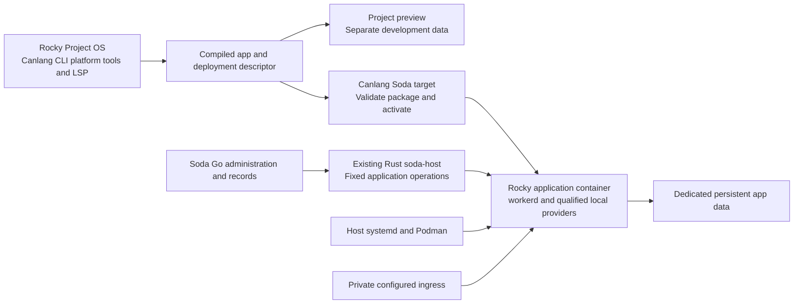
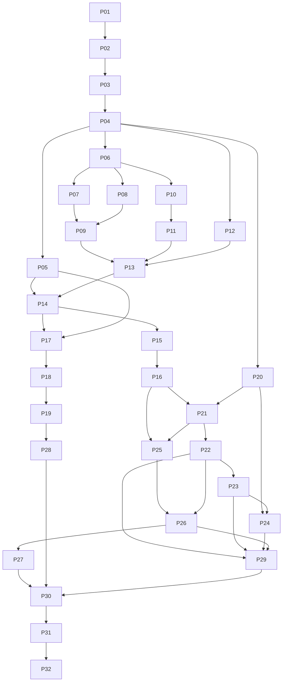

# Canlang and Soda OS implementation plan

**Draft for future implementation · 6 October 2026**

Canlang applications should be developed in Soda OS Project OS and deployed to a separate Rocky Linux application container for a small team on one private appliance. The application runs on Cloudflare's open source **workerd** runtime, with local implementations of the services its compiled artifact requires. Soda OS supplies deployment administration, private access, supervision and recovery; Canlang retains ownership of application semantics, identity, storage and background work.

This is feasible within that bounded scope. Packaging workerd is the easy part. The substantial work is completing Canlang's existing runtime joins and proving that local service implementations preserve acknowledged writes, file lifecycle, work delivery and migration rules. A container cannot package Cloudflare's entire managed platform or automatically inherit its production guarantees.

**Recommended approach:** prove the pinned Canlang and Miniflare stack on Rocky first, then build a narrowly scoped Soda deployment target around the proven service subset. Keep the developer image and application image separate. Implementation, installation, deployment and publication remain deferred.

## Scope and existing decisions

The intended environment is a trusted small team, a single Fedora CoreOS host, Podman containers and private LAN access with optional Tailnet connectivity. Soda currently supports native Linux x86_64 qualification only. Rocky supplies container userspace; containers share the host kernel.

| Decision | Planning consequence |
| --- | --- |
| Use Rocky Linux | Start with Soda's existing Rocky 10.2 foundation, freeze an image digest and qualify its actual packages and target CPU. Alpine work is excluded. |
| Prebuild the software | Ship compiler/platform tools in Project OS and runtime dependencies in the app image. Startup must work without downloading packages or compiling the application. |
| Keep environments distinct | Development accounts, SSH, compilers and nested Podman belong to Project OS. Production gets only the runtime, app assets, required providers and an unprivileged process. |
| Private use by a small team | One active writer per application data directory; brief maintenance downtime is acceptable as a proposed first-release operating model. Public and hostile-tenant hosting are excluded. |
| Integrate both repositories | Soda consumes Canlang artifacts and tools. Canlang gets a Soda target using its existing compiler/runtime/deployment contracts. |
| Plan now and implement later | The task list is a proposed execution order, not an instruction to start implementation or create issues. |

Soda's current product contract excludes a production hosting platform and defers factory deployment after merge. Private application hosting is therefore a **proposed narrow product extension**. Its adopted contract must preserve the existing public-hosting exclusion and the separation between factory merge authority and application deployment authority. [Soda product scope](https://github.com/levitateos/sodaos/blob/9a8dbcfd1f0439ff0811c8079e1094c87d50cccc/docs/product/scope.md), [product overview](https://github.com/levitateos/sodaos/blob/9a8dbcfd1f0439ff0811c8079e1094c87d50cccc/docs/product/overview.md), [platform scope](https://github.com/levitateos/sodaos/blob/9a8dbcfd1f0439ff0811c8079e1094c87d50cccc/docs/architecture/release.md).

## Source baseline and implementation gaps

The planning baseline is Soda OS `9a8dbcfd1f0439ff0811c8079e1094c87d50cccc` and Canlang `96cf12f5509f96286f171a13e5a1e372f857959f`. The Soda checkout was clean when inspected. The earlier Soda baseline `cd7c7622…` differs in release-build module organization, so release tasks below use the current split owners. This is a focused source and upstream feasibility assessment; native runtime and installed release qualification remain future task outcomes.

Canlang's compiler is implemented in Rust, emits JavaScript and compile artifacts, and exposes an LSP. The Cloudflare package supplies `can-platform`; installing only the `can` binary does not supply the platform commands. The old root README understates implementation progress and must not be used to conclude that the compiler is absent. [Compiler source](https://github.com/veighnsche/canlang/blob/96cf12f5509f96286f171a13e5a1e372f857959f/compiler/src/cli.rs), [code generation](https://github.com/veighnsche/canlang/blob/96cf12f5509f96286f171a13e5a1e372f857959f/compiler/src/codegen/mod.rs), [platform package](https://github.com/veighnsche/canlang/blob/96cf12f5509f96286f171a13e5a1e372f857959f/packages/cloudflare/package.json).

| Existing component | Integration work still required |
| --- | --- |
| Compiler artifact and deployment descriptor | Reuse resource requirements, migrations, schedules and compatibility identity. Add authored app identity/locale/owner metadata: the current assembly derives app identity from the first source filename. Durable scope must survive file moves. |
| Portable deployment bundler | Reuse the emitted app and module assembly. Stage the required files, work and provider dependencies deliberately rather than copying compiler logic into Soda. |
| Local runner and platform CLI | The inspected runner binds D1 without explicit persistent storage or the full resource set. CLI `runArtifact` assembles metadata rather than serving; CLI tests report zero executed examples. Add real local serving and example execution. |
| Worker browser and MCP serving | Complete operation/authentication routes, authenticated page/query context and the file receiver; preserve the existing MCP invocation path. |
| D1 identity and state storage | Close the documented identity multi-step write-fence gap. Shared database placement alone does not make identity transitions atomic. |
| File lifecycle and blob port | Reconcile the synchronous blob port with asynchronous R2 operations while preserving metadata ownership, authorization, finalization and garbage collection. |
| Durable work and deployment gates | Connect real state/provider inventory, outstanding work, scheduler wakeups and writer fencing to installed activation. Gate every effect, including MCP grant creation. Declaration checks alone do not prove real bindings. |
| Installed Canlang packages | Close the release dependency set and remove checkout-relative sibling `dist` assumptions. A working monorepo bundle does not prove that a clean installed compiler/platform/runtime can load. |
| Project OS and appliance services | Existing nested workloads are development services. Add a separate production application lifecycle, authority model, private endpoint and release payload integration. |

Canlang evidence: [deployment descriptor](https://github.com/veighnsche/canlang/blob/96cf12f5509f96286f171a13e5a1e372f857959f/packages/contracts/src/deployment.ts), [bundler](https://github.com/veighnsche/canlang/blob/96cf12f5509f96286f171a13e5a1e372f857959f/packages/cloudflare/src/deploy/bundle.ts), [local runner](https://github.com/veighnsche/canlang/blob/96cf12f5509f96286f171a13e5a1e372f857959f/packages/cloudflare/src/dev/local-run.ts), [platform CLI](https://github.com/veighnsche/canlang/blob/96cf12f5509f96286f171a13e5a1e372f857959f/packages/cloudflare/src/cli/platform.ts), [worker assembly](https://github.com/veighnsche/canlang/blob/96cf12f5509f96286f171a13e5a1e372f857959f/packages/cloudflare/src/worker/assembly.ts), [identity storage](https://github.com/veighnsche/canlang/blob/96cf12f5509f96286f171a13e5a1e372f857959f/packages/identity/src/storage/d1.ts), [file ports](https://github.com/veighnsche/canlang/blob/96cf12f5509f96286f171a13e5a1e372f857959f/packages/files/src/ports.ts), [installed probe](https://github.com/veighnsche/canlang/blob/96cf12f5509f96286f171a13e5a1e372f857959f/packages/cloudflare/src/deploy/installed.ts), [activation](https://github.com/veighnsche/canlang/blob/96cf12f5509f96286f171a13e5a1e372f857959f/packages/cloudflare/src/deploy/activate.ts).

Additional Canlang evidence: [artifact schema](https://github.com/veighnsche/canlang/blob/96cf12f5509f96286f171a13e5a1e372f857959f/packages/contracts/src/artifact.ts), [production main and grants](https://github.com/veighnsche/canlang/blob/96cf12f5509f96286f171a13e5a1e372f857959f/packages/cloudflare/src/worker/main.ts), [release package set](https://github.com/veighnsche/canlang/blob/96cf12f5509f96286f171a13e5a1e372f857959f/.github/workflows/release.yml).

Soda evidence: [Project OS image](https://github.com/levitateos/sodaos/blob/9a8dbcfd1f0439ff0811c8079e1094c87d50cccc/system/project/Containerfile), [development service boundary](https://github.com/levitateos/sodaos/blob/9a8dbcfd1f0439ff0811c8079e1094c87d50cccc/docs/guides/project-services.md), [architecture](https://github.com/levitateos/sodaos/blob/9a8dbcfd1f0439ff0811c8079e1094c87d50cccc/docs/architecture/overview.md), [release image producer](https://github.com/levitateos/sodaos/blob/9a8dbcfd1f0439ff0811c8079e1094c87d50cccc/lib/soda-release-build/src/production_images.rs).

## Feasibility of the service set

workerd supports self-hosting, but its standard Linux binary needs glibc 2.35 or later and specific CPU features. Rocky 10 raises the x86 baseline to x86-64-v3. The actual appliance CPU, final image libraries and selected binary must pass the first native proof; a compatible container cannot supply missing CPU instructions. workerd also cautions that its standalone isolate sandbox does not reproduce Cloudflare's complete protection against malicious code. [workerd requirements](https://github.com/cloudflare/workerd#running-workerd), [Rocky 10 architecture requirements](https://docs.rockylinux.org/latest/releases/release_notes/10_0/).

The initial runtime candidate must retain Canlang's locked Miniflare `4.20260730.0` and workerd `1.20260730.1`, with Node 22 or later and the selected compatibility date/flags recorded separately. Miniflare is documented as a development and testing tool. Using it for production would be a maintained Canlang/Soda profile with its own durability and lifecycle evidence. [Canlang lock](https://github.com/veighnsche/canlang/blob/96cf12f5509f96286f171a13e5a1e372f857959f/bun.lock), [pinned Node requirement](https://github.com/cloudflare/workers-sdk/blob/miniflare%404.20260730.0/packages/miniflare/package.json), [Miniflare purpose](https://developers.cloudflare.com/workers/testing/miniflare/).

| Capability | Local feasibility and requirement |
| --- | --- |
| Workers execution | workerd runs compiled worker modules locally. Supply real bindings, pinned compatibility settings, graceful shutdown and process supervision. |
| D1 | Baseline requirement. Use local SQLite-backed D1 and an explicit persistent root. Prove atomic batch rollback, revision fences, replay behavior and migrations through Canlang's real engine. |
| R2 and files | Required by applications using files. Miniflare supplies local metadata/blob storage. Qualify only the R2 operations and file semantics used by Canlang. An S3 server alone does not supply a Worker R2 binding. |
| SQLite Durable Objects | Conditional on compiled root authority. Prove namespace identity, transactional behavior, restart routing and alarms. Local disk storage is marked experimental in workerd, so storage-format compatibility is an upgrade gate. |
| KV and cache | Local implementations are available. Canlang's deployment resource union does not currently cover KV; either add its deliberate mapping or reject artifacts requiring it. Keep reconstructible caches disposable and exclude authoritative identity/business state. |
| Queues and durable work | The pinned Miniflare queue broker is in memory. It cannot meet restart-safe delivery by adding a persistence directory. Use Canlang's durable outbox/recovery path where its contract permits, and qualify an explicit durable transport for named queue requirements or reject them. |
| Scheduling | Supply wakeups into Canlang's durable due-work scans and define missed-run/retry behavior. For pinned v4, use verified programmatic dispatch rather than assuming newer cron configuration examples apply. Avoid a second competing business scheduler. |
| Service bindings | Local worker-to-worker bindings are feasible. Admit only declared destinations and real dependencies; preserve their identity and isolate credentials. |
| Analytics Engine | The local plugin's `writeDataPoint` is a no-op. Provide a real bounded telemetry sink and documented semantics, or reject required analytics. A stub is unsuitable as business or audit storage. |
| Workflows | Treat as unsupported in the initial target unless a selected application declares it and a concrete durable implementation is qualified. Canlang's work engine is not an automatic replacement for the Cloudflare API. |
| Workers AI and Vectorize | No packaged equivalent of the managed Cloudflare service is established here. An explicit external or local adapter can be future work; offline deployments must reject unsupported requirements. |
| Email, payments and other providers | These are explicit Canlang integrations with separate credentials and network dependencies. Installing workerd does not install the vendor service. Offline testing uses declared fixtures, never silent success mocks. |

Pinned provider evidence: [D1 plugin](https://github.com/cloudflare/workers-sdk/blob/miniflare%404.20260730.0/packages/miniflare/src/plugins/d1/index.ts), [R2 plugin](https://github.com/cloudflare/workers-sdk/blob/miniflare%404.20260730.0/packages/miniflare/src/plugins/r2/index.ts), [queue storage](https://github.com/cloudflare/workers-sdk/blob/miniflare%404.20260730.0/packages/miniflare/src/plugins/queues/index.ts), [analytics behavior](https://github.com/cloudflare/workers-sdk/blob/miniflare%404.20260730.0/packages/miniflare/src/workers/analytics-engine/analytics-engine.worker.ts), [core options](https://github.com/cloudflare/workers-sdk/blob/miniflare%404.20260730.0/packages/miniflare/src/plugins/core/index.ts), [workerd storage schema](https://github.com/cloudflare/workerd/blob/v1.20260730.1/src/workerd/server/workerd.capnp).

The supported capability matrix must be machine-readable and consumed by build, install and activation. Every declared requirement receives a real provider or a clear unsupported result. Optional capabilities can be deferred; capabilities required by the selected qualification app cannot be waived to make its demonstration pass.

## Architecture alternatives

| Option | Benefit | Cost and decision |
| --- | --- | --- |
| Embedded pinned Miniflare and workerd | Reuses Canlang's current package, local providers and bundle assembly. Lowest cost path to native evidence. | Recommended first candidate, conditional on production proof. Add a dedicated launcher and persistent configuration; disable development interfaces. |
| Direct workerd with local provider workers | Explicit runtime configuration and fewer development orchestration assumptions. | Keep as an alternative if a demonstrated Miniflare limitation blocks the required app. D1/R2 providers and protocols still need ownership; direct workerd does not remove storage-format concerns. |
| Local execution with remote Cloudflare bindings | Retains selected managed services. | Optional future mode with explicit internet, credentials, latency and outage behavior. Development remote-binding support does not establish a production adapter contract. |
| Reimplement every Cloudflare service | Potentially broad compatibility. | Reject for this scope. It creates a platform maintenance project before the first local application is proven. |

For placement, use Project-nested containers for preview and the initial experiment. Adopt appliance-managed containers for private production so an app continues when the Project, terminal or editor stops. The two paths consume the same versioned Canlang artifact and provider contract but never share a writable production volume.

## Recommended component boundaries

**Project OS** ships the verified `can` compiler, matching `can-platform` packages and capability catalog, the required Node runtime, and editor/LSP integration. Rust source-build tooling is only needed for compiler development. Do not assume Bun can replace Node in the selected Miniflare launcher. Existing retained Projects receive explicit maintenance of the same root; terminal Open never installs tools or recreates the environment.

**Application image** starts the runtime directly. It contains the pinned public runtime dependencies, Canlang packages, admitted app modules and assets, and any qualified local provider workers. Run as an unprivileged user, confine writes to app state, and apply bounded resource limits. Do not inherit Project OS's SSH, sudo, nested engine, developer homes, host socket or provider credentials. Reduce the Rocky package set after the working image is proven.

**Canlang** owns artifact semantics, worker assembly, identity, file/work rules, provider ports, migration planning and activation fences. Keep the Cloudflare target and Wrangler renderer intact; expose only the shared bundle and gate operations needed by Soda. A broad generic-provider framework or package rename is unnecessary.

**Soda** owns app administration, deployment metadata, native lifecycle and configured private endpoints. Keep domain/store/API responsibilities in Go and privileged native operations/release work in the existing Rust owners. Canlang's generated JavaScript remains part of its runtime. Reuse Soda's PostgreSQL for deployment metadata where appropriate; application D1 data stays separate.

**Packaging recommendation:** ship a pinned generic runtime base with Soda and derive each application image from that admitted base and an exact Canlang artifact. Record both digests and their compatibility identity. Do not accept arbitrary image references merely because Podman can start them. Freeze this choice in P01 before designing delivery.

## Persistence and operations

Place persistent application state on the explicitly admitted roomy `/home` filesystem. The small root disk is excluded. A stable app data identity owns database files, object metadata/blobs, Durable Object state and durable work records. Bind names and storage identities survive image replacement. Only one runtime may write a given data directory.

For pinned Miniflare v4, configure and verify `defaultPersistRoot` or the selected `d1Persist`, `r2Persist`, `kvPersist` and `durableObjectsPersist` options. Do not rely on temporary defaults or copy persistence option names from a later major version. A missing, read-only or full required mount must fail visibly rather than fall back to ephemeral storage. [Pinned Miniflare API](https://github.com/cloudflare/workers-sdk/blob/miniflare%404.20260730.0/packages/miniflare/README.md).

Systemd owns boot and restart supervision; Soda records requested operations and observes the actual container generation and health. Opening a browser view does not start or deploy an app. Start and Stop retain its data. Replacement and activation are explicit operations; deleting data is a separate action with its own authority.

Use a stopped, application-consistent backup initially: stop admission, drain or record active work, stop writers, copy the complete storage tree and its runtime/schema manifest, then resume. Restore into a fresh data identity and verify records and object checksums before allowing writes. Live copying of SQLite database files alone can omit committed WAL data. [SQLite WAL behavior](https://www.sqlite.org/wal.html), [SQLite backup API](https://www.sqlite.org/backup.html).

Upgrade requires preflight compatibility, a consistent pre-upgrade backup, the real Canlang migration and outstanding-work gates, old-writer fencing, and readiness before switching ingress. An image rollback does not undo database migrations. Recovery must use proven backward-compatible storage, a defined reverse migration, or the complete backup. State explicitly whether restoring it loses writes accepted after the backup.

Private network reachability does not authenticate an app user. Preserve Canlang's principal/team/session/MCP model. Keep appliance administration, app administration and app use distinct. Default to explicit app-owner bootstrap; any Soda/Forgejo identity mapping is a separate designed integration. Never forward Forgejo browser cookies to apps or inherit Identity Broker credentials.

Use an explicitly configured private endpoint and TLS policy. The existing Caddy configuration is not a general app router. Observing a Podman bridge address or enrolling the host in Tailnet does not prove a client can reach the app. Client routing and trust must be demonstrated. Disable development inspector/explorer/trigger endpoints and redact secrets in runtime logs.

## Proof gates and reconsideration

| Gate | Required evidence | If it fails |
| --- | --- | --- |
| G1 Native boundary | Exact locked binaries load on target x86_64 Rocky/Podman; an actual compiled app reaches its D1 engine and a callable interface. | Resolve CPU, library or bundle incompatibility before adding orchestration. Reconsider the selected launcher rather than repeating full Soda builds. |
| G2 Complete runtime | Real browser/auth/MCP and file/work paths; concurrent edits and denied access; acknowledged state survives abrupt restart and replacement. | Return findings to the owning Canlang/runtime task. A successful container start is insufficient. |
| G3 Operational lifecycle | Production survives Project stop and host reboot; real private access; consistent backup/restore; failed upgrade cannot admit incompatible writers. | Fix the specific lifecycle boundary before release integration is declared ready. |
| G4 Native release | Exact packaged tools, runtime image and app artifact are present in an installed Soda candidate, with the complete user journey exercised. | Keep the candidate unqualified. Reuse development artifacts for diagnosis without relabeling them as release proof. |

The first qualification app should exercise two users, team access, a state mutation, a denied mutation, a file upload/download, and durable scheduled work with a declared test provider. Include explicit DO or named-queue fixtures when those capabilities are claimed. No broad release build is needed to answer G1 or G2.

## Ordered implementation tasks

Every item below is deferred. Dependencies identify completed and demonstrated outcomes, not merely started work. The listed lanes are ownership queues; they do not require seven simultaneous workers. New paths are proposals, while paths named in the source baseline identify current owners.

### Establish scope and prove the native boundary

- [ ] **P01 Adopt the private application scope and select the qualification app** — Lane A, no prerequisites. Settle the production lifetime, app administration/bootstrap, private endpoint/TLS, packaging choice, required services, external dependencies, maintenance downtime and backup objectives. Update the owning Soda product/trust/network contracts only when this extension is adopted. Completion: one bounded contract and app feature inventory, with unresolved choices retained as blockers for their tasks.

- [ ] **P02 Freeze the reproducible input set** — Lane A, depends on P01. Record compiler/platform/catalog versions, Node, locked Miniflare/workerd, compatibility date/flags, Rocky digest, architecture and checksums/licenses. Use Canlang manifests and Soda's admitted release inputs rather than incidental upgrades. Completion: a reproducible bundle/image input manifest and the exact native host prerequisites.

- [ ] **P03 Run the smallest native runtime proof** — Lane D, depends on P01 and P02. Build a disposable Rocky experiment on `/home`, load actual emitted Canlang modules through the existing test/injection seams, exercise their D1 engine and callable path, then restart with a persistent path. Completion: G1 evidence including CPU/library/signals. This controlled probe does not claim active production deployment or bypass its unresolved activation gates.

- [ ] **P04 Freeze the authored app and Soda target contracts** — Lane A, depends on P03. Extend the compiler artifact and deployment descriptor with stable authored app identity, locale/owner metadata, runtime producer versions, bindings, storage identities, provider configuration and schedule inputs. Keep shared semantics and the Cloudflare target. Completion: versioned schemas/exports and contract fixtures establish stable durable app scope and agreed state/file/work ports. Later tasks prove actual consumer integration.

### Complete Canlang runtime joins

- [ ] **P05 Close the installed Canlang producer packages** — Lane A packaging owner, depends on P04. Build/export and release every runtime dependency required by the selected app, including interfaces/identity/UI/files/work/services as applicable. Replace checkout-relative load assumptions with admitted installed artifacts. Completion: compile/docs/bundle loading works outside the source checkout; missing/stale producers fail clearly. This can run beside kernel and files work under distinct file ownership.

- [ ] **P06 Complete state and identity write fencing** — Lane A, depends on P04. Own `packages/state/**` and `packages/identity/**`; close multi-step identity transitions and provide agreed kernel commands needed by files/work. Completion: real D1 atomic rollback, one conditional claim winner, stale-write rejection and identity invariants, with SQLite DO checks when selected.

- [ ] **P07 Complete production browser authentication and operation dispatch** — Lane B, depends on P06. Own `cloudflare/src/worker/{assembly,main}.ts` and `runtime/env-assembly.ts`. Connect sessions, authenticated pages/read queries, team policy, operations and MCP to the shared engines. Completion: two users can use the compiled app; unauthorized operations fail through real routes without unavailable placeholders or anonymous interim context.

- [ ] **P08 Define and implement the asynchronous blob seam** — Lane B, depends on P04 and P06. Own `packages/files/**`; preserve state-owned metadata commands supplied by Lane A. Completion: local and R2-compatible adapters use an explicit asynchronous contract and preserve finalized-object integrity and failure outcomes.

- [ ] **P09 Connect authenticated file routes and lifecycle** — Lane B, depends on P07 and P08. Join upload authorization, receiver routing, finalization, download, quota/retention and cleanup to the selected blob provider. Completion: the compiled app's files survive replacement, unauthorized access fails, and interrupted uploads remain recoverable or visibly failed under the established lifecycle.

- [ ] **P10 Connect durable work and external provider dispatch** — Lane C, depends on P04 and P06. Own `packages/work/**` and `packages/services/**`; Lane A implements state changes. Completion: durable occurrences, guarded claims, stable replay identities, retry/reconciliation and uncertain provider outcomes work on real persistent storage.

- [ ] **P11 Supply scheduler wakeups and required queue delivery** — Lane C, depends on P10. Implement wakeup policy using Canlang's durable due scans; coordinate host hooks with Lane D. Named queue requirements need a qualified durable implementation or a clear rejection. Completion: restart, duplicate/reordered delivery, retries and missed-run catch-up preserve the declared behavior; stock in-memory queues cannot pass durability acceptance.

- [ ] **P12 Resolve all additional declared bindings** — Lane D, depends on P04. Prove DO namespaces/alarms, service bindings, any required KV mapping and a real telemetry sink where selected. Record Workflows/AI/Vectorize and other unsupported services explicitly. Completion: every capability in the release matrix has evidence or an activation rejection; no production success stubs.

- [ ] **P13 Connect installed capability and activation gates** — Lane A, depends on P06, P09, P11 and P12. Own shared deployment compatibility/installed/activation modules; Lane B applies route integration. Implement real-store, producer-version, provider-inventory, migration/work and writer-generation seams against agreed inventory fixtures. Completion: unsupported resources and incompatible work refuse activation; inactive routes cannot create MCP grants or mutate. P15 proves these gates against the assembled runtime.

- [ ] **P14 Implement the Canlang Soda target assembler and launcher** — Lane D, depends on P13 and P05. Add narrowly scoped target modules and expose common bundle operations. Construct actual bindings, persistent paths and server-only provider inputs with explicit outbound destinations; start/stop with health and admission shutdown. Completion: one installed target serves the exact artifact without source siblings; configured provider calls use injected credentials without placing them in app artifacts.

- [ ] **P15 Qualify the complete runtime on native Rocky** — Lane D, depends on P07, P09, P11, P12, P13 and P14. Exercise browser/MCP, concurrent writes, files/work, abrupt restart/replacement and missing/full/read-only mounts. Check real installed provider inventory, inactive grant/mutation refusal and active admission through P13's gates. Completion: G2 and a precise supported-service matrix; failures return to their owner tasks.

### Package distinct development and production environments

- [ ] **P16 Finalize the application image** — Lane D, depends on P15. Proposed owner: `system/containers/canlang/`. Prebuild locked dependencies and app packaging, use an unprivileged account, bounded writable paths/resources, direct runtime startup and correct signals. Completion: offline startup, production-only endpoints, stable data identity and no development privilege/credential inheritance. Trim packages after these checks pass.

- [ ] **P17 Complete local serving and emitted example execution** — Lane E with Canlang CLI ownership, depends on P07, P09, P13, P14 and P05. Add the actual local URL/listener lifecycle and persistent development mode over shared target assembly; execute emitted positive/negative example rows with isolated fixtures. Completion: preview serves the compiled app and CLI test reports actual executed examples/results, rather than harness boot. Keep disposable test data separate from preview and production.

- [ ] **P18 Package Canlang developer tools in Project OS** — Lane E, depends on P04, P05 and P17. Extend the existing Project recipe/public-tool staging with compiler, platform packages/catalog and required Node. Keep the app runtime recipe separate. Completion: a fresh Project can check/format/lint/compile and use the proven preview/test workflow without source siblings. Define explicit same-root maintenance for retained Projects. Packaging design can begin after P04; complete delivery waits for its producers.

- [ ] **P19 Integrate the language server and editor workflow** — Lane E, depends on P18. Use `can lsp` and the existing compatible editor extension or a scoped LSP connection. Completion: diagnostics, completion, navigation and formatting operate inside Project OS; agents can use CLI tools independently of personal dotfiles and editor state.

### Add Soda application administration and recovery

- [ ] **P20 Define the application domain and persisted administration records** — Lane F Go, depends on P04. Proposed application owner beneath `internal/`; use the existing store for deployment metadata. Freeze identity, wire, permission and observed-instance records, including authorized secret references and provider configuration. Completion: exact app/artifact/runtime/data identities and grants; secret custody is separate from deployable artifacts; no second authority database or restart controller.

- [ ] **P21 Add fixed native lifecycle operations** — Lane F Rust, depends on P16 and P20. Extend existing `lib/host/src/` and vendor systemd ownership with a dedicated application owner. Admit bounded image/artifact/config/volume inputs and inject app-scoped secret files through restricted references. Completion: exact-generation lifecycle preserves data; a declared provider call and credential availability survive restart; secrets remain outside images/logs and unrelated apps/Projects are unaffected.

- [ ] **P22 Implement and prove private application ingress** — Lane F ingress, depends on P01 and P21. Extend the existing Caddy/native endpoint installation owner with configured app routes and bounded backend exposure. Completion: a real LAN/Tailnet client reaches the app with the selected TLS/trust policy; app/admin origins and credentials stay distinct; no public-domain requirement.

- [ ] **P23 Add authorized deployment APIs** — Lane F Go, depends on P20, P21 and P22. Add native client and API operations using current domain/store ownership. Completion: explicit install/activate/start/stop/replace authorization, honest observed health/outcomes and separated app-use rights; browser navigation and factory merge cannot deploy.

- [ ] **P24 Add application controls in the existing Soda interface** — Lane F UI, depends on P20. Implement against the frozen API contract in established extension/Spaces surfaces. Final acceptance also depends on P23. Completion: users can review the admitted artifact and operation consequences, inspect health and use authorized controls; no second Soda frontend or invented app login system.

- [ ] **P25 Implement stopped backup and fresh-volume restore** — Lane F Rust, depends on P16 and P21. Reuse existing native tooling owners and keep state on `/home`. Completion: a consistent full manifest/database/blob/work backup restores into a separate data identity, verifies application records/checksums and never overwrites later protected writes implicitly. Record RPO, restore procedure and recovery time from the actual proof.

- [ ] **P26 Qualify native lifecycle and upgrade recovery before release integration** — Lanes A and D with the integration owner, depends on P13, P16, P21, P22 and P25. Prove Project-stop independence, host reboot, private access, backup/restore and migration/readiness/ingress switching against exact versions. Completion: G3 before release staging, including successful and failed upgrades; incompatible old writers cannot return and image rollback cannot stand in for database rollback.

### Integrate release delivery and demonstrate the full journey

- [ ] **P27 Integrate runtime images into Soda release delivery** — Lane G, depends on P16 and P26. Current build owners include `production_images.rs`, `production_inputs.rs` and `production_assets.rs`; update image/media models, payload validation/import and installed bindings coherently. Completion: admitted image digests and attribution ship through the native candidate, with offline availability and no app rebuild during appliance activation.

- [ ] **P28 Integrate Project tool assets into release staging** — Lane G, depends on P18 and P19. Use the existing `tools/release-assets/` and native tool producers with verified compiler/platform/editor assets. Completion: fresh and explicitly maintained Project environments consume matching installed releases, checksums and licenses.

- [ ] **P29 Write the operator and developer procedures** — Lane G, depends on P22, P23, P24, P25 and P26. Proposed guide: `docs/guides/canlang-applications.md`; update existing Project/development references. Completion: compile, preview, owner bootstrap, deploy, access, secrets, maintenance, backup, restore and upgrade procedures match real behavior and state capability limits.

- [ ] **P30 Demonstrate the integrated small-team journey** — Lane G, depends on P27, P28 and P29. Develop/compile in Project OS, deploy the exact artifact, use browser/MCP as two users, stop the Project while production remains available, reboot, replace, deliver scheduled work and restore into a fresh target. Completion: repeat G3 through installed release integration with actual UI/API/runtime evidence and the full claimed service matrix.

- [ ] **P31 Qualify the native Soda release candidate** — Lane G, depends on P30. Run the applicable existing native x86_64 candidate/installation checks once the integration prerequisites are proven. Completion: G4 ties installed tools/images, app artifact and observed behavior to exact candidate identities. Delivery/publication is a later separately authorized operation.

- [ ] **P32 Absorb completed planning into canonical owners** — Lane G, depends on P31. Reconcile product scope, architecture/trust/network, Project OS, operator guides, licensing and the living ideal filetree plan. Completion: durable contracts describe the shipped feature; this temporary implementation plan is removed after its decisions and procedures are absorbed. No new permanent status tracker.

## Parallel lanes and integration order

| Lane | Exclusive responsibility | Main order |
| --- | --- | --- |
| A | Canlang contracts, state/identity kernel, installed producer closure and shared deployment gates; adopted cross-repo contracts | P01 → P02 → P04; P05 beside P06 → P13 |
| B | Canlang worker/environment assembly and files | P07 and P08 → P09 |
| C | Canlang work/provider runtime and scheduler semantics | P10 → P11 |
| D | Soda target/provider assembly, native proof and app image | P03 → P12 → P14 → P15 → P16; contributes P26 |
| E | Canlang local CLI/example workflow and Project compiler/platform/LSP tooling | P17 → P18 → P19 |
| F | Soda domain/store/API, fixed Rust operations, private ingress and existing UI | P20 → P21 → P22 → P23; P24 runs against P20; P25 → P26 |
| G | Release integration, guides, composed evidence and canonical documentation | P27 and P28; P29 → P30 → P31 → P32 |

After P04, Project tooling, Soda domain design and additional provider work can run alongside kernel repairs. After P06, serving/files and work/provider joins can proceed in parallel. After P16/P20, native control and backups form the operational path; UI work can already use the frozen P20 contract. Runtime and Project release assets can be staged independently after their prerequisites, then converge for the installed journey.

The checklist is the authoritative dependency list; the diagram shows the main branches. P24 is not proven against the live API until P23 passes. Optional capability work in P12 may close with an explicit unsupported result, but a capability required by P01's selected app must be implemented and demonstrated.

For an initial three-worker allocation, use A for contracts/kernel work, D for native/provider proof, and a third worker for installed producer closure after P04. Move workers to B/C as those prerequisites finish, then E/F. Developer packaging design can begin after P04, while complete preview/test delivery waits for P17. Do not maximize concurrent edits at the expense of shared ownership or the token budget. Lane names remain stable when people change assignments.

Lane A alone changes shared state/identity commands and deployment contracts; its packaging worker owns Canlang package build/export changes under distinct files. Consumers request exact additions. Lane B alone changes worker assembly/environment joins. Lane C alone changes work/services. Lane D alone changes target launch/provider configuration and the app recipe; Lane E owns the local CLI workflow and Project recipe. Lane F assigns distinct Go, Rust, ingress and UI owners. Lane G owns Soda release manifests, locks and delivery wiring. The integration owner applies shared workspace/lock/export/host-registry/API-route changes and architecture assertions; multiple lanes do not edit those files simultaneously.

Refresh the source baseline and task placements before execution if either repository advances. Existing whole-repository restructuring plans remain separate from this focused feature plan. Reuse existing checks and artifacts; run expensive native release qualification after critical boundaries pass.

## Decisions to settle before dependent implementation

| Decision | Proposed starting point | Required by |
| --- | --- | --- |
| Production ownership | Appliance-managed application, independent of its Project | P01 and P20 |
| Artifact packaging | Admitted generic runtime base plus exact app image | P01 and P02 |
| Required service set | D1/auth/MCP/browser plus files and durable scheduled work for the first complete app; other requirements explicit | P01 and P04 |
| App owner and identity | Explicit Canlang owner bootstrap; no automatic Forgejo principal substitution | P01 and P07 |
| Private endpoint and TLS | Configured private address/origin with a demonstrated client trust path | P01 and P22 |
| Maintenance and recovery targets | Brief stopped backup/upgrade; owner selects acceptable backup interval and data-loss tolerance | P01 and P25 |
| Retained Project tooling | Explicit maintenance in the same root, never installation on Open | P18 and P28 |
| Optional remote providers | Explicit credentials and outage semantics; reject them in an offline-only profile | P04 and P12 |

These choices do not need to delay saving the plan. They must be resolved before their dependent implementation, and this draft's proposed defaults do not silently adopt new product requirements.
