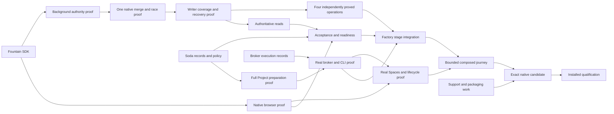
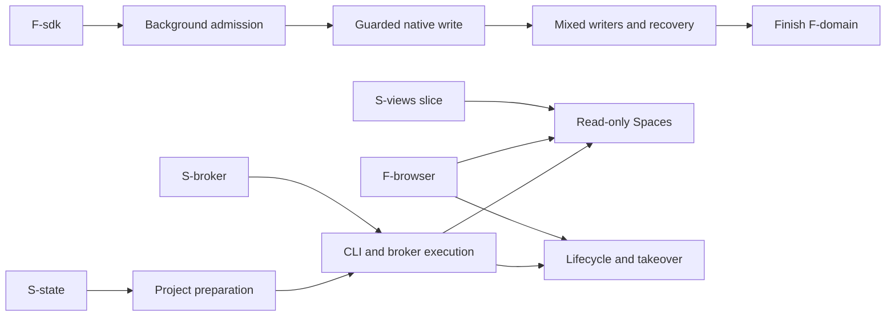

# Factory implementation plan

The planning target is Soda's automatic issue → readiness → coding → PR →
review/fix → native merge → unblock loop, running in persistent Projects and
visible through Spaces. Fountain supplies generic native collaboration and
extension capabilities; Soda owns factory policy and environment coordination.

This plan establishes the planning baseline, maps requirements to finished
deliverables, identifies source changes, references the defined implementation
interfaces, establishes their dependency graph and places the uncertain native
integrations into early implementation-and-proof milestones. The
[implementation tasks](#reviewable-implementation-tasks) define reviewable outcomes,
owners, prerequisites, changes, checks and completion conditions.
[Integration, cutover and qualification](#integration-cutover-and-qualification)
define how those outcomes join, when features become usable and when to demonstrate
and qualify the complete product. Requirement coverage, boundaries, dependencies
and cost have been independently reviewed. Implementation and native proof remain
the work specified by this plan. The [execution readiness](#execution-readiness)
section distinguishes the settled decisions from remaining implementation risks.
Planning is complete; no implementation, build or qualification is authorized by
this document alone. The linked owning guides remain authoritative for behavior,
and this plan does not duplicate or replace their requirements.

The sole appliance target is **x86_64**, under the
[release platform contract](../architecture/release.md#architectures). ARM support
and qualification are excluded; no ARM machine or evidence is a handoff prerequisite.

## Source baseline

Recorded on September 30, 2026, before this planning edit:

| Repository | Exact commit | Working tree at capture |
| --- | --- | --- |
| SodaOS (`sodaos`) | `079edf0d017d595bfc277be77440267d11f166fc` | Clean |
| Fountain (`forgejo-ext`) | `c22b3543f6a1f88ede70ed3f046576b725430934` | Clean |

These revisions identify the source and contract inputs to planning, not installed
appliance versions or qualified release artifacts. Planning commits can extend
this document without changing that starting pair. Before assigning implementation
changes against later source, reconcile the affected differences; do not reset a
checkout to this baseline or discard intervening work. Toolchain and dependency
versions remain in the selected source manifests and locks.

## Owning contracts

| Subject | Authoritative planning input |
| --- | --- |
| Product outcome and feature disposition | [Factory workflow](../product/overview.md#software-factory-workflow) and the complete [scope guide](../product/scope.md), including supporting features. |
| Readiness and accepted requirements | [Blockers](../product/overview.md#readiness-and-blockers), [accepted native records](../product/overview.md#accepted-requirements-and-native-records), and their invalidation/reassessment rules. |
| Prompts, capacity and intervention | [Prompt assembly](../product/overview.md#prompt-assembly), [concurrency and usage limits](../product/overview.md#concurrency-and-usage-limits), [review/correction](../product/overview.md#review-and-correction), [merge conditions](../product/overview.md#automatic-merge-conditions) and [human intervention](../product/overview.md#human-intervention). |
| Environment and sessions | [Projects](../product/projects.md), including [approved preparation](../product/projects.md#preparing-the-environment), accounts/checkouts, creation and persistence; [Spaces](../product/spaces.md) owns session views and interaction boundaries. |
| Architecture and ownership | [Factory architecture decisions](../architecture/overview.md#factory-architecture-decisions), shared execution, native observations and persistence boundaries. |
| Authority and privilege | [Factory grants](../architecture/trust.md#factory-authority-boundary), [Project execution](../architecture/trust.md#project-execution-boundary), [preparation authority](../architecture/trust.md#project-preparation-authority) and [host helper](../architecture/trust.md#host-helper). |
| Fountain operations and recovery | [Generic consumption boundary](../architecture/trust.md#fountain-consumption-boundary) and [conditional mutations](../architecture/trust.md#conditional-native-mutations): publication, PR creation, review and merge; background authentication, callback binding, participating writers, cancellation and recovery. |
| Provider identity | [Identity Broker](../reference/credentials.md#identity-broker) and provider-specific subscription custody, concurrency, execution and return contracts. Native forge authentication remains separate. |
| Retained appliance support | [Networking](../architecture/networking.md), [runners](../reference/runners.md), [Project OS](../reference/project-os.md), [human terminals](../reference/terminal.md), [native services](../guides/project-services.md) and [operator setup](../guides/operator-setup.md), under the scope guide's retain/adapt decisions. |
| Acceptance and delivery | [Finished factory demonstration](testing.md#finished-product-demonstration), [acceptance cases](testing.md#acceptance-cases), [preparation acceptance](testing.md#project-preparation-acceptance), [conditional operation acceptance](testing.md#conditional-operation-acceptance), [evidence rules](testing.md#evidence-rules) and the [release architecture](../architecture/release.md). |
| Engineering and documentation | Repository [instructions](../../AGENTS.md), [Go ownership](go.md), [TypeScript](typescript.md), [Python tooling](python.md) and [documentation authority](../README.md#authority-rules). Use existing ownership and focused checks; keep one current implementation. |

Product and architecture guides describe the target. Reference guides describe
interfaces present in the baseline and do not override the target with the older
manual factory workflow. The [capability map](../research/factory-capability-map.md)
is source/evidence material for deriving changes, not an additional requirements
owner or proof that all mapped capabilities work together.

## Execution readiness

The plan is finalized for its recorded baseline and exclusions. All known review
findings are resolved: the capability graph includes protected release admission,
delivery promises attributable artifacts rather than reproducible builds, shared
capabilities are introduced with their consumers, and superseded planning gaps
have been removed. The implementation tasks provide outcomes, owners, prerequisites,
coupled changes/removals, verification and completion conditions.

**No known unresolved major product or architectural decision prevents execution.**
The owning contracts select the factory behavior, authority boundaries, component
interfaces and supported first paths. Implementers need not invent those choices.
Repository-specific tooling/checks, actor bindings, provider sponsorship and grants
are inputs supplied through the defined product and administration interfaces;
they are not missing product design. Selecting bounded fixtures and the first
harness to prove is an implementation choice within those contracts.

The remaining uncertainty is whether the chosen mechanisms meet their contracts
on the actual native paths. It is assigned to implementation and proof work:

| Remaining implementation risk | Assigned work and decisive evidence |
| --- | --- |
| Native package and background authority may behave differently through deployed peers, namespaces or restarts. | FT01–FT02 and M1a prove the real independent consumer, browser/service admission and actor binding before operation consumers rely on them. |
| The reservation may miss an ordinary writer, callback or deferred effect, or recovery may not establish whole-domain quiescence. Complete native coverage is the largest implementation breadth risk. | FT03–FT04 / M1b–M1c test the mechanism before FT05–FT09 broaden coverage. FT10–FT14 require the complete domain and their own read/operation proofs; partial merge evidence cannot enable them. |
| Approved tools, setup and service access may not produce isolated, usable coding and review environments in the full Project OS. | ST01 / M2 prove preparation and human-data preservation; ST05 proves the real maintainer/administrator approval journey. Missing privileged preparation remains an explicit wait. |
| Actual CLI custody, process identity, delayed starts or credential return may violate the scoped execution contract. | ST02 / M3 prove each exposed harness and broker/host boundary, including targeted stop and restart reconciliation. Unproved harnesses remain unavailable. |
| Real Spaces attachment, intervention or takeover may fail to preserve execution identity, current authority or unrelated human activity. | ST03–ST04 / M4a–M4b prove browser observation, lifecycle controls and safe transfer independently before composition. |
| Individually working components may fail when composed or installed as the exact shipping candidate. | ST15 proves the real development loop; ST13–ST14 cover removal and retained support. RT01–RT03 establish protected admission, candidate/media identities and affected native x86_64 qualification. |

These risks are not unresolved decisions or permission to add alternative runtimes,
authentication workarounds or speculative recovery services. Follow the
[milestone failure rules](#passing-evidence-and-failure-handling): stop the affected
dependent work, establish the smallest missing fact and reconsider necessity and
cost before expanding. If evidence contradicts an architectural assumption, resolve
that new decision in its owning contract with the required fresh Jev consultations.
Otherwise, complete the assigned implementation and checks without reopening settled
product behavior. A passing plan review is not native proof or product completion.

## Implementation goal completion

The implementation goal covers **all 32 tasks: FT01–FT14, ST01–ST15 and
RT01–RT03**, including their required proofs, the composed factory demonstration
and native x86_64 qualification. These are completion requirements, not optional
work after the code is committed.

A task is complete only when its required implementation and coupled removals are
integrated, its original **Done** criterion is satisfied, and its required checks
and upstream proofs pass at the scope and source revisions actually consumed.
Record the implementation commits and scoped evidence with that task. A commit,
passing unit tests or a subagent's completion report alone cannot establish task
completion. Apply the [consumer-proof rules](#start-readiness-and-consumer-proof)
and the acceptance owner's [evidence rules](testing.md#evidence-rules); reuse valid
evidence without treating it as proof of a different boundary.

Mark the overall goal complete only after every task meets that standard,
**ST15** passes the real [composed factory journey](testing.md#finished-product-demonstration),
and **RT03** qualifies the exact **RT02** candidate on native x86_64 through the
protected release path. Final review must reconcile all task IDs with their
implementation and required evidence and close material findings. Retain the
[completion receipts](testing.md#recording-completion) and report the actual
qualified scope. Qualification does not authorize publication or production
activation beyond the existing task scope.

Missing access, an unavailable fixture, exhausted capacity or an unresolved
failure leaves the affected task and overall goal incomplete. Report the task ID,
missing proof and concrete prerequisite or next action; continue independent
ready work. Do not silently waive a required proof, narrow the goal or count
unexecuted, failed or merely authored checks as passes.

## Deliverable map

Each row identifies a finished outcome derived from the linked requirements.
The IDs provide traceability for later implementation tasks; they are not execution
order, milestones, new requirements or completion claims. **Soda** owns factory
policy, its backend/UI and privileged integration. **Fountain** owns generic
extension/native-operation contracts. **Upstream** supplies the existing native
services and protocols to consume, not a parallel implementation to build.

The evidence column describes what will establish completion. Reuse valid evidence
at its stated scope; do not repeat every check for every task. Detailed acceptance
remains in [Testing](testing.md#factory-acceptance). The source inventory below
locates the changes; the [interface definition](#interface-definition) specifies
their boundaries and the [dependency graph](#dependency-graph) orders their integration.

### Native extension foundation

| Deliverable and requirements | Finished native capability and backend behavior | Privileged operations and user interaction | Ownership | Completion evidence |
| --- | --- | --- | --- | --- |
| **D01 — Consumable extension platform.** [Fountain boundary](../architecture/trust.md#fountain-consumption-boundary), [extension maintenance](../architecture/trust.md#maintaining-the-forgejo-extension-layer). | An independently built Soda extension consumes the supported SDK and declared capabilities. Installation, replacement, enable/disable, required-package behavior and existing selected policy hooks preserve their native enforcement and diagnostics. Package-only changes do not require rebuilding the host. | Native administrators manage trusted packages through the native interface. Soda's backend, database, broker and host-helper access remain isolated from the extension host. No agent receives package administration. | **Fountain:** SDK, host lifecycle/capability enforcement and generic policy seams. **Soda:** package, isolated service and consumption. **Upstream:** native operations beneath those seams. | Independent consumer build, package lifecycle and real native bridge/isolation checks. Selected policy coverage includes actual signup/admin/API/external-auth/import/CLI refusal on timeout, crash or missing required package, without identity/filesystem side effects. Reuse applicable earlier evidence; package metadata alone is insufficient. |
| **D02 — Native browser and stream integration.** [Spaces integration](../product/spaces.md#integration-boundary), [frontend/session authority](../architecture/trust.md#frontend-and-session-boundary). | Native login admits Soda pages, persistent panel, requests and bounded streams with current actor/repository authority. Session change, logout, permission loss and extension shutdown enforce the selected transport contract; no second login or browser credential is needed. | Native navigation exposes the Soda contributions and retains their permitted mounted views. Browser attachments receive no host privilege or execution grant merely by connecting. | **Fountain:** admission, contribution host and transport. **Soda:** consumer checks and Lit views. **Upstream:** native sessions/routes. | Real-browser/native HTTP and WebSocket journeys, forged authority/Origin refusal, stale-session denial and safe account switching; native navigation preserves the actual terminal view. D19 adds factory-specific observation. |
| **D03 — Background actor authentication.** [Background authentication](../architecture/trust.md#background-authentication). | Stable installation identity and runtime/service admissions authenticate unattended requests. Explicit installation/actor/token/repository/operation bindings intersect current native permissions and credential generations. Reconnect/restart cannot renew an old operation's intent or impersonate another installation. | Native administrators enroll bounded actor bindings; Soda retains credentials in protected service inputs. Browser logout does not end valid background authority. Deployment verifies actual Unix peer identities and user-namespace mappings. | **Fountain:** generic admission, binding and native verification. **Soda:** protected caller configuration. **Upstream:** native repository-restricted credentials and Unix identity. | Authenticated unattended calls after logout; wrong peer/installation/actor/kind/repository and rotated/revoked credential refusals; restart and owned lookup/cancellation checks without exposing secrets. |
| **D04 — Authoritative collaboration inputs.** [Accepted native records](../product/overview.md#accepted-requirements-and-native-records), [native observations](../architecture/overview.md#native-observations-and-accepted-inputs). | Permission-checked reads expose exact issue/comment revisions, title/lifecycle events, dependency occurrences, PR/review/ref/check state and verified creation provenance where required. Atomic native revision/occupancy reads bracket current input reads. Native text and relations remain canonical; Fountain does not interpret acceptance or blocker semantics. | Existing native issue/dependency/comment interfaces remain usable. Soda can show source links and exact acceptance inputs without direct forge database access or leaking inaccessible records. No host privilege is needed. | **Upstream:** records, permissions and observations. **Fountain:** missing generic snapshot/read surfaces. **Soda:** supported consumption. | Native visibility/version/occurrence checks, including edit/revert, delete/recreate, hidden dependencies and edited initial content. Cached text or author names must not establish current provenance. |
| **D05 — Ordered native mutations and recovery.** [Conditional operations](../architecture/trust.md#conditional-native-mutations), [participating writers](../architecture/trust.md#participating-native-writers), [recovery](../architecture/trust.md#recovery-authority). | The selected reservation/revision mechanism covers all participating native writers and bound callbacks. All four operation kinds expose SDK submission, lookup and cancellation with immutable identity, cancellation-before-submission records and attributable receipts across restart. Effect, completion and cancellation remain distinct; expiry limits admission, not physical publication. Busy native queues retain work and uncertain writers stay fenced. Soda records intents before dispatch and rereads/advances only from attributable receipts and required completion. D11, D12 and D14 consume the specific operation kinds. | Native operator diagnostics expose busy, pending cancellation and uncertain effects accurately. Only the specified offline operator recovery can release an interrupted owner after whole-domain quiescence and reconciliation of both conditional and ordinary native effects; no timed force-unlock or agent bypass. Execution secrets and native credentials stay private/redacted. | **Fountain:** generic gate, operation ledger, binding and recovery. **Upstream:** native Git/SQL/services. **Soda:** caller tracking, withdrawal and appliance recovery integration. | Native writer/callback coverage, stale-state and both cancellation/write orderings, duplicate/changed-intent refusal, controller/host restart, completion failures and offline recovery. The prototype's single merge path does not qualify all writers. |

### Factory behavior

| Deliverable and requirements | Finished native capability and backend behavior | Privileged operations and user interaction | Ownership | Completion evidence |
| --- | --- | --- | --- | --- |
| **D06 — Factory enablement and standing grants.** [Factory authority](../architecture/trust.md#factory-authority-boundary). | Separately recorded repository policy, appliance capacity and provider sponsorship authorize unattended accepted work. Current authority governs enablement, selected actors/roles/checks and withdrawal; issue content, a browser session or one grant cannot substitute for another. | Repository administrators configure factory policy, operators allocate capacity, and provider owners sponsor connections. Controls expose which authorization is missing or withdrawn without exposing private credentials. | **Soda:** grants, policy and controls. **Fountain/upstream:** native identity and permission evidence. | Missing/withdrawn-grant refusals, cross-authority denials, operation cancellation on withdrawal, and valid background work after browser logout. |
| **D07 — Accepted requirements and resolutions.** [Acceptance rules](../product/overview.md#accepted-requirements-and-native-records). | Soda records the approver and exact native inputs/outcomes through authenticated acceptance or the narrowly verified initial-creation route. Changes invalidate affected acceptance and pending write authority; comments, labels and agent assertions do not approve scope. | A code-write maintainer sees and adopts exact objectives, dependencies, selected answers and resolutions; stale acceptance submissions refuse. The UI distinguishes current accepted inputs, proposals and historical decisions. No privileged environment action is implied. | **Soda:** acceptance records, comparison and interaction. **Fountain/upstream:** D04 reads and authenticated human authority. | Native acceptance/invalidation cases: issue and selected-comment edits, edge replacement, approver loss, code/non-code outcomes, conflicting updates and delayed notifications. Unselected discussion does not reset accepted scope or allowances. |
| **D08 — Automatic intake and readiness.** [Workflow](../product/overview.md#software-factory-workflow), [blockers](../product/overview.md#readiness-and-blockers). | One coordinator consumes authenticated observations and bounded authoritative reconciliation. It discovers eligible issues, deduplicates events, evaluates declared dependencies and missing requirements, and reassesses only relevant changes. Cycles, inaccessible evidence and unproved prerequisite outcomes remain blocked. | Work status exposes a specific blocker, supporting native links and what would resolve it. Maintainers answer/adopt through D07. No routine operator admission is required; missing events cannot permanently hide work. | **Soda:** coordinator/readiness. **Upstream:** native webhook and collaboration machinery. **Fountain:** generic reads/transport where needed. | Issue/dependent journey; missed/duplicate observations; longer dependency cycles, hidden prerequisites and unchanged-blocker suppression. Closure alone must not satisfy a required code outcome. |
| **D09 — Bounded scheduling and accounting.** [Concurrency and usage](../product/overview.md#concurrency-and-usage-limits). | Durable attempt/resource/usage reservations select the oldest eligible ready work within appliance, repository and provider limits. Resource waits release execution capacity; resume, duplicate events and changed inputs do not replenish budgets. Explicit retry retains historical and rolling consumption. | Operators, repository authorities and provider owners control only their own limits. Queue/wait/usage state explains why work cannot start. Native process/resource enforcement remains bounded; no paid, provider or account fallback occurs. | **Soda:** scheduler and accounting. **Upstream:** process/resource and provider restrictions. | Deterministic short-limit checks plus actual resource/lease enforcement, shared-connection accounting, failed execution, correction consumption and refusal when limits cannot be established. |
| **D10 — Inspectable coding assignments.** [Prompt assembly](../product/overview.md#prompt-assembly), [checkout ownership](../product/projects.md#accounts-and-checkout-ownership). | Each coding run receives recorded accepted inputs, approved-base guidance, environment context, template/role, checkout and selected harness/model/connection. It produces candidate changes, actual check evidence and blockers within that assignment; fresh runs preserve only the permitted attempt state. | Spaces/work context exposes the assignment and outcome without secrets. Native execution uses D16–D18; prompts cannot grant privilege, change policy or let candidate instructions replace authoritative inputs. | **Soda:** assignment, prompt/result handling and UI. **Upstream:** selected CLI and Git. | Inspect a real run's bound inputs and outputs; verify instruction precedence, secret exclusion, blocker reporting, retained coding work and a fresh run identity. |
| **D11 — Candidate publication and PR creation.** [Publication](../architecture/trust.md#candidate-ref-publication), [PR creation](../architecture/trust.md#pr-creation). | A separate publisher validates the candidate and uses two distinct conditional operations: exact-ref creation/fast-forward publication, then same-repository native PR creation. Publication registration waits without holding the reservation; only one matched receive can start. PR records and the primary receipt commit together, with derived refs/notifications tracked separately. Corrections target the recorded prior candidate and existing PR. Native receipts attribute each effect; later failure does not undo earlier success. | Users see the linked issue/attempt, native candidate PR and any incomplete publication outcome. Publisher credentials stay outside agent sessions; no unguarded push/POST fallback or adoption of a similar PR. | **Soda:** candidate validation, policy, linkage and sequencing. **Fountain:** conditional receive/create and receipts. **Upstream:** Git transport and PR services. | Exact head/base/ref and protected-path refusals; unexpected refs, duplicate PRs, cancellation on both sides of commit, lost replies and incomplete native completion. A matching branch or PR is not attribution. |
| **D12 — Review and correction.** [Review rules](../product/overview.md#review-and-correction), [native review submission](../architecture/trust.md#review-submission). | A distinct reviewer gets a fresh exact-candidate checkout and independent Git/configuration, reports supported findings and submits a commit-bound final review through its separate native actor; review records and the primary receipt commit together before native completion. Only the coder fixes the candidate; every changed head gets fresh required checks and review within remaining limits. | Native body-only reviews and Soda findings show actionable defects, disputes and correction outcomes. No reviewer publication or self-approval; non-progress reaches maintainer intervention. No additional root permission is granted. | **Soda:** role separation, findings/fix loop and eligibility. **Fountain:** conditional review operation. **Upstream:** review records/rules. | Real same-Project coding → findings → correction → fresh review, plus wrong actor/head/base, pending-draft/self-review and duplicate/lost-response refusals. Earlier reviews cannot approve changed candidates. |
| **D13 — Complete native CI evidence.** [Merge conditions](../product/overview.md#automatic-merge-conditions), [runner boundary](../reference/runners.md). | Soda evaluates the nonempty complete configured check set for the exact candidate and verified base. Native Actions schedules work on separately managed capacity. Missing, skipped, cancelled, stale or failed checks cannot pass; candidate edits to approval definitions require separate adoption. | Work/PR context links native checks and distinguishes actionable failures from unavailable infrastructure. Native Actions exposes separately managed runner capacity. Obsolete Soda runner resources receive explicit transition cleanup under D24; local runner creation and host-account execution stay deferred. | **Upstream:** Actions/checks and runner execution. **Soda:** evidence policy and observation. **Fountain:** generic authoritative access and D05 writer participation. | Native check-set and candidate/base matching, failure/infrastructure waits, changed-policy refusal and separately managed capacity; no substitute CI engine or agent success narrative. |
| **D14 — Automatic merge and dependent pickup.** [Merge policy](../product/overview.md#automatic-merge-conditions), [initial native method](../architecture/trust.md#initial-merge-methods). | Current Soda eligibility requests conditional native fast-forward-only merge of the reviewed head and verified base. Native permissions/protections remain effective. Completion requires attributable merge, native bookkeeping and the approved issue outcome before dependent work is reconsidered. | Native PR/issue state and factory status distinguish committed, completed, cancelled and uncertain results. Unsupported methods/diverged candidates refuse without policy fallback; native human-review requirements remain binding. | **Soda:** eligibility, operation consumption and unblocking. **Fountain:** generic conditional merge. **Upstream:** native merge/protection/issue machinery. | Changed head/base, stale authority, native protection refusal, both cancellation orderings and lost-response recovery; a confirmed first issue automatically makes its eligible dependent runnable. |
| **D15 — Intervention and interrupted work.** [Human intervention](../product/overview.md#human-intervention), [Project persistence](../product/projects.md#persistence). | Pause, cancel, resume, retry and takeover affect the correct attempt and all its outstanding operations. Stop/reconcile recorded executions and credential use; preserve unfinished work and remaining allowances. Controller interruption cannot silently resume a conversation or duplicate execution. Cleanup failure stays separate from the work outcome. | Authorized controls show pending withdrawal, confirmed cancellation or intervention. Takeover transfers work to the member's own checkout/credentials after confirmed stop/return. Native helper effects are limited to the assigned execution and owned scratch. | **Soda:** control, state, broker coordination and UI. **Fountain:** native cancellation/lookup. **Upstream:** process and storage primitives. | Native intervention/interruption cases, committed effects preserved, no restart on issue reopen, safe explicit retry/takeover and surviving human sessions/data. |

### Project execution and human work

| Deliverable and requirements | Finished native capability and backend behavior | Privileged operations and user interaction | Ownership | Completion evidence |
| --- | --- | --- | --- | --- |
| **D16 — Persistent Project and account foundation.** [Environment model](../product/projects.md#environment-relationships), [creation](../product/projects.md#creation-and-ownership), [execution authority](../architecture/trust.md#project-execution-boundary). | One retained Rocky-headless Project serves each supported repository. Authorized create/start/reuse establishes separate coding/review roles and checkout ownership without human membership. Native identity/incarnation bindings survive as appropriate; unsupported ownership/profile and incomplete provisioning require intervention. | Fixed helper operations create/start/stop and provision bounded role/layout state. Human Join stays explicit. Current owner/operator lifecycle authority differs from membership or code-write permission. Start/Stop controls coordinate holds and credential return without replacing roots. | **Soda:** association, authorization, accounts and lifecycle integration. **Upstream:** Linux accounts, Podman/systemd, Git and persistent storage. | Native absent/existing Project paths, role permission separation, wrong authority/incarnation refusals, independent Git metadata and coordinated Stop/Start preserving human dirty work, tools and service volumes. |
| **D17 — Usable approved environment.** [Preparation](../product/projects.md#preparing-the-environment), [preparation authority](../architecture/trust.md#project-preparation-authority). | Accepted native tooling/setup/service inputs produce verified installed tools, protected setup selection, role-private dependencies and assigned disposable test resources. Both coding and fresh review checkouts pass actual tool/build/service checks before agent credential use; drift or partial setup cannot pass as ready. | Native Project administrators prepare shared packages/mise/services; factory roles receive only ordinary setup and scoped data access. UI reports missing prerequisites, preparation results and maintenance holds. No engine socket, root recipe, new manifest or automatic privileged installer is added. | **Soda:** approval binding, preparation coordination and readiness evidence. **Upstream:** package/mise/build and native service tools. | [Full Project preparation cases](testing.md#project-preparation-acceptance), including candidate dependency changes, rejected privileged/configuration effects, enforced data separation, partial failure and retained human state. |
| **D18 — Broker-bound agent execution.** [Provider custody](../reference/credentials.md#identity-broker), [run boundary](../architecture/trust.md#project-execution-boundary). | Every exposed harness runs under the intended non-login role with a fresh home/config/auth and exact Project/container/run/checkout/process-generation binding. Subscription sponsorship, provider concurrency and lease return work with targeted descendant termination; stale or unreturned execution cannot release the connection for reuse. | Protected broker/helper channels stay outside Projects. Account enrollment/selection and intervention remain usable without exposing secrets. Ending a run must preserve unrelated terminals/services; provider lease ownership is independent of the viewer. | **Soda:** broker, provider adapters, attestation and scoped launch/return. **Upstream:** supported CLI authentication and Linux process controls. | Bounded real CLI/broker execution for every selectable factory harness, plus stale-binding and failed-return checks. Synthetic credentials, provider enrollment or the old disposable-worker receipt alone cannot qualify it. |
| **D19 — Live factory Spaces and controls.** [Sessions/views](../product/spaces.md#sessions-and-views), [factory visibility](../product/spaces.md#factory-visibility). | Spaces shows the actual supervised CLI and its issue/attempt/run/candidate context beside human sessions. Views are read-only attachments; splits/navigation/hide/close do not change execution identity or lifetime. Current code-write authority governs live access and controls. | Native contribution views expose blockers, queues, preparation, checks and intervention from the other deliverables. Human terminal input/End cannot control a factory run; factory actions use D15. No transcript-replay or conversation-resume product is implied. | **Soda:** inventory, authorization, UI and execution attachment. **Fountain:** D02 generic persistent host/stream. **Upstream:** terminal primitives. | Real rendered factory route, rejected input/control forgery, navigation/reconnect continuity, permission loss and safe account switching. Mock UI plus native tmux proof is insufficient. |
| **D20 — Retained human development access.** [Join](../product/projects.md#explicit-joining), [Project access](../product/projects.md#access), [terminal](../reference/terminal.md), [Project CLIs](../guides/project-clis.md). | Explicit Join establishes real stable native-user/Linux membership. Member terminals, tmux tabs/splits, explicit-key SSH/SCP/SFTP, personal checkouts and native `tea`/`gh`/Git authentication remain usable without borrowing factory accounts or credentials. Existing access-loss and persistence semantics remain intact. | Fixed account/public-key and terminal operations enforce current Soda execution authority. Human UI distinguishes Create, Join, Open and End; opening a terminal cannot create/start a Project. No private-key onboarding, host developer account or automatic Linux offboarding expansion. | **Soda:** membership/access and terminal integration. **Upstream:** Linux/OpenSSH/tmux/Git/CLIs. **Fountain:** native caller authority. | Real Join, managed terminal and external access journeys, wrong-permission/identity refusals, native Git use and dirty-work preservation while factory work runs. |

### Supporting appliance capabilities and delivery

| Deliverable and requirements | Finished native capability and backend behavior | Privileged operations and user interaction | Ownership | Completion evidence |
| --- | --- | --- | --- | --- |
| **D21 — Private networking and HTTPS.** [Networking](../architecture/networking.md), [operator setup](../guides/operator-setup.md), [retained scope](../product/scope.md#appliance-networking-ci-and-delivery). | Project/service addresses have usable LAN routes; Caddy and native browser origin provide private HTTPS with configured client trust. Optional host/project Tailnet preserves operator policy, opt-in and separate device identities. Baseline readiness works without Tailnet or domain purchase. | Existing operator/Tailnet controls use fixed network/helper operations; factory issues grant no network or trust changes. Human service access remains ordinary native ports. | **Soda:** configuration, controls and companion integration. **Upstream:** Linux networking, Caddy and Tailscale. **Fountain:** control-route authority. | Actual client/service connectivity, private HTTPS/origin and optional enrollment-policy checks on the changed path. An observed IP or host Tailnet enrollment alone is not connectivity proof. |
| **D22 — Operator administration and fixed helpers.** [Host helper](../architecture/trust.md#host-helper), [setup](../guides/operator-setup.md), [Cockpit](cockpit.md). | Bootstrap establishes the correct native operator/appliance identity. The isolated backend invokes only authorized fixed host operations with restricted secret inputs. Stock Cockpit continues to provide native diagnosis and administration; no custom Project-management subsystem is restored there. | Native operators retain host logs, storage, networking and service tools. Repository and provider authorities cannot acquire host administration; helper/broker sockets are not exposed through the extension host or Project. | **Soda:** bootstrap, helper validation, packaging and isolation. **Upstream:** Cockpit and host administration. **Fountain:** native identity/permission inputs. | Real setup/helper authorization and isolation checks, rejected arbitrary commands/cross-Project targets and retained Cockpit/operator journeys; protect secret-bearing diagnostics. |
| **D23 — Retained presentation and attribution.** [Supporting feature disposition](../product/scope.md#appliance-networking-ci-and-delivery), [branding](../design/branding.md). | Soda branding, avatars, console guidance, canonical assets and attribution remain integrated through supported extension/image surfaces. Native Forgejo presentation stays native; superseded copies and standalone shell assets are absent. | Human-facing pages, account imagery and console guidance remain coherent and usable. No new privilege or authentication surface is introduced for presentation. | **Soda:** owned assets, UI and packaging. **Fountain/upstream:** supported native surfaces. | Affected source/browser/branding checks and installed asset/notices inspection; verify actual rendered surfaces rather than screenshots of obsolete pages. |
| **D24 — One current implementation and cutover.** [Retirement decisions](../product/scope.md#retire), [documentation authority](../README.md#authority-rules). | Replaced OAuth/Git mediation, manual/disposable factory paths, obsolete runner artifacts, presentation patches, formats/callers/configuration/staging and fixtures are removed together. Operator tools and Spaces address one coordinator. Owning references document only interfaces that actually ship. | Existing retained workflows transition to the new native paths without a second login, engine or compatibility branch. Cleanup affects only identified task-owned/obsolete resources; human/project state remains protected. | **Soda:** consumer/runtime removal, caller and documentation cutover. **Fountain:** superseded host seams if applicable. **Upstream:** retained functionality. | Affected caller/staging checks and real retained journeys demonstrate the new path is used. Review removals with replacements; no new permanent subsystem whose sole purpose is detecting retired code. |
| **D25 — Attributable native appliance delivery.** [Release architecture](../architecture/release.md), [release workflow](release.md), [native input contract](native-support.md#build-and-artifact-contract), [extension maintenance](../architecture/trust.md#maintaining-the-forgejo-extension-layer). | The existing producer/staging/installation/update path carries exact Fountain, SDK/Soda package, service, Project OS and notice/source identities. Release admission rejects failed, cancelled, incomplete or mismatched evidence; native qualification selects the actual candidate bytes; upstream maintenance remains attributable without incidental version upgrades. Backup/recovery and protected existing state remain supported. | Existing native operator installation/activation and recovery retain their authorization boundaries. Build/release or production rollout is not a factory agent action. No failed release is relabeled as qualified. | **Soda:** packaging, producer, installation and qualification. **Fountain:** host/SDK artifacts and generic package integration. **Upstream:** CoreOS/rpm-ostree/container delivery primitives. | Native x86_64 candidate/install/update/recovery evidence, exact artifact provenance, admission refusals and state preservation. Development/cross-build evidence does not qualify the appliance. |
| **D26 — Demonstrated complete factory.** [Finished product demonstration](testing.md#finished-product-demonstration), [completion evidence](testing.md#recording-completion). | One installed supported system composes the preceding outcomes: accepted issue and blockers → ready Project → real coding CLI → native PR → separate review/fix → complete CI → conditional merge → confirmed issue outcome → eligible dependent pickup. | Actual Spaces and human intervention/access coexist with the loop, protected credentials and preserved human work/services. Normal progress needs no manual issue admission or routine human merge. | **Soda:** composed product and evidence. **Fountain/upstream:** demonstrated native dependencies, not substituted mocks. | The specified real provider/broker/browser/native collaboration journey plus focused rejection/race cases. Receipts bind actual source/runtime/architecture, authority/input/candidate identities, usage and cleanup; no component test or Jev verdict substitutes for composition. |

### Coverage and boundaries

The scope guide's factory/identity features map to D01–D15 and D18; Projects,
Spaces and human access to D16–D20; networking, native CI, operator support,
presentation and delivery to D13 and D21–D26. The retired paths map to D24.
Deferred and excluded features stay outside this map rather than
becoming prerequisites or placeholder functionality.

Unfinished extension/appliance work from the earlier plan maps to D01–D05 and
D21–D25, including the delivery owners in the source inventory below. That mapping retains
the required outcome, not the old task order, proposed implementation or claim of
qualification. The [interface definition](#interface-definition) fixes component
contracts and the [dependency graph](#dependency-graph) establishes prerequisites.
The [early integration milestones](#early-integration-milestones) put native proof
before dependent expansion; the [task breakdown](#reviewable-implementation-tasks)
assigns executable changes and checks. The
[integration sequence](#integration-cutover-and-qualification) groups delivery,
replaces old callers and schedules demonstration and qualification.

## Interface definition

The [factory interface owner](../architecture/factory-interfaces.md) defines the
target component APIs, persistent records, state transitions, process bindings
and UI actions. Product and security rules remain in their existing owners; the
current API reference is not relabeled as an implemented target API.

| Deliverables | Defined interface boundary |
| --- | --- |
| D01–D05 | Generic Fountain background SDK admission, native snapshots and four typed operation intents; native records/results continue to follow Trust's operation and reservation protocol. |
| D06–D15 | Authenticated policy/grant/acceptance/work controls, one Soda ledger, local CAS and ordered withdrawal/dispatch, scheduling/usage records and attributable stage transitions. |
| D16–D20 | Canonical Project preparation/checkout identities, fixed host preparation and one-time launch/stop, execution-unique broker acquisition, exact process binding, read-only output and separate human takeover. |
| D21–D26 | Existing networking/operator/delivery interfaces retain ownership; source inventory changes integrate packaging, removal and composed qualification with these boundaries. |

The bounded source check used Soda `edc10d7dc4c114e37cf6e3a0ec3c77bb31124f71`
and Fountain `c22b3543f6a1f88ede70ed3f046576b725430934`; the intervening Soda
commits since the baseline are documentation only. Newly resolved decisions are
to host the coordinator in the existing backend/store, and to put the broker/native
launch handshake in fixed host execution code. This requires publisher Git in the
backend image and stronger durable run/acquisition receipts; it does not claim
the existing human launch helper is already retry-safe.

Three fresh Jev requests, an independent complete-request wording/equivalence
audit, all responses and the source-grounded decision record are retained in
`.artifacts/factory-implementation-interfaces-20260930/jev/`. All three supported
both choices. Agreement is advisory; native restart, credential and writer-boundary
evidence is still required by the acceptance contract. No product/runtime code,
build or installed qualification is part of this interface-definition step.

## Dependency graph

This graph uses Soda `8548d85042e0cdc85a0a1eadec668f4ee0c1c927` and Fountain
`c22b3543f6a1f88ede70ed3f046576b725430934`, both clean at capture. Soda's changes
since the planning baseline remain documentation only. No new architecture choice
is introduced here: the edges follow the agreed interfaces, source inventory and
[remaining native boundaries](../research/factory-capability-map.md#remaining-decisive-boundaries).

The node tables below describe capability prerequisites. **Work** nodes produce
bounded implementation; **Native** nodes include implementation and a focused
demonstration of the actual capability. A downstream consumer must have that
native evidence before building integration that relies on the uncertain boundary.
DTOs, pure policy, fixtures and component views can be authored earlier against
the agreed contracts; they do not satisfy a Native node. Small drivers and the
minimum deployment wiring needed to demonstrate a boundary belong to that node,
not to the eventual complete factory or production release.

Prerequisites are direct edges; transitive edges are omitted. `—` means the
selected source/contracts are sufficient to start, not that existing upstream
behavior needs rewriting. Each node includes its affected caller/configuration/
fixture removal from the source inventory. These are dependency groups, not new
features, time estimates or independent approval gates.

Shared Work nodes such as S-state, S-views and A-package are supplied in the slices
needed by their consuming tasks. An arrow does not require every later policy,
view or packaging behavior before an early native proof. The
[task prerequisites](#reviewable-implementation-tasks) define concrete completion
order, including coupled retirement and product integration; their grouped
capability coverage is recorded in [task handoffs](#task-coverage-and-handoffs).

### Fountain foundation and native operations

| Node | Kind / deliverables | Prerequisites | Output that downstream work can rely on |
| --- | --- | --- | --- |
| **F-sdk** | Work; D01 | — | Supported SDK, declared capabilities, package/runtime lifecycle and dispatcher interfaces. Reuse existing selected policy seams and valid evidence. Soda's independently built consumer remains separate from the host. |
| **F-browser** | Native; D01–D02 | F-sdk | Real Soda contribution and bounded stream admission through native login, current actor/repository/session checks, navigation and authority-loss behavior. Includes the narrow consumer/manifest needed for the check; does not require background actor operations. |
| **F-auth** | Native; D03 | F-sdk | Runtime and external Soda service bootstrap with actual deployed Unix peers/namespaces; stable installation identity, actor/token/resource/kind binding, rotation/revocation refusal and installation-owned lookup/cancel admission. This proves admission/ownership authorization; F-core proves durable operation records and cancellation ordering. A minimal SDK caller demonstrates the boundary without a factory loop. |
| **F-core** | Native; D05 | F-auth | Durable reservation/revision and operation identity, trusted execution/callback binding, plus one real native fast-forward merge and a competing input/ref writer. Demonstrate the prepared-to-publication span, both cancellation orderings, retained ownership, native protection, lost reply and restart without duplicate mutation. Port/reuse the scoped prototype cases on the selected implementation; it does not establish full writer coverage. |
| **F-domain** | Native; D04–D05 | F-core | Complete participating-writer/revision coverage, native lock ordering, bounded synchronous completion and fresh ownership for deferred jobs. Demonstrate whole-domain offline stop, restart inhibition, common exact-owner release, ordinary-writer effect reconciliation and the F-core merge recovery path. Each additional conditional kind proves its own effect/completion recovery in its sibling node below. Unknown effect stays fenced. This is the shared consistency prerequisite for every enabled conditional operation. |
| **F-read** | Native; D04 | F-domain | Permission-checked snapshots with native versions, creation/lifecycle evidence, dependency occurrences, refs/reviews/checks and completeness. Equal idle revision brackets reject intervening changes from every relevant writer. Snapshot DTO/read implementation can proceed alongside F-auth/F-core; its authoritative guarantee waits for F-domain. |
| **F-publish** | Native; D05/D11 | F-domain | Registered single-use native receive, exact ref/head/base and correction binding, native protections, attributable effect/completion and cancellation/restart behavior. |
| **F-create** | Native; D05/D11 | F-domain | Native PR insertion and receipt in the same real SQL commit; derived refs/notifications complete separately, with kind-specific effect/completion recovery. Lost reply/cancellation cannot duplicate or adopt a similar PR. |
| **F-review** | Native; D05/D12 | F-domain | Exact-candidate body-only final review, native eligibility, atomic primary receipt, separate completion and kind-specific recovery; stale/draft/replay/cancellation cases. |
| **F-merge** | Native; D05/D14 | F-domain | Supported fast-forward-only SDK operation with the complete merge contract, exact result and native protections, attributable outcome and completion recovery. F-core is reusable evidence for its tested cases, not a substitute for this complete operation. |

The four operation implementations are siblings: PR creation can be tested with
a native fixture branch without implementing conditional publication first;
review and merge can use native fixture PRs. Full operation completion requires
F-domain, but after F-core their implementation and per-kind checks can proceed
alongside writer-coverage/recovery work. Proving merge does not qualify the other
three kinds. No caller gains a temporary unguarded push/POST fallback while waiting.

### Soda execution, consumers and user journeys

| Node | Kind / deliverables | Prerequisites | Output that downstream work can rely on |
| --- | --- | --- | --- |
| **S-state** | Work; D06–D09/D15 | — | Canonical records, CAS/idempotent commands, grants/acceptance/assessment logic, usage and dispatch registration/withdrawal ordering in the existing store/coordinator. Pure scheduling, prompt and evidence predicates can be checked with short deterministic fixtures. No mock authorizes a real launch/write. |
| **S-broker** | Work; D18 | — | Execution-keyed acquisition/lookup/closure, terminal acquisition identity retained after return, broker grant/accounting and canonical binding records. Reuse custody and private transport; real Project execution is proved in S-run. |
| **S-project** | Native; D16–D17/D20 | S-state | Full selected Project OS with owner-authorized creation/reuse, fixed role/layout, separately accepted requirements and privileged effects, installed tools/service access and private setup/readiness for coder and fresh reviewer. Preserve human work/data; preparation needs no AI lease or completed factory loop. |
| **S-run** | Native; D18 | S-project, S-broker | Fixed host launch/inspect/stop/finish with exact run/container/unit/incarnation, durable preparation/start/stop receipts and late-acquire/start fencing. One bounded real broker/CLI run per selectable harness proves credential delivery/return and targeted descendant retirement while human activity survives. Synthetic failure cases cover refusal/uncertainty without wasting provider time. |
| **S-input** | Work; D06–D08 | S-state, F-browser, F-read | Real human acceptance and current authority, native input invalidation, bounded intake/reconciliation and dependency/requirement readiness. Blocking questions remain proposals until the prescribed native records are adopted. |
| **S-launch** | Work; D09–D10/D15 | S-input, S-run | Coordinator reservations, actual approved preparation and broker availability feed recorded assignments and bounded dispatch. Stop/block/pause/restart reconciles existing identities; no silently resumed conversation or refreshed allowance. |
| **S-publish** | Work; D11 | S-launch, F-publish, F-create | Verified coding export → conditional candidate publication → attributable PR creation. Each stage persists its own immutable operation ID and handles withdrawal/lost replies before advancing. |
| **S-review** | Work; D12 | S-publish, F-review | Distinct reviewer assignment and native review; findings return to coder within remaining limits, and changed candidates require fresh evidence. Uses S-run's already demonstrated role/private-state boundary. |
| **S-checks** | Native; D13 | S-state, F-read | Complete configured native check-set assessment for exact head/base using separately managed native Actions capacity. Native status changes participate in F-domain. Use a small fixture workflow; do not depend on human acceptance/intake integration, Soda runner provisioning or a completed AI coding loop. |
| **S-merge** | Work; D14 | S-review, S-checks, F-merge | Current accepted inputs/grants, exact review and CI evidence authorize one conditional merge. Confirm effect, native completion and issue outcome before recording completion and reconsidering dependants. |
| **S-views** | Work; D06–D07/D15/D19 | S-state | Status, settings, acceptance, blocker, usage, preparation and intervention components against defined API records, with explicit pending/uncertain states. Component work does not wait for merge or real agent output. |
| **S-spaces** | Native; D19 | S-views, F-browser, S-run | Observe an actual factory CLI through rendered Spaces; exact issue/run binding, read-only frames, navigation/detach survival and current code-write access. No need to finish publication/review/merge before proving this view. |
| **S-life** | Native; D15/D20 | S-run, F-browser | Coordinated Project hold/Stop/Start, stale-binding rejection, preserved roots and transfer into the member's own checkout after confirmed retirement/accounting. Retain Join, ordinary human terminal/End and explicit-key SSH/Git. Admission remains closed during uncertainty. |

Soda acceptance, prompts, budgets, dependency outcomes and merge eligibility stay
in Soda throughout this graph. Fountain provides native facts and conditional
operations; a missing generic boundary is resolved there, not with a Soda login,
credential relay, native SQL read or bypass credential.

### Supporting work, assembly and qualification

| Node | Kind / deliverables | Prerequisites | Output that downstream work can rely on |
| --- | --- | --- | --- |
| **A-support** | Work; D21–D24 | — | Retained LAN/private HTTPS, optional Tailnet, native operator/Cockpit, assets and attribution; coherent removal of deferred local-runner implementation. Reuse existing source/native evidence where applicable and check affected journeys. Optional Tailnet/domain setup is not a factory prerequisite; usable native origin/networking is. |
| **A-package** | Work; D01/D22/D24–D25 | — | Build/staging/install selectors and service/Project OS/extension configuration evolve alongside each implementation, including backend Git/private publisher data and socket identity mapping. This group also includes RT01’s protected evidence-admission/finalization mechanism, whose focused proof must pass before R-candidate. Minimal relevant packaging is included in each Native check; this node does not demand a finished production image to discover a boundary. |
| **C-loop** | Native; D06–D20/D26 development evidence | S-merge, S-spaces, S-life | One bounded composed development journey: accepted issue and blockers → coding → publication/PR → review/correction → native CI → merge/completion → eligible dependent pickup, with control withdrawal and preserved human activity. Use the actual provider/broker/native/browser path and current source identities. This closes orchestration gaps before expensive production qualification; it is not a qualified release. |
| **R-candidate** | Work; D24–D25 | C-loop, A-support, A-package | Coherent removal/caller/configuration closure and exact Fountain/SDK/Soda/service/Project OS artifacts in the existing native candidate pipeline. Required support/native evidence must match the affected paths. No obsolete alternate runtime remains enabled. |
| **R-qualify** | Native; D25–D26 | R-candidate | Existing installed acceptance and finished-factory demonstration against identified shipping bytes, including installation/update/recovery and retained support. Qualify x86_64; reuse valid matching evidence rather than repeating unrelated builds or every harness combination. |

Package edits start early; **full production qualification follows the critical
native boundaries and bounded composition**, not the other way around. Reuse
retained artifacts for non-qualifying development checks. A previously failed
release cannot be resumed or relabeled qualified. A planned proof edge is not
new proof, and none of these native nodes is marked complete by this document.

The overview below groups nodes for readability; the tables define all edges:

### Parallel work and integration holds

- **Start independently:** F-sdk/F-auth/browser adaptation, S-state, S-broker,
  existing Project role/preparation primitives, S-views components, A-support and
  A-package. Their required domain/SDK fields are already specified. Coordinate
  edits to shared schema/DTO/facade files rather than treating parallelism as
  permission for competing definitions.
- **Prove the two uncertain foundations early:** F-core on the selected native
  implementation, and S-project followed by S-run. The retained merge prototype,
  minimal-container experiment and old disposable-worker/provider receipt reduce
  investigation; their limited scopes do not satisfy these replacement boundaries.
- **After the primitive works:** finish F-domain and the independent operation
  implementations while Soda readiness/UI/accounting work continues. S-spaces and
  S-life can prove real execution independently of the full agent loop. Native CI
  setup/check assessment can use fixture commits rather than waiting for AI output.
- **Hold dependent automation:** no actual coordinator launch before S-run; no
  authoritative accepted-input/CI consumption before F-read; no automatic native
  publication, review or merge consumer before its named native operation proof.
  A harmless fixture adapter or pure predicate may be developed earlier, but do
  not build broad orchestration to discover an unresolved native primitive.
- **Hold enablement/qualification:** per-kind tests cannot excuse incomplete
  common writer/callback/recovery coverage, and component fixtures cannot substitute
  for real Spaces or the composed loop. A selectable harness requires its own
  S-run evidence; separately proven harnesses need not multiply unchanged product
  demonstrations. Failure or a changed native contract pauses only its dependent
  branch; do not rebuild unrelated siblings as a diagnostic default.

### Cutover and cycle prevention

D24 is an obligation on replacement nodes, not a deferred cleanup feature. Change
code, callers, formats, configuration, packaging and fixtures together according
to the [removal closure](#removal-closure-and-retained-exceptions). ST02 owns the
coherent runtime cutover, including the old publication/review and human-merge
callers; ST08–ST12 later add automatic consumers to that single runtime. Early
S-run proof can use a bounded driver without landing a second selectable engine.
Graph nodes are not mandatory separate commits. The
[cutover procedure](#replacing-the-existing-callers) below assigns closure to the
replacement tasks; R-candidate verifies it rather than postponing removal until
release assembly. Unfinished behavior stays unavailable.

The runtime issue/review/fix/unblock loop is intentionally cyclic; the delivery
graph is not. Native fixtures break false dependencies from PR/review/merge proof
back to Soda coding, and preparation works without a lease or the scheduler.
Human Join is not a prerequisite for factory accounts. Source checks may use
fixed DTOs without asserting native success. Existing upstream Actions is a
dependency, while new Soda runner provisioning remains excluded. At runtime,
local store transactions do not span native/broker calls, host locks do not span
`Register` callbacks into `Validate`, and deferred native work takes fresh
ownership; these interface rules prevent the same apparent cycles from becoming
deadlocks in the implementation.

## Early integration milestones

These milestones make the graph's uncertain boundaries executable before broad
factory orchestration expands. They specify **implementation and proof**, not
another research phase or approval ceremony. This planning step uses Soda
`3671005cfc28628e94dffa0503decfd68076b384` and the same Fountain revision recorded
above; neither repository's runtime changed, and no milestone was executed here.
The [testing guide](testing.md#factory-acceptance) remains the acceptance owner.
The cases below select early decisive checks from it; they do not replace the
remaining acceptance cases or claim installed qualification.

Start the Fountain and Project paths in parallel with only their necessary
SDK/domain/store/service wiring. The native browser contribution can proceed
independently alongside them. Preparation precedes real provider consumption;
after consumption works, viewing and lifecycle control can be proved independently:

M1c follows M1b. Native operation implementations can proceed as siblings after
M1b, but their completion/consumer gates still require F-domain and their own
proofs. M4a also needs the small S-views contribution, not the full factory UI.
The [source inventory](#source-change-inventory) fixes implementation ownership
and coupled removals; these milestone boundaries do not require separate commits
that would leave two selectable runtimes.

### M1a — Authenticate the actual background channel

**Entry and implementation:** F-sdk's required SDK/host interfaces. In Fountain,
implement installation/runtime/service admission and native actor binding through
the selected private dispatcher/control channel. In Soda, build only the minimal
independent extension and external service caller plus exact socket/secret-file
deployment wiring. Use the actual native Unix peers and user namespaces; a caller
in a different namespace is not a substitute. No coordinator, AI run or Git write
is needed for this boundary.

**Decisive proof:** bootstrap both supported caller forms without a browser;
accept the bound caller and reject wrong/ambiguous peer, forged installation/actor
and wrong repository/kind. Restart/replace the runtime and preserve installation
identity while replacing ephemeral admission. Verify current token generation,
permission and binding withdrawal are enforced, with owning-installation
lookup/cancel **admission** still available. This last check concerns authorization;
M1b establishes durable operation/tombstone behavior.

**Passing proves / permits:** F-auth for the recorded deployment, caller forms and
credential binding. Proceed to authenticated native enforcement. It does not
prove a conditional write, native cancellation ordering or unattended Soda policy.

**On failure:** inspect the actual peer mapping, installation lifecycle and native
credential checks. If the selected channel cannot distinguish the required peers,
reconsider that generic Fountain admission boundary before adding native mutation
callers. Do not compensate with a Soda login relay, browser cookie or broader PAT.

### M1b — Enforce one native write through its full effect span

**Entry and implementation:** M1a. Implement the F-core operation/reservation
records, submit/get/cancel path, prepared-checkpoint admission and trusted native
execution/callback binding in the selected Fountain source. Use one fixture
repository/PR, the supported fast-forward-only path, an ordinary branch update
and a relevant issue/input mutation. Reuse the retained prototype's bounded pause
and race cases as test instruments through the real SDK/native Git/hook path;
neither a test-only authorization bypass nor the old prototype qualifies the new
code. Keep factory scheduling and all other mutation kinds out of this milestone.

**Decisive proof:** a valid exact merge succeeds and native branch protection still
refuses an ineligible one. Changed head, base or participating input revision
refuses stale intent; changed intent cannot reuse an operation ID. Cancellation
recorded before submission prevents a delayed request from starting. Cancellation
winning before admission prevents the write;
an admitted writer keeps cancellation pending until the actual effect is known,
and a committed write returns its attributable result and `too_late`. Pause after
prepared admission: a competing writer cannot mutate through the held owner.
Lose the response or interrupt the caller while the receiver survives; identical
operation lookup/replay cannot launch another merge. Restart or deadline passage
cannot erase ownership, and a forged execution/phase binding cannot reenter it.

**Passing proves / permits:** the authenticated F-core path and its observed native
ordering, attribution and fencing cases. Expand into M1c and independent native
operation implementations. It does not establish all writer coverage, authoritative
snapshot brackets, production recovery or any Soda write consumer's readiness.

**On failure:** locate the first unauthorized effect, duplicate launch or premature
release in native evidence. Reconsider enforcement placement, execution-capability
propagation or effect/owner lifetime if it does not span the real write. A route
preflight, additional Soda lock or larger orchestration layer cannot repair this
boundary. An inaccurate pause/observer requires a driver correction, not an
invented architecture change or another full release build.

### M1c — Test mixed native writers and recovery before widening coverage

**Entry and implementation:** M1b. Take the first slices of F-domain through a
transaction-plus-direct-Git writer such as `DeleteBranch`, an Actions task/job
update and its resulting status, and a deferred push/completion worker. Acquire
Actions ownership before task state changes, not merely at the final status insert.
Add their actual outer ownership,
nested execution context, busy-work retention and effect identities. Implement
the minimum offline stop/restart-inhibition and exact-owner reconciliation for
the interrupted ordinary fixture and M1b's merge. Use the real selected deployment
domain, with task-owned native fixtures, not a replacement supervisory service.

**Decisive proof:** missing/stale ownership refuses before effects; participating
mutations advance the revision. Required synchronous callbacks finish without
waiting on their parent's gate, and a deferred job retains busy work then acquires
fresh ownership. With the entire fixture writer domain stopped and restart
inhibited, recovery identifies the known effect and releases only its exact
owner/generation. Wrong generation, unaccounted ordinary effects and uncertain
attribution remain fenced; a merge-tip comparison cannot release an ordinary
writer's reservation.

**Passing proves / permits:** these mixed Git/SQL, callback, queue and recovery
integration mechanisms work for the recorded families. Proceed with the rest of
the existing participating-writer inventory. **M1c alone does not complete
F-domain.** Complete source/caller coverage and remaining affected checks still
precede F-read or any enabled conditional operation. Each operation sibling must
also prove its own effect/completion recovery; none waits for all other kinds.

**On failure:** reconsider where the native transaction starts, which phase owns
completion, how deferred work is retained, or whether deployment controls can
actually establish quiescence. Correct the failed boundary before applying it to
more writers. Never replace missing attribution with timeout release, force-unlock,
or an assumption that process exit means the native effect did not happen.

### M2 — Prepare a usable shared Project without an agent

**Entry and implementation:** the necessary S-state Project/approval records and
existing lifecycle helpers, independent of Fountain's mutation milestones. Implement
fixed coder/reviewer roles and protected layout, separate maintainer requirement
acceptance and privileged-effect approval, exact approved setup, preparation
inspect/stop, maintenance hold and readiness records. Use the selected full Rocky
Project OS and actual launcher environment with one small repository, a real
toolchain and a native development service. Keep a dirty human checkout, terminal
and identifiable service data present. Test both absent-Project acquisition and
retained-Project reuse through the authorized path.

Use current native identity/permission admission for human approvals. If the
bounded preparation driver instead seeds accepted owner/maintainer/admin records,
identify those fixture inputs explicitly: it can prove preparation execution and
helper restrictions, but not the human approval/admission journey. That journey
retains its F-browser/S-input and actual control prerequisites; fixture records
are not a production authorization path.

**Decisive proof:** missing shared prerequisites wait without a provider lease.
After native administrative preparation, both the coding checkout and a fresh
independent reviewer checkout can prepare/build/test using the resolved installed
tools and assigned service data. Check actual UID/permissions/PATH and effective
inputs: repository hooks or changed referenced configuration cannot select root
execution, shared tooling or the engine socket. Both roles can use disposable test
data without accessing human data. Interrupt private setup, observe partial effects
and retire it before a safe preparation with a new identity. Maintenance holds
deny affected admission and retained roots/human state survive the check.

**Passing proves / permits:** S-project's preparation/role/data boundary for that
profile, native architecture and representative service arrangement. Proceed to
M3; later dispatch may consume this readiness boundary. Fixture-seeded approvals
leave the real admission journey unproved. This pass also does not establish
arbitrary repository setup, a functioning provider CLI or a qualified appliance.

**On failure:** reconsider the fixed role/launch permissions, approved-input
resolution or native service/data assignment that failed. A successful account
creation is insufficient if the launched environment still has shared authority.
Do not bypass missing tools with privileged repository execution, automatic root
installation, a disposable worker fallback or replacement of the retained Project.

### M3 — Run and retire a real CLI through the broker

**Entry and implementation:** M2 and S-broker's execution acquisition/closure
records. Implement the fixed host prepare/launch/inspect/stop/finish sequence,
single-use start and terminal acquisition identities, exact process binding and
restricted credential delivery/return. Keep it callable by a small driver through
the real host/broker interfaces; no issue scheduler or publication loop is needed.
Use M2's retained Project and a short real task under the selected subscription.
Start with one named supported harness and prove its intended coding and reviewer
role environments. Its pass permits dependent integration for that harness without
waiting for the others. Each additional selectable harness needs its own M3 proof
and remains unavailable until then; reuse identical already-proven native primitives.

**Decisive proof:** the CLI authenticates and executes with its fresh private home
and recorded role/run; host observation and broker lease identify the same Project
incarnation and native unit invocation. Normal completion and targeted retirement
account for credential state and descendants while human terminal/service activity
continues. Controlled delayed acquire/register/start, withdrawal, lost reply and
restart cannot reacquire a retired execution or start a second conversation.
Uncertain stop/return keeps the connection unavailable. Test the `Register` →
`Validate` callback with real transport so a lock-order error is observable.
Use short deterministic limits/faults for accounting and races instead of spending
provider time to exhaust quotas or reproduce every failure.

**Passing proves / permits:** S-run for the named harness/version, provider path,
role bindings and architecture. Permit actual S-launch integration, M4a attachment
and M4b control; this is not proof that the agent produces correct code/reviews or
has native publication authority. Enrollment or another harness's pass does not
qualify an untested selectable harness.

**On failure:** distinguish provider availability/reauthentication from a broken
fresh-home delivery contract. Reconsider process containment if descendants escape
or human activity is killed, and serialization if start or broker callbacks race
stop. Preserve an uncertain lease fence and inspect the same execution; never
replay credential delivery or launch another provider task merely to repair an
observer. Do not switch accounts, enable paid access or restore whole-Project kill.

### M4a — Observe that process through real Spaces

**Entry and implementation:** M3, F-browser and the necessary S-views component.
Wire the real factory inventory/output route and read-only rendered view using
minimal durable issue/attempt/run records. Drive the actual fixed host/broker path;
the minimal record fixture must be identified in the evidence and must not bypass
the native viewer authority or process binding being tested. Reuse a suitable M3
execution/output fixture; a full intake or review/merge loop is not required.

**Decisive proof:** displayed output and status belong to the recorded run and
actual process. Input, resize/signals and human-terminal End cannot control it.
Navigation, split/hide/close/reopen and reconnect preserve execution identity;
reattachment never launches an agent. Native logout, permission loss and account
switch disconnect the view and prevent stale private output disclosure. Use the
actual native contribution and stream, not a standalone mock page.

**Passing proves / permits:** S-spaces for the tested browser/transport/run path;
proceed with observation UI integration. It does not qualify control actions,
durable transcript replay or the complete automatic factory.

**On failure:** reconsider attachment lifetime if closing a view ends execution,
admitted routing/framing if human terminal commands reach the factory process,
or authority revalidation if stale viewers retain access. Debug rendering/transport
with retained output or a harmless native process where sufficient; do not repeat
provider calls just to test UI, and do not accept that substitute as the missing
final real-CLI composition proof.

### M4b — Control lifecycle and transfer work safely

**Entry and implementation:** M3 and F-browser for the actual admitted control
actions; M4a is not a prerequisite. Implement minimal durable hold/pause/cancel
records, Project Stop/Start coordination and fixed takeover into a joined member's
separate checkout, all using the same host/broker owners. Use unfinished factory
changes alongside the human dirty checkout, terminal and service data.

**Decisive proof:** hold/withdrawal closes dispatch before stopping; a delayed
acquisition or physical start cannot escape confirmed retirement. Normal run stop
preserves other activity. An explicit authorized **Project** Stop can stop that
Project's services, but preserves their data and root; Start does not revive old
runs, leases, grants or readiness. Stale incarnations refuse. Takeover waits for
descendant retirement and credential accounting, then copies only retained work
into independent human Git state, excluding provider homes and role configuration.
Human Join, terminal/End and explicit-key access remain usable. Where a native
write outcome is pending, control status stays pending and takeover cannot finish;
proving that write's actual cancellation belongs to its Fountain operation check.

**Passing proves / permits:** S-life's execution/lifecycle and human-transfer
boundary. Proceed with those controller/UI controls and later C-loop composition.
Stopping a CLI still does not prove cancellation of a previously submitted native
write; the corresponding operation proof remains a separate dependency.

**On failure:** reconsider durable effect admission if stop can finish ahead of
delayed creation, lifecycle invalidation if Start restores authority, or checkout
transfer if it requires a live agent/credential home. Keep unresolved native
effects explicit; neither restarting the Project nor replaying the run resolves
them. Do not enlarge the factory loop while these control guarantees are missing.

### Passing evidence and failure handling

Keep a small task-scoped receipt for each milestone: exact source/patch and driver
identities, native architecture and selected images/CLI versions, operation or
run/lease/binding IDs, the observed before/after result, and the limits of the
claim. Preserve relevant failure diagnostics without credentials. Reuse previous
evidence only where its source, boundary and native path still apply; changed
boundaries need the affected check, not automatic repetition of every milestone.

On a failed or uncertain check, stop expansion of its dependent graph branch and
name the unproved fact before the next action. Classify it as fixture/observer,
implementation defect, unavailable prerequisite, or a contradicted design
assumption. Choose the cheapest check that distinguishes those explanations.
Repair and retry a demonstrated defect within the authorized development scope;
do not turn suggested case counts into a new approval limit. If evidence invalidates
an architecture choice, update its owning contract and assemble that evidence for
the required three fresh Jev consultations before committing to a replacement.
Unchanged independent branches may continue. There is no automatic retry loop,
weakened pass criterion or production rebuild to compensate for an unresolved
native boundary.

Passing these early milestones permits the dependent work named above, not general
factory enablement. F-domain coverage, authoritative F-read, each operation's
separate effect/completion proof, complete native CI, C-loop and R-qualify still
have their graph-defined dependencies. Use the smallest native development target
and minimum relevant packaging throughout; no full production build is required
merely to discover whether these boundaries work.

## Reviewable implementation tasks

Derived at Soda `456d54d173e072c87c8053d61ef65e994f57d2f8` and Fountain
`c22b3543f6a1f88ede70ed3f046576b725430934`. These are future implementation tasks;
none is marked complete by this planning edit. **Baseline** means the selected
source, settled interfaces and reusable evidence, not a new prerequisite project.
Task IDs identify review boundaries and dependencies, not a prescribed commit
count, estimate or permission limit. A task can contain several coherent commits;
required coupled replacements must land together.

Each task delivers a callable native capability, a working product interaction or
a bounded executable release path. Schema, DTO, configuration, UI and fixture
changes belong to that behavior, never to disconnected foundation tasks. Required
task-local drivers use real interfaces and disclose seeded inputs; they are not
new production admission commands. The owning [interfaces](../architecture/factory-interfaces.md),
[source inventory](#source-change-inventory), [early milestones](#early-integration-milestones)
and [acceptance guide](testing.md#factory-acceptance) supply exact fields, paths,
pass scope and failure handling without duplicating their contracts here.
The [execution assignments](#execution-assignments) add a lane, accountable owner,
start condition, downstream proof requirement and shared-resource constraints to
each of these same tasks. Their IDs and completion criteria remain unchanged.

For every row, include affected caller/configuration/generated-asset/staging and
current-reference/handbook changes with the implementation. Remove obsolete
code/formats/fixtures with their last caller; no forwarding implementation or
legacy reader. Keep Fountain generic and SQL in Soda `store`. Run focused tests
and language/tooling checks for changed owners, plus `internal/archcheck` when
ownership/imports change. Browser changes include the affected built assets and
actual contribution where native evidence is required. A named milestone is a
required proof at its stated scope, not shorthand for running a full release.

The [start-readiness and consumer-proof rules](#start-readiness-and-consumer-proof)
distinguish permitted early implementation from a completed capability that another
task can rely on. Shared native service/model edits retain one definition and owner.

### Fountain tasks

Fountain paths below are relative to `forgejo-ext`; Soda paths are explicitly
identified. New `models/nativeoperation`, `services/nativeoperation` and
`modules/nativeoperation` names are the generic target owners from the interface
contract, not existing completed packages.

| Task and usable outcome | Owning repository / packages | Prerequisites | Required changes and removals | Relevant checks and completion condition |
| --- | --- | --- | --- | --- |
| **FT01 — Consume the native extension platform independently.** A separately built Soda package installs, serves its real contribution and maintains native browser/stream authority. | Fountain: `sdk`, `modules/extensions`, `services/extensions`, `routers/web/extensions`, browser host. Soda: extension entry/manifest, `web/auth`, contribution build and service bridge. | Baseline | Finish actual consumer/SDK/package lifecycle gaps; preserve selected native policy enforcement and service isolation. Update example/CLI/manifest/manager callers and browser assets together; replace only concrete superseded presentation/bridge paths. | Independent build and install/replace/disable behavior without a package-only host rebuild; real native browser navigation, account switch, origin/forged-context refusal and stream authority loss, plus affected policy fixtures. **Done:** F-sdk/F-browser work through the actual isolated consumer; no background grant is required and fixture-only terminal evidence is not claimed as factory viewing. |
| **FT02 — Authenticate an unattended extension and Soda service.** Both caller forms reach authorized generic native admission without a browser. | Fountain: SDK control, extension manager/service callback/router, native token/binding owners. Soda: protected service inputs and socket/peer configuration. | Baseline SDK; coordinate shared fields with FT01, without waiting for its browser proof | Add durable installation identity, ephemeral admissions and administrator enrollment of actor/token/repository/kind bindings using native credential verification. Keep browser context separate; update actual deployment peers, capability declarations and diagnostics. | M1a through native runtime and external-service channels, including rotation/revocation/restart and owning-installation lookup/cancel admission. **Done:** F-auth passes for both recorded caller forms; no claim about durable mutation semantics. |
| **FT03 — Guard one native fast-forward merge.** The SDK can submit, inspect and cancel one attributable conditional Git effect. | Fountain: generic native operation model/service/context, SDK/router dispatch, merge service, generated hooks, private routes and Git child binding. | FT02 | Implement durable identity/tombstones/reservation/revision, native prepared admission and private execution capability; retain ownership through writer quiescence. Integrate the real merge path and one competing ref/input writer. Implement enforcement in shipping owners; retain the bounded prototype pause/interposer only as a disclosed test instrument. No unguarded merge fallback. | M1b, including cancel-before-submit, both effect orderings, native protection, stale/changed intent, surviving receiver, lost reply and restart fencing. **Done:** F-core has scoped native proof; ordinary writer closure and automatic consumer enablement remain held. |
| **FT04 — Exercise mixed writers and exact-owner recovery.** Ordinary native work survives contention and an operator can reconcile the representative interrupted owners. | Fountain: branch/repository deletion, Actions task/status, push completion/deferred queue and native recovery command owners. Soda: minimum native deployment stop/restart-inhibition wiring. | FT03 | Acquire before `DeleteBranch` transaction/Git work and before Actions task/job changes, not just final status. Carry bounded callback ownership, preserve deferred busy work and record family/resource effects. Add exact-owner recovery for these fixtures and FT03 merge; never add timed unlock. | M1c with actual synchronous/deferred work, whole fixture-domain quiescence, known-effect recovery and wrong-generation/unknown-effect refusal. **Done:** representative mechanisms work; this does not complete F-domain. |
| **FT05 — Cover repository and ref writers.** Supported HTTP/SSH/direct repository changes obey the same native reservation without breaking ordinary Git. | Fountain: Git HTTP/SSH ingress, `services/repository`, pull/ref/file services, mirrors, repository lifecycle/protection and maintenance/admin entrypoints. | FT04 | Apply outer ownership before native locks/transactions and require it in lower mutators for every mapped ref/repository caller. Complete ordinary resource/effect records and family reconciliation; update hook/context and queue callers, not only routes. | Affected native HTTP/SSH/direct-write, lock-order, busy-work and interrupted-family fixtures. **Done:** this inventory's actual callers are covered, normal Git still works and unknown ordinary effects remain fenced. |
| **FT06 — Order changes to native authority.** Account, credential and repository-authority changes invalidate stale operation admission. | Fountain: auth/user/key/auth-source, collaborator/org/team models/services, external-directory sync and native administration. | FT04 | Cover mapped authority changes and derived permission updates before effects; preserve upstream permissions and credential behavior. Add attributable ordinary-family recovery. Remove bypasses through alternate/direct callers, not native identity features. | Native token/permission withdrawal between route admission and claim, account/team/key changes and interrupted authority-writer recovery. **Done:** every selected authority writer participates and an old permission observation cannot authorize its competing conditional write. |
| **FT07 — Order native collaboration input changes.** Issue, comment, dependency, PR and review edits retain native semantics while advancing the shared revision. | Fountain: `models/issues`, issue/pull/review services, native API/web/admin callers. | FT04 | Cover actual outer mutations, their version/timeline and eligibility side effects, with nested-context checks and ordinary-family reconciliation. Preserve content/edge identities; do not add factory approval fields or interpret Soda decisions. | Native body/title/comment edit/revert/delete, edge removal/readdition, PR/review changes and interrupted-family cases. **Done:** the mapped collaboration writers have no unowned path and their native evidence remains usable for later snapshots. |
| **FT08 — Order Actions updates and native completion.** Native runner updates and asynchronous work keep functioning under the reservation protocol. | Fountain: Actions runner `UpdateTask`, task/result/status services, push/PR-test workers, notifiers and deferred queues. | FT04 | Finish logical task/job/result/status ownership, bounded synchronous callbacks and fresh deferred ownership. Retain busy work and native side effects without gate reacquisition or drops; complete family recovery. Keep Actions scheduling upstream. | Actual runner task update through status, native notification/PR-test/push completion, held-owner contention and interrupted-job recovery. **Done:** all mapped result/completion callers are accounted for and deferred work resumes under fresh ownership. |
| **FT09 — Close and operate the complete native mutation domain.** Common reservation diagnostics and offline recovery work across the selected host. | Fountain: operation/recovery service and commands plus remaining native ingress/worker/admin owners. Soda: actual native service/domain controls. | FT05, FT06, FT07, FT08 | Close remaining caller/inventory gaps; compose ordinary-family and FT03 merge recovery with whole-domain stop and restart inhibition. Keep terminal identities/revisions and native consistency; expose bounded operator diagnostics, never a force-unlock endpoint. | Source/caller coverage backed by the affected native family cases, whole-domain reconciliation, wrong-owner and uncertain-effect refusal; reuse unchanged FT04 cases. **Done:** F-domain is demonstrated. Missing coverage is a failure to complete this task, not a documented exception enabling consumers. |
| **FT10 — Read authoritative native snapshots.** A consumer receives complete permission-checked native evidence bracketed by one revision. | Fountain: SDK/callback reads, native issue/comment/dependency/PR/review/check/ref conversion and operation revision observation. Soda: thin SDK read caller. | Start baseline; complete FT09 | Expose exact versions, creation/title/lifecycle evidence, edge occurrences, visibility and completeness; add atomic idle/revision reads. Replace incomplete read assumptions in the bounded consumer, without native SQL access or a second graph. | Native hidden/missing page, edit/revert/delete/recreate/provenance cases and interfering-writer bracket rejection. **Done:** F-read supplies authoritative current evidence on the complete domain. |
| **FT11 — Publish one conditional candidate ref.** Registered smart-HTTP receive creates or advances exactly its intended branch. | Fountain: SDK transport setup, Git HTTP receive launch, operation service and native hooks. | Start FT03; complete FT09 | Bind receive to installation/actor/operation and exact ref/head/base/correction intent, with restricted credentials and one-time receiver admission. Ordinary PAT-only push cannot consume registration. | Native absent-branch and correction cases, extra/stale refs, protections, cancellation orderings, lost reply/restart and kind-specific effect/completion recovery. **Done:** F-publish is usable without depending on PR creation; no duplicate receiver or unknown effect is treated as failure/success by guesswork. |
| **FT12 — Create one attributable native PR.** Primary PR records and their operation receipt commit together. | Fountain: SDK/router dispatch, PR API/service and `models/issues` SQL core, derived-ref/notification callers. | Start FT03; complete FT09 | Separate primary SQL insertion from Git and bounded postcommit completion; update ordinary and conditional callers coherently. Preserve native validation and attribution; remove the conditional path's dependency on an outer transaction spanning Git. | Native fixture branches, transaction/cancel race, response loss/restart, one PR identity and failed derived completion with recovery. **Done:** F-create returns its own committed effect and completion state; similar PRs are never adopted. |
| **FT13 — Submit one exact-candidate native review.** A final body-only review is independently attributable. | Fountain: SDK/router dispatch, review API/service/model and completion callers. | Start FT03; complete FT09 | Commit primary review effects and receipt together under current native eligibility. Require exact head/base and no pending draft; remove stale/diff-equivalence shortcuts only from this conditional contract. Preserve ordinary native review behavior. | Both dispositions, stale/self/authority/draft refusals, SQL/cancel ordering, lost reply and kind-specific completion recovery on a native fixture PR. **Done:** F-review is complete without waiting for publication or PR-create implementations. |
| **FT14 — Complete the supported conditional merge.** A native caller can rely on the entire fast-forward-only effect/completion contract. | Fountain: SDK/router merge dispatch, merge/protection/prepared-result/post-receive and recovery owners. | Start FT03; complete FT09 | Finish uncovered merge-intent, current authority, exact result and completion/reconciliation cases. Retain native method/protection checks; add neither other merge styles nor Soda policy fields. | Reuse matching FT03 evidence; prove remaining non-FF/no-op/protection, committed-but-incomplete and recovery cases. **Done:** F-merge is complete and only its documented method is exposed. |

### Soda product and runtime tasks

Paths in this table are relative to `sodaos`. The first operational callers are
deliberately small: preparation and supervised runs must work before automatic
intake exists. A seeded approval/assignment fixture proves only its stated native
boundary; the later product tasks deliver the authentic human admission journey.

| Task and usable outcome | Owning packages / surfaces | Prerequisites | Required changes and removals | Relevant checks and completion condition |
| --- | --- | --- | --- | --- |
| **ST01 — Prepare and inspect a shared repository Project.** The fixed host API produces usable coder/reviewer environments and reports why preparation cannot proceed. | `project`, `store`, `host/project`, thin `host` client/mux, Project OS helpers/rootfs and existing native driver. | Baseline Project/identity interfaces; required preparation records are part of this task | Implement fixed role/layout, protected approved setup, separate requirement/admin references, maintenance hold and readiness for independent checkouts. Preserve existing lifecycle/Join and human data. Stage helpers with source; do not add a privileged package manager or new manifest. | M2 in full Project OS: actual tools/service, create/reuse, missing prerequisites, permissions/data isolation and interrupted setup. **Done:** callable prepare/inspect/stop and role readiness work; fixture decisions are disclosed and do not qualify human approval. |
| **ST02 — Replace disposable workers with supervised Project CLI runs.** One named harness runs, is observable and retires through the broker while a minimal backend supervisor reconciles its durable identity. | `factory/control`, `factory`, `store`, `identity`/control/client, `host/project`, `host/terminal`, dashboard/identity startup, operator CLI and service packaging. | ST01; current provider custody | Implement execution-keyed acquire/get/close, persistent start/stop receipts, exact binding, credential return and minimal run/usage/command supervision in the backend. **Coherent cutover:** remove `host/workspace`, manual `Admit`/`Execute`, independent `execution.db`, old controller loop and worker assignment/result formats, one-repair/human-merge policy, ordinary factory push/direct PR/review callers and their unused client methods, worker configuration/service inputs, broker/Muse container-wide capture/stop and obsolete fixtures/archcheck entries. Retain useful bundle/source/result validation, human launch and provider custody; the private operator CLI only status/stops/reconciles. Automatic intake remains unavailable. | M3 for the first named harness, genuine callback transport, duplicate/late-launch/stop/restart and uncertain-return cases; affected Go/architecture and staging checks. **Done:** the new runtime and operational caller work, the old engine has no caller or selectable backend, and other harnesses stay unavailable until their own M3 pass. Establish the narrow proof before expanding/removing its coupled callers; do not add compatibility scaffolding to split the cutover. |
| **ST03 — Watch the real factory process in Spaces.** Native pages show factory output beside separately controlled human sessions. | Spaces frontend, `web/api` inventory/output, native contribution/terminal transport, built assets and manifest. | ST02, FT01 | Add actual run/status mapping and read-only factory frames; preserve human input/End on its own admitted route. Include the minimal issue/attempt/view records and native consumer needed to render the actual run. No full scheduler or generic transcript service. | M4a: actual CLI/process identity, native page/stream, navigation/detach/reconnect and current-authority/account-switch cases. **Done:** S-spaces passes; fixture records remain explicit and do not imply automatic issue admission. |
| **ST04 — Stop, resume and take over work through the same owners.** Admitted controls coordinate run state and Project lifecycle without transferring agent credentials. | `factory/control`, `store`, Project lifecycle APIs/helpers, broker, Spaces intervention controls and human access callers. | ST02, FT01; independent of ST03 | Implement sticky pause/cancel, remaining-allowance resume/retry decisions, hold/Stop/Start and fixed takeover. Keep action and native-effect status separate; unfinished automation may remain queued rather than launching. Preserve member-owned terminals/keys/Git and current native code-write admission. Later operation tasks connect actual native cancellation to this same withdrawal path. | M4b plus focused pause/retry accounting/current-authority cases and affected human access checks. **Done:** actual controls retire the recorded execution, retain work/usage and transfer into the human checkout only after all known boundaries settle; pending native effects cannot appear cancelled. |
| **ST05 — Configure independent factory and preparation authority.** Owners can configure/revoke only their own policy, capacity, sponsorship, lifecycle and preparation permissions. | Factory/Project/identity domain/control, `store`, `web/api`, native auth/client, configuration and Spaces settings. | ST02, FT01, FT02 | Expose the separate per-repository grant contracts and native actor-binding references through the new coordinator; the old startup policy/configuration is removed in ST02. Wire actual maintainer preparation acceptance and separate administrative approval to ST01. Persist command IDs/CAS and ordered withdrawal; do not enroll native actor credentials through a repository setting. | Real admitted owner/operator/provider/maintainer/admin journeys, cross-authority refusal, stale/duplicate command and withdrawal status checks. **Done:** effective/missing authority is visible and changed grants close dispatch without impersonation or secrets in responses. F-read remains required for issue acceptance, not a reason to postpone ordinary settings admission. |
| **ST06 — Accept exact native objectives and resolutions.** Maintainers adopt native requirements and see whether their acceptance is still valid. | Factory domain/control, `store`, `forgejo`/SDK consumer, `web/api`, acceptance/blocker views. | ST05, FT10 | Implement immutable decision/predecessor receipts, exact selected native versions/dependency outcomes and invalidation through the new admitted APIs; the former manual/configured-human admission is removed in ST02. Native question/answer and resolution comments stay the source; no Soda-local issue editor or automatic approval-comment write. | Native creation/adoption, edit/revert, edge replacement, hidden sources, approver loss and stale/duplicate decisions. **Done:** the actual human journey and invalidation work, including the narrowly verified original-creation path; comments/labels cannot grant scope. |
| **ST07 — Discover eligible issues and explain blockers.** New and previously missed issues reach a durable readiness state automatically. | `factory/control`, native observation client, `store` assessment/control records and work-status views. | ST06 | Add bounded native reconciliation and authenticated event hints, deduplication, declared-dependency and missing-requirement assessment to the new coordinator; ST02 already removes manual admission. Record only relevant evidence changes; reuse native events and relations. | Native issue/answer/dependency journey; missed/duplicate events, longer cycles, inaccessible outcomes and unchanged-blocker suppression. **Done:** eligible work queues without manual admission, closure alone cannot satisfy a code outcome, and unchanged blockers do not trigger repeated model work. |
| **ST08 — Dispatch bounded coding work automatically.** The oldest eligible issue gets its recorded assignment and actual Project CLI within current limits. | `factory/control`, factory/identity records, `store`, host client, prompt/result handling and assignment view. | ST07, ST02 | Wire preparation/readiness, slot/provider-usage reservations, protected accepted-input prompts, exact source/harness and fresh run identities into the supervisor. Extend the current assignment/result validation retained by ST02; its retired worker formats are not reintroduced. No budget refresh from edits/resume and no paid/account fallback. | Short-limit/deterministic scheduling, accounting and interruption cases plus a real automatically assigned run. **Done:** no routine operator admission is needed, resource waits release only confirmed-unused capacity, and run inputs/results are inspectable without credentials. |
| **ST09 — Publish coding work as one native PR.** A validated candidate becomes an attributable branch and PR, with accurate partial outcomes. | `host/publish`, controller publication/native operation client, `store` dispatch receipts and status. | ST08, FT11, FT12 | Add two separately persisted conditional operations and fresh observations to the retained publisher validation; ST02 removes the former ordinary push/direct PR callers. Keep clean bundle import/protected-path validation and publisher secrets outside the Project. Add backend Git/private publication storage and stage it with this caller. | Native candidate/correction, wrong/extra refs, lost replies, withdrawal and branch-committed/PR-failed cases. **Done:** one exact PR is linked by receipts; no duplicate mutation, guessed failure or lookalike adoption advances the stage. |
| **ST10 — Review and correct the exact candidate.** A separate reviewer produces native findings; only a coder correction changes the next candidate. | Factory assignments/results/control, native review client, `store`, findings and review views. | ST09, FT13; ST02 proof for each selected role/harness | Use fresh reviewer Git/configuration and exact candidate inputs; submit body-only reviews through the separate native actor. Build on ST02’s current run/result model; the former direct review POST and one-repair loop are already removed there. Consolidate findings, consume correction allowances and invalidate evidence after every changed head. | Actual same-Project review/fix/new-head/fresh-review sequence, role separation, stale review and bounded non-progress cases. **Done:** useful review/correction behavior works within remaining allowances; reviewer edits cannot publish and an old review cannot approve a new candidate. |
| **ST11 — Evaluate the complete native CI requirement.** Work status explains whether the exact head/base satisfies every configured required check. | Native client, factory policy/verification, `store` evidence references and check/status view. | ST05, FT10; separately managed native Actions capacity | Add complete nonempty check-set evidence and refusal of unaccepted approval-definition changes. Keep scheduling/runners upstream; fixture commits and disclosed accepted-policy records can drive assessment before ST06–ST10 finish. ST06 supplies the real human adoption journey, composed in ST15. | Small native workflow and missing/pending/skipped/cancelled/failed/stale cases, including changed check definitions. **Done:** only complete current evidence passes; zero configured checks or an agent success claim cannot authorize merge. |
| **ST12 — Merge and start eligible dependants.** Verified work reaches native merge/completion and triggers the next ready issue. | Factory verification/completion/readiness, SDK client, `store` operation/outcome records and work views. | ST10, ST11, FT14 | Add the conditional merge under current authority, exact head/base/review/check evidence and confirmed issue outcome/reachability; ST02 has removed the old human-merge loop. Connect withdrawal and completion recovery to existing controls; do not equate a committed ref with finished bookkeeping. | Native stale input/ref/authority/protection, both cancellation orderings, lost reply and committed-but-incomplete cases; confirmed completion makes an eligible dependent runnable. **Done:** automatic merge and attributable unblocking work without bypassing native protection or replaying uncertain writes. |
| **ST13 — Remove the local-runner experiment end to end.** Native Actions remains while obsolete Soda runner controls and installed artifacts disappear. | Runner frontend/API/host/domain/command, release selectors, sysusers/tmpfiles, install scripts and affected fixtures. | Baseline; account for exact owned experimental resources before deleting their live management path | Remove runner command/routes/manifest/assets/configuration/staging and runner-only tests together. Relocate shared Tailnet CSS and update its build/import callers. Preserve native Actions, separately managed capacity and obsolete-Cockpit-package rejection; no permanent cleanup subsystem. | Affected frontend/host/build/staging/installed-selector checks and retained Tailnet rendering. **Done:** the removed command/package has no source or installation caller and exact task-owned resources are accounted for without broad pruning. |
| **ST14 — Retain usable appliance support under the new deployment.** Human access, networking, operator administration and presentation remain functional. | Affected access/SSH, Tailnet/Caddy, installer/setup, helper/Cockpit, avatar/branding/console and existing native drivers. | Start baseline; complete affected-path integration after FT01, ST02, ST04, ST13 | Fix only demonstrated integration changes, preserving stock/native ownership. Keep actual private-origin/LAN connectivity, optional Tailnet policy, OS-vs-native operator identity, helper/socket isolation and notices/assets. Carry changed payload selectors with source; no replacement networking or Cockpit subsystem. | Reuse valid evidence; run affected native human/key/service, network/origin, operator/non-operator and asset/notice journeys. **Done:** retained support works with the selected new components; optional Tailnet/domain purchase is not required for factory use. |
| **ST15 — Demonstrate the composed development factory.** A real issue and dependant complete the product loop with actual Spaces and controls. | Soda controller/API/frontend/native drivers plus selected Fountain and Project OS integration. | ST12, ST03, ST04; their native prerequisites are transitive | Compose actual accepted input/blocker, coding, PR, separate review/correction, complete CI, conditional merge, confirmed outcome and dependent pickup. Repair concrete orchestration gaps in their existing owners; use minimum development assembly, not a new qualification framework. | C-loop with real provider/broker/native/browser identities, bounded usage, withdrawals and retained human work. **Done:** the complete scoped journey passes; evidence is explicitly developmental and does not qualify shipping bytes. |

### Delivery and qualification tasks

Minimal packaging belongs to every affected task above. These tasks finish the
existing release path; they are not permission to publish, activate production
or start expensive qualification before its native prerequisites exist. Retain
the unfinished release-admission work from the earlier extension plan rather
than counting old checked tasks as evidence. The current
[`Payload.Validate`](../../internal/release/deliver/payload.go) explicitly rejects
nonempty `UpgradeFrom`; source compatibility alone cannot justify removing that
restriction. Its replacement must be grounded in the owning release contract and
qualified native upgrade observations.

| Task and usable outcome | Owning repository / packages | Prerequisites | Required changes and removals | Relevant checks and completion condition |
| --- | --- | --- | --- | --- |
| **RT01 — Admit native release evidence through the protected path.** Failed or mismatched runs cannot become releasable, while valid evidence can reach existing finalization without rebuilding tested bytes. | Soda: `tools/soda-build`, `internal/acceptance`, `release/build`, `release/image`, `release/deliver`, installer/recovery owners and existing protected drivers. | Baseline release contracts; establish missing protected native observations with the smallest development target before implementing dependent orchestration | Reconcile retained observations; finish missing protected admission/controller and finalization wiring in current owners. Preserve exact candidate/media identities, fixture-versus-production trust and qualified upgrade-source selection. Replace temporary guards only with working admission; do not merely delete blanket refusals or invent compatibility. | Focused valid/failed/cancelled/incomplete/mismatched/forged-evidence cases, native protected-boundary checks and preservation/recovery observations. **Done:** the executable admission path enforces the release contract; fixture acceptance is explicitly non-qualifying, and any advertised upgrade source has the required real evidence. This does not publish or qualify a candidate. |
| **RT02 — Produce the coherent native candidate.** Selected Fountain, SDK/Soda package, backend/helpers and Project OS bytes form one attributable staged appliance. | Soda: `soda-build`, `release/build`, `release/image`, `release/deliver`, installer, service/container recipes, stage/native-check scripts. Fountain: exact host/SDK/package identities and notices. | ST15, ST13, ST14, RT01 | Close remaining caller/configuration/format/asset/reference/handbook removal gaps; finish exact x86_64 source/image inputs and deployed socket/user mappings. Remove obsolete Soda ARM target selection, mandatory ARM live-input resolution and corresponding positive fixtures together; unsupported target requests must refuse. Reuse the existing candidate pipeline and refusal rules; package changes were already exercised in earlier narrow tasks. | Applicable source/staging/native-candidate checks and identity/notice/removal-closure inspection. **Done:** the x86_64 artifact set is complete and attributable, and Soda build/delivery entry points reject unsupported architectures without fetching their inputs, with no obsolete alternate engine or guessed upgrade claim. Candidate production is not installed qualification. |
| **RT03 — Qualify the x86_64 candidate.** Installed evidence establishes the advertised product on that native target. | Soda native acceptance/release/installer owners; actual selected Fountain/Project OS and provider/browser integration. | RT02 for x86_64 | Run the established installation/update/recovery, retained support and finished-factory journeys against the exact candidate; correct failures in their owning tasks. Preserve protected state and failed-run identity; use its artifacts only for separately identified development checks. | Existing native/installed acceptance and D26 with matching artifact/source/architecture evidence. **Done:** every required case for the exact x86_64 bytes passes or the task remains incomplete; no production publication/activation is implied. |

### Task coverage and handoffs

| Deliverables / graph groups | Implementation tasks |
| --- | --- |
| D01–D03; F-sdk/F-browser/F-auth | FT01–FT02, with package wiring in each affected task |
| D04–D05; F-core/F-domain/F-read and operation siblings | FT03–FT14 |
| D06–D10; S-state/S-input/S-launch | ST02, ST05–ST08 |
| D11–D14; S-publish/S-review/S-checks/S-merge | ST09–ST12 and their named Fountain operation tasks |
| D15–D20; S-broker/S-project/S-run/S-views/S-spaces/S-life | ST01–ST06, ST08–ST10 as their execution/control consumers |
| D21–D24; A-support and coupled retirement | ST13–ST14; required removal closure travels with every replacement task |
| D25–D26; A-package/C-loop/R-candidate/R-qualify | ST15, RT01–RT03; minimum packaging accompanies all native proof tasks |

FT03/FT04 establish the shared operation/context/recovery seams before FT05–FT08
spread them to native families. Later per-kind tasks consume that same owner and
receipt definition. Soda domain/store methods are introduced with ST01/ST02's
actual preparation/run behavior and extended by product consumers, not recreated
as parallel DTOs or SQL APIs. ST02 is the intentionally coupled retirement
boundary; it should be reviewed as runtime, custody, controller and packaging
concerns within one coherent cutover, not decomposed into a compatibility backend.

One passing ST02 harness permits its ST03/ST04 and later integration work; additional
harnesses repeat only the missing M3 path before becoming selectable. ST03 and ST04
remain independent, and ST11 can progress before intake/coding finishes. FT11–FT14
remain native-fixture siblings. RT03 follows the x86_64 candidate and its native
prerequisites/resources. Failure pauses the affected dependent
branch under the milestone rules; task numbering does not require serial execution.

### Implementation lanes

The 32 tasks are arranged into six logical lanes. Arrows show order within
a lane; parallel branches do not wait for unrelated work in that lane. These are
not global waves: a task can proceed when its own prerequisites and resources are
ready, without waiting for every other lane to reach the same point.

| Lane | Implementation order |
| --- | --- |
| Fountain enforcement | FT02 → FT03 → FT04 → parallel FT05–FT08 → FT09. |
| Fountain browser and operations | FT01 independently; FT10 can start from the baseline; FT11–FT14 can start after FT03. FT10–FT14 finish only after FT09 and their own proofs. |
| Project runtime and sessions | ST01 → ST02 → independently ST03 and ST04, once FT01 also passes. |
| Factory behavior | ST05 → ST06 → ST07 → ST08 → ST09 → ST10 → ST12. ST11 runs alongside intake/coding after its own prerequisites; ST15 joins the completed loop, Spaces and controls. |
| Retained support | ST13 independently; ST14 can start unaffected support work from the baseline and finishes after its affected integrations. |
| Release | RT01 independently; RT02 after the composed demonstration, support work and RT01; RT03 qualifies the x86_64 candidate. |

All existing cross-lane dependencies still apply. The
[execution assignments](#execution-assignments) retain each task's exact start
conditions, downstream proof and shared-resource constraints; the lane summary
does not replace them. In particular, early operation implementation does not
release its Soda consumer, and qualification still requires the matching candidate.
Owner roles remain accountable across parallel contributors; lane membership does
not force serial execution or allocate additional workers.

### Worker allocation and concurrency

Use **at most three active implementation workers** across the six lanes. The
coordinator assigns work and resolves conflicts; it must count itself within that
limit if it also implements. Delegated implementation helpers do not create extra
capacity outside the limit. This controls implementation staffing, not the
product's separately defined factory concurrency or provider limits.

| Initial worker slot | Initial task | Accountable role |
| --- | --- | --- |
| 1 | FT02 — Background extension/service authentication | Enforcement lead |
| 2 | ST01 — Shared Project preparation | Runtime lead |
| 3 | FT01 — Independent native package/browser consumption | Integration lead |

These are the initial priorities for a future implementation run, not dispatched
workers. FT01 and FT02 coordinate shared SDK/manifest/manager files before editing;
their separate proofs remain independent. ST01 runs alongside them in Soda's
canonical checkout, coordinating any shared service or backend changes with FT01.

Reassign capacity when a task finishes or cannot make useful progress within its
available prerequisites/resources. Prefer ready work that unlocks dependent native
proof or product integration: FT03 after FT02 and ST02 after ST01 are early
examples. Other free capacity can advance permitted FT10 work, ST13 or RT01 when
their files and fixtures are available. Later FT05–FT08, operation siblings,
sessions and CI can share the same three slots as their own prerequisites pass.
No lane permanently owns a slot, and an independent task need not wait for an
entire lane to finish. Leave capacity idle if using it would require speculative
work, conflicting edits or consumption of an unproved boundary.

Before reassigning a worker, identify its partial changes, evidence, next action
and any resources still held. Retain an explicit accountable owner for outstanding
native operations, processes, credentials and fixtures. A blocked task or freed
worker does not establish quiescence, return a provider connection or release a
fixture; unresolved resources remain held under their existing contracts.

Apply the [shared-resource coordination](#shared-resource-coordination) rules and
each task's resource column at dispatch and handoff. In particular, whole-domain
recovery requires exclusive use of that native domain, and concurrent workers
never gain separate Soda authoring worktrees. Use existing task coordination and
fixture controls; this schedule adds no worker pool or resource-management service.

### Start readiness and consumer proof

**Can start** and **proven for consumers** are separate scheduling facts, not new
factory runtime states. The assignment table records their conditions; it does not
assert that implementation has started or evidence has passed.

| Scheduling fact | Meaning |
| --- | --- |
| **Can start** | The row's start prerequisites and necessary shared resources are available for its stated implementation and task-scoped proof work. This does not establish product enablement or let a downstream integration rely on an unproved native capability. |
| **Proven for consumers** | The original task checks and **Done** criterion, including required upstream proof, are satisfied with evidence valid for the capability being consumed. An authored interface, completed code or passing mock/source test cannot substitute for a required native check. This handoff retains its stated scope; it does not establish unrelated capabilities or qualified shipping bytes. |

A named task prerequisite requires its completed, scoped proof unless the row
explicitly allows an earlier start. FT10's read conversion can start from the
baseline. FT11–FT14 can implement and exercise native fixtures after FT03 while
writer coverage continues; each remains unproved for its Soda consumer until FT09
and its own operation proof pass. Conversely, FT03's narrower proof is sufficient
for FT04 and the stated early operation work; they need not wait for full FT09.
FT01 and FT02 can prove their separate channels in parallel against the baseline
SDK, coordinating shared fields without waiting for each other's completion.

Pure predicates, DTOs and bounded fixtures may be authored before dependent native
integration under the graph's rules. They do not satisfy the native handoff or
justify expanding orchestration around an unresolved boundary. Baseline means the
recorded source/contracts, not another foundation task.

The producing owner identifies the evidence and its source/boundary scope; the
consuming owner checks that it covers the actual integration. Harness, role and
native architecture scope apply where relevant: one M3 harness pass permits its
dependent work while unproved harnesses remain unavailable. Record receipts through
the existing task/evidence path. If a relevant boundary changes or proof fails,
hold only the affected consumers and use the existing milestone failure rules;
unchanged evidence and independent work remain reusable. Resource contention can
delay work without turning an otherwise proved capability into an unproved one.

### Execution assignments

Each row below refers to the existing task with the same ID; it is not another
task or a replacement definition. The original outcome, owning packages, required
changes/removals, checks and **Done** criterion remain authoritative. The proof
column identifies what downstream consumers need, without shortening those checks.

**Assigned owners are accountable implementation roles.** Each task has one owner
for its complete review boundary, including cross-repository changes. Bind the
role to a concrete implementer when dispatching work; no people or agents are
dispatched by this table. A role may coordinate contributors on disjoint files,
but responsibility for the task and its proof stays with that owner. Lane labels
group related work, not six mandatory simultaneous workers or additional packages.

The two readiness columns apply the
[start-readiness and consumer-proof rules](#start-readiness-and-consumer-proof)
without changing the task definitions or adding a tracking subsystem.

#### Shared resource coordination

These shared-resource rules apply to every row and all three worker slots:

- Keep Soda authoring in the canonical checkout. Coordinate overlapping files,
  schema/DTO definitions and generated outputs; serialize commits and other Git
  mutations per checkout. Reserve the affected inputs while producing attributable
  test/build evidence. A file conflict is a scheduling constraint, not a new
  product dependency or permission to create a worktree.
- Coordinate shared Fountain SDK, operation/context, hook and completion changes
  through their existing owners. Parallel family/kind work must consume the same
  definitions. Do not create competing schemas or temporary alternate runtimes.
- Reserve the actual native fixture domain for interruption, whole-domain stop,
  restart-inhibition and offline recovery checks. Separate repositories on the
  same domain do not make those checks independent. Ordinary checks can overlap
  on already supported isolated fixtures when resources permit.
- Respect broker/provider concurrency, custody and usage limits. Coordinate live
  Spaces checks with a suitable bounded run where practical; recorded output does
  not replace a live-process check. Account-switch/logout tests need exclusive
  control of their browser session and affected fixture identities.
- Use the existing producer's clean-source, native-target, output and concurrent-
  build rules. A documented build input checkout is not another authoring worktree.
  Qualification needs its own matching native capacity; no new fixture manager,
  resource scheduler or production build is introduced by these constraints.

| Task | Lane | Assigned owner | Can start when | Proven for consumers when | Shared-resource constraints |
| --- | --- | --- | --- | --- | --- |
| FT01 | Fountain browser and operations | Integration lead | Baseline SDK/consumer contracts; coordinate FT02 fields without waiting for its proof. | Independent package lifecycle, selected policy/isolation and real native browser/stream proof: F-sdk/F-browser. | SDK, manifest, extension manager/router and Soda bridge with FT02; generated browser assets and admitted browser session. |
| FT02 | Fountain enforcement | Enforcement lead | Baseline SDK; coordinate FT01 fields without waiting for browser completion. | M1a for both runtime and external-service admission, including actor binding and withdrawal. | Shared SDK/manager/router with FT01; private socket/peer configuration, native actor and credential fixtures. |
| FT03 | Fountain enforcement | Enforcement lead | FT02. | M1b: scoped native merge, binding, cancellation/replay and restart proof. Full-domain consumers remain held. | Common operation model/context, hooks and merge path; exclusive race/interruption fixture. |
| FT04 | Fountain enforcement | Enforcement lead | FT03. | M1c: representative mixed writers, completion and exact-owner recovery. Full F-domain remains held. | Operation/recovery seams, repository and Actions writers; exclusive whole writer domain for recovery. |
| FT05 | Fountain enforcement | Enforcement lead | FT04. | Repository/ref-family coverage and interrupted-family proof for FT09. | Repository/pull/hook files with FT11/FT14; shared operation context; Git/SSH and recovery fixtures. |
| FT06 | Fountain enforcement | Enforcement lead | FT04. | Authority-family coverage, withdrawal ordering and interrupted-family proof for FT09. | Native authority/token definitions with FT02; permission fixtures must not invalidate another task's live actor unexpectedly. |
| FT07 | Fountain enforcement | Enforcement lead | FT04. | Collaboration-input writer/version/eligibility coverage and recovery for FT09. | Issue/pull/review models and services with FT10/FT12/FT13; native input and recovery fixtures. |
| FT08 | Fountain enforcement | Enforcement lead | FT04. | Actions/result and synchronous/deferred completion coverage and recovery for FT09. | Actions/status/notification files with FT04 and operation completion; external runner capacity and native job/recovery fixtures. |
| FT09 | Fountain enforcement | Enforcement lead | FT05, FT06, FT07 and FT08. | Complete F-domain coverage, quiescence and common/ordinary recovery proof; no uncovered-writer exception. | Integrate shared schema/context and all writer families; reserve the whole native domain and its service controls for recovery. |
| FT10 | Fountain browser and operations | Integration lead | Baseline for read conversion and DTO work. | FT09 plus FT10's native visibility/version/completeness and revision-bracket proof: authoritative F-read. | SDK/read conversion and issue/PR/check models with FT07/FT08; final bracket proof needs the complete native domain. |
| FT11 | Fountain browser and operations | Integration lead | FT03 for implementation and scoped native fixtures. | FT09 plus publication-specific effect, completion, cancellation/replay and recovery proof. | Git HTTP/hooks and repository files with FT05; common operation definitions and exclusive receive/recovery fixture. |
| FT12 | Fountain browser and operations | Integration lead | FT03 for implementation and scoped native fixtures. | FT09 plus atomic primary PR/receipt, completion, cancellation/replay and recovery proof. | Pull/issue SQL and completion with FT07/FT13/FT14; fixture branches/PRs and recovery domain. |
| FT13 | Fountain browser and operations | Integration lead | FT03 for implementation and scoped native fixtures. | FT09 plus exact-candidate review eligibility, primary receipt, completion and cancellation/recovery proof. | Review/pull SQL and dispatch with FT07/FT12; distinct actor/PR fixtures and recovery domain. |
| FT14 | Fountain browser and operations | Integration lead | FT03 for implementation and reuse of scoped merge evidence. | FT09 plus the complete supported FF-only merge/protection/effect/completion/recovery contract. | Merge/hooks/pull completion with FT03/FT05/FT12; exact-ref race and recovery fixtures. |
| ST01 | Project runtime and sessions | Runtime lead | Baseline Project/identity interfaces; introduce required preparation records with the behavior. | M2 in the full Project OS, including actual tools/services and preserved human state. Seeded grants do not prove human approval. | Project/store records, host helpers and Project OS inputs; preparation/maintenance fixture with protected human data. |
| ST02 | Project runtime and sessions | Runtime lead | ST01 and existing provider custody. | M3 for each exposed role/harness, durable start/stop/return proof and coherent old-runtime removal. | Factory/store/host/broker/startup and service files; Project incarnation and provider connection. Keep ST02 retirement intact and unresolved legacy ownership attributable. |
| ST03 | Project runtime and sessions | Runtime lead | ST02 and FT01. | M4a through real native Spaces with the actual run, read-only access and session/authority-loss checks. | Spaces/API/manifest/generated assets with FT01/ST04/ST05; live provider-backed run and exclusive browser session for identity changes. |
| ST04 | Project runtime and sessions | Runtime lead | ST02 and FT01; independent of ST03. | M4b plus control/accounting/refusal checks; native-write cancellation is connected and proved by later operation consumers. | Store/controller/Project lifecycle/broker with ST05 and later factory tasks; scoped stop/takeover fixture, browser session and connection custody. |
| ST05 | Factory behavior | Factory lead | ST02, FT01 and FT02. | Real separate owner grants, preparation acceptance/approval and ordered withdrawal/admission checks. | Shared store/domain/API/Spaces settings with ST04; native administrator, maintainer and provider-grant fixture identities. |
| ST06 | Factory behavior | Factory lead | ST05 and FT10. | Actual native acceptance/provenance/invalidation and stale/duplicate decision proof. | Acceptance/store/API definitions and read client; native issue/comment/dependency/actor fixtures. |
| ST07 | Factory behavior | Factory lead | ST06. | Native readiness journey, missed/duplicate events, cycle/hidden-input and unchanged-blocker checks. | Controller/store observations with ST08/ST11; event/reconciliation fixtures and any bounded assessment connection. |
| ST08 | Factory behavior | Factory lead | ST07 and ST02. | Short-limit accounting/scheduling and a real automatically assigned run with inspectable inputs/results. | Scheduler/store/host assignments; appliance/repository execution capacity, prepared Project and broker connection. |
| ST09 | Factory behavior | Factory lead | ST08, FT11 and FT12. | Exact candidate/PR receipts, correction, partial outcomes, withdrawal and lost-response proof. | Publisher/controller/store, backend Git/storage and packaging; recorded stopped run, native receive/PR fixtures and writer domain. |
| ST10 | Factory behavior | Factory lead | ST09 and FT13; ST02 proof for each selected role/harness. | Real independent review/correction/new-head/fresh-review sequence and role/stale/non-progress checks. | Run/result/controller/store records; shared Project with separate role state, broker concurrency and distinct native reviewer. |
| ST11 | Factory behavior | Factory lead | ST05, FT10 and separately managed native Actions capacity; independent of ST06–ST10. | Complete exact-head/base check-set assessment and missing/stale/changed-policy refusals using a native workflow. | Verification/policy/store with ST06/ST12; Actions runner capacity and fixture statuses/accepted-policy records. |
| ST12 | Factory behavior | Factory lead | ST10, ST11 and FT14. | Conditional merge, cancellation/lost-response/completion and confirmed issue-outcome/dependent-pickup proof. | Verification/completion/readiness/store; exact ref/review/check fixtures and exclusive native race/recovery cases. |
| ST13 | Retained support | Support lead | Baseline; identify/account for exact owned experimental resources before removing their management path. | Source/caller/staging/selector closure and retained Tailnet rendering after local-runner removal. | Runner routes/assets/configuration, shared Tailnet CSS, installer/release selectors and exact owned runner resources. |
| ST14 | Retained support | Support lead | Baseline for unaffected support work. | FT01, ST02, ST04 and ST13 plus affected retained human/network/operator/presentation proof. | Access/network/helper/Cockpit and packaging files with runtime/release work; isolated connectivity/operator/browser fixtures. |
| ST15 | Factory behavior | Factory lead | ST12, ST03 and ST04, including their transitive native proofs. | Real composed development journey, grants/acceptance, correction, CI, merge/outcome and dependent pickup with human state preserved. | Coordinated Project/provider/native/browser/CI fixture; avoid concurrent authority, lifecycle or recovery changes outside the demonstrated case. |
| RT01 | Release | Release lead | Baseline release contract; prove missing protected observations narrowly before dependent orchestration. | Working protected admission/finalization mechanism for RT02. Future candidate qualification and unsupported upgrade sources are not prerequisites. | Release/acceptance/installer/recovery files with support work; restricted evidence inputs and isolated native preservation/recovery fixtures. |
| RT02 | Release | Release lead | ST15, ST13, ST14 and RT01 before complete candidate production. Earlier task-local packaging remains with its owning task. | Attributable, complete x86_64 candidate/media and source/image/service identities; unsupported Soda architecture selection refuses and installed qualification remains outstanding. | Clean exact source inputs, exclusive native builder/output and generated inventories; coordinate recipe/selector changes before capturing inputs. |
| RT03 | Release | Release lead | Matching RT02 x86_64 artifacts and native x86_64 resources. | All required exact-candidate installed/native and finished-factory evidence passes for x86_64. | Matching-native installation target, protected state, candidate/media/evidence identity, provider/browser/CI capacity. |

Proof must still match the source, native path and scope consumed downstream.
Passing source checks alone does not release a native handoff. A resource conflict
can delay otherwise ready work without adding a dependency between unrelated
features. Use existing task coordination and fixture controls to resolve it.

### Execution list validation

The execution list is validated against the existing task definitions:

- All 32 tasks have exactly one execution assignment, one logical lane and one
  accountable owner. Remaining task IDs are stable; release work follows the
  x86_64-only scope and its updated completion criteria.
- The separate start/proven dependency graph and the capability graph are acyclic.
  Early starts and scoped proof requirements agree with the original prerequisites.
- The coordinator owns resolution of shared-code conflicts under the three-worker
  limit; task owners retain their implementation and proof responsibilities.
- Full RT02 candidate production waits for ST15, ST13, ST14 and RT01, transitively
  including the required Fountain and Soda proofs. RT03 then requires that
  x86_64 candidate and native execution resources.

Detailed validation results and the removal of unsupported ARM qualification are
recorded in Git history. This establishes execution-list consistency, not completed
tasks, available native resources or permission to start implementation or
production builds.

## Integration, cutover and qualification

Delivery follows demonstrated prerequisites, not calendar dates or task numbering.
The groups below join the existing tasks; they add neither a second backlog nor
new architecture. Behavior remains owned by the linked product, interface and
testing contracts. Nothing in this schedule records a completed implementation
or authorizes production activation.

### Joining the components and making features available

All product consumers join the same
[coordinator and records](../architecture/factory-interfaces.md#service-and-persistence-placement).
The backend owns factory decisions and their durable dispatch records, the host
owns fixed Project/process operations, and the broker owns provider custody.
Fountain owns native authentication, observations and conditional mutations.
Browser requests and unattended operations use their separate native admissions;
Spaces observes the recorded execution rather than starting another agent engine.

| Integration group | Join and prerequisite evidence | Available behavior and remaining hold |
| --- | --- | --- |
| Native host and independent Soda package | FT01/FT02 join the selected Fountain host/SDK, Soda manifest/package and actual private channels. Carry changed service/socket/user mappings with each narrow proof. | Native browser contributions and background admission are usable at their proved scope. They do not establish authoritative factory reads or safe writes. A Soda package change need not rebuild an unchanged Fountain host. |
| Shared Project execution | ST01 then ST02 join preparation, the backend supervisor/store, fixed host operations and execution-bound broker custody. M2/M3 identify the actual Project OS and first named harness. | Bounded supervised development runs work through the new runtime; automatic intake is unavailable. Other harnesses remain unavailable until their own role, result, credential and stop evidence passes. Seeded preparation grants prove only the fixture boundary. |
| Product controls and views | ST03/ST04 independently attach real Spaces observation and intervention to those same runs. ST05 joins the separate owner grants and the real preparation acceptance/administration journey. | Admitted settings, preparation, views and controls become usable when their respective task passes. Settings can report missing prerequisites; enabling a policy cannot make unfinished automation operational. Resume stays queued while its execution prerequisites are absent. |
| Native evidence and automatic intake | FT09 closes the complete writer/recovery domain before FT10 snapshots become authoritative. ST06–ST08 join actual native acceptance, discovery/readiness, assignment and proven Project execution. ST11 can assess real CI independently after its own prerequisites. | Accepted work can reach bounded automatic coding in development. Missing publication/review/merge stages remain visibly unavailable; coding success is not completed issue work. Native fixture reads or a merge-only proof cannot remove the FT09 hold. |
| Candidate and review | ST09 joins FT11 publication and FT12 PR creation to the retained clean publisher; ST10 joins FT13 review and the separately proven reviewer execution. Each native kind requires FT09 and its own completion evidence. | Development runs can publish, review and correct attributable exact candidates. Each operation retains its own ID, cancellation, effect and completion state in the existing attempt; no direct push/POST fallback fills an unfinished stage. |
| Complete automatic loop | ST12 joins ST10, ST11 and FT14; ST15 then composes it with ST03/ST04 and all transitive native prerequisites. | The real development demonstration can run after the components pass. Only its passing composed result establishes the complete factory at that scope. A committed merge still waits for native completion and the required issue outcome before dependent pickup. |
| Qualified appliance | ST13/ST14 close retired-runner and retained-support integration. RT01 supplies protected evidence admission. RT02 assembles the exact candidate after these and ST15; RT03 qualifies x86_64. | The x86_64 candidate becomes eligible for delivery only for the harnesses and paths actually qualified. Qualification alone does not sign, publish or activate it. |

These availability holds belong in the current routes, controls and capability
declarations; they are not a new feature-flag or version-negotiation subsystem.
During implementation, report the missing stage rather than silently falling back
to the former engine. Keep native Git, Actions and human Project workflows usable
under their existing authority. The retired interactive Git credential mediation
does not return; provider selection retains the agreed no-fallback limits.

For every integrated assembly, identify the exact Fountain revision and SDK,
separate Soda package/backend, Project OS and changed helper/service inputs used
by its evidence. Final candidate identities and source/license inventories follow
the [release workflow](release.md#fountain-upstream-maintenance). Consume one
supported set of contracts, without legacy readers or dual formats. If the actual
Soda caller exposes a missing generic authentication or mutation capability,
resolve it in Fountain before the dependent integration proceeds; do not add a
login relay, borrowed browser identity or direct native database access.

### Replacing the existing callers

1. **Prove the replacement before expanding its consumers.** Use the early
   milestones and smallest development assembly. Before replacing a deployed
   experimental path in a task-owned fixture, stop its admission, account for its
   exact executions, native outcomes and provider leases, and retire them through
   their current owners. Confirm retirement before removing owning state. If an
   effect or credential return remains uncertain, retain its authoritative owner
   and attributable evidence, keep the affected fixture's replacement admission
   closed and prevent connection reuse. Removing the engine or starting a new
   controller does not establish a fence. Independent fixtures can still progress.
2. **Land ST02 as one runtime replacement.** Remove manual `Admit`/`Execute`, the
   old controller and independent `execution.db`, disposable `host/workspace`,
   worker formats/configuration and broad capture/stop callers together. Remove
   ordinary factory push/direct PR/review and human-merge callers here, even though
   ST09/ST10/ST12 arrive later. Preserve useful candidate validation and provider
   custody. The remaining operator client only inspects, stops and reconciles the
   backend; unfinished new stages have no selectable legacy backend.
3. **Close each affected surface with its source change.** FT01/ST03 carry native
   contributions, routes, manifest declarations and generated browser assets.
   ST13 accounts for exact owned runner resources before deleting their management
   path, and removes commands, routes, configuration, staging and fixtures while
   relocating shared Tailnet assets. Each task updates its callers, affected tests,
   installed selectors and current reference/handbook instructions together.
4. **Start new automatic product work from current authority.** Do not import or resume old
   experimental attempts or turn retired configuration into new grants. Use the
   new owner settings, approved preparation and native acceptance journey. Preserve
   human Projects/checkouts, service data, native collaboration and protected
   provider custody; removing an experiment does not authorize deleting them.
   Disposable experimental state needs no permanent migration/compatibility path.
   Earlier bounded driver fixtures remain permitted at their explicitly limited
   proof scope; they cannot establish product admission or seed production grants.
5. **Verify closure in RT02 and the installed target.** Confirm the selected
   binaries, services, routes, assets and instructions have only their intended
   current callers. Reuse affected task checks instead of adding a permanent
   legacy-detection service. Unsupported deployment inputs remain unavailable.
   Recovery follows the existing release/state-preservation contract; neither an
   old controller nor an old database restored over later writes is a fallback.

The removed Soda forge OAuth/login/Git mediation is already absent at the planning
baseline. It is not another implementation task. Native forge authentication and
legitimate provider/Tailnet OAuth remain under their existing owners.

### Demonstration and native qualification schedule

| When to run | Scheduled work | Evidence and consequence |
| --- | --- | --- |
| With each affected FT/ST task | Focused source checks, minimum packaging and the named early/native boundary case. RT01's missing protected admission observations may proceed independently on the smallest applicable development target. | Establish the actual dependency before building its orchestration. A fixture approval, prototype gate or old worker receipt retains only its stated scope. No complete production build is required merely to join two components. |
| After ST12, ST03 and ST04 pass, including their transitive prerequisites | **ST15: the real composed development demonstration.** Use real owner grants and accepted requirements, approved tooling/service preparation, one proved subscription harness, native CI on separately managed capacity and rendered Spaces. | Run the [finished product journey](testing.md#finished-product-demonstration): blocked input and accepted answer, automatic coding, exact PR, independent review/correction, complete checks, conditional merge, confirmed issue outcome and automatic dependent pickup. Keep human dirty work, terminal and service data present. This is developmental evidence, not shipping qualification. |
| After ST15, ST13, ST14 and RT01 pass | **RT02: produce the first complete FCOS candidate and consuming installation media**, for x86_64 using the existing build/media pipeline. | Bind exact clean source revisions, candidate/media bytes, configuration and notices. Verify archive/image/installed-inventory identities as required by the release owner. Retained old extension or factory evidence does not certify this assembly. |
| After the matching RT02 candidate and native execution prerequisites are ready | **RT03: qualify the exact installed candidate** on native x86_64. | Exercise the affected installation/update/recovery and retained-support paths, and run the real finished-factory demonstration against these bytes through existing acceptance tooling. Prove each selectable harness's native boundary; one representative composed journey need not expand into every harness/component combination. Emulated or other-architecture receipts cannot substitute for native x86_64 evidence. |
| After all required cases pass for that target | Protected admission and existing finalization consume the exact successful candidate/media evidence. | Do not rebuild tested shipping bytes to finalize. Advertise only qualified upgrade sources; preserve the current `UpgradeFrom` refusal until real protected evidence supports its replacement. Signing/publication/production activation remain separate authorized actions. |

RT01's prerequisite for RT02 is the working protected admission mechanism, proved
with bounded evidence. It does not require a future RT02 candidate to have already
qualified. RT03 supplies that candidate's real installation/update/recovery
observations; unsupported upgrade sources stay refused until their required native
evidence exists. This keeps candidate production independent of an unproved
upgrade claim without dropping update/recovery qualification.

For ST15 and installed qualification, use a bounded separate correction case if
the normal agent result needs no fix; do not fabricate findings. Use deterministic
fixtures for rejection races, duplicates and short-limit accounting rather than
spending provider time to exhaust clocks. The acceptance owner specifies those
cases and the [receipt contents](testing.md#recording-completion); this schedule
does not introduce another harness or duplicate evidence store.

A failed boundary pauses its dependent integration or qualification, with the next
check narrowed to the unresolved fact under the milestone failure rules. Reuse
unchanged evidence at its valid scope. Driver-only debugging can use retained
artifacts in an explicitly non-qualifying development check without rebuilding
shipping bytes. A shipping change requires refreshed candidate identity and the
affected evidence; a failed release run remains failed, never relabeled or resumed
as qualified. Missing native x86_64 evidence leaves qualification incomplete;
repeat builds are justified only by changes or failures in the affected boundary.

## Source change inventory

The bounded source check used Soda `3f0117bf70ea20bd667f5ec3d27474c49e90faa2`
and Fountain `c22b3543f6a1f88ede70ed3f046576b725430934`, both clean before this
edit. Soda's intervening commits change only planning documentation; the runtime
source still matches the recorded baseline. The
[capability map](../research/factory-capability-map.md) supplies prior source and
native evidence; additional reads here resolve caller, configuration and removal
boundaries, not a new whole-repository audit.

**Retain** keeps the working mechanism, **adapt** changes it within its existing
ownership, **replace** removes the superseded behavior with its callers, and
**remove** deletes a retired surface. **Add** identifies absent behavior and its
owning area, not a claim that a named new interface already exists. Listed test
families change only where their contract changes; none is an instruction to run
the full test/build matrix for each edit. Record/API and coordinator transport
contracts now live in the [interface owner](../architecture/factory-interfaces.md);
the tasks above implement them with their actual callers.

### Fountain native capabilities and mutation boundaries

Fountain links point to the sibling `forgejo-ext` checkout. New generic
model/service concerns below are absent today; their target records and public
contracts are specified in the interface owner, with SQL implementation owned by
the corresponding native model task. Existing upstream services keep their native
rules. This is a bounded seam map, not a claim that every writer has already been
audited or that the prototype is a shippable implementation.

| Deliverables | Source disposition and required change | Coupled callers, configuration and fixtures |
| --- | --- | --- |
| **D01–D02 — Existing extension host and SDK** | **Retain/adapt** [sdk](../../../forgejo-ext/sdk/) `contract.go`, `manifest.go`, `runtime.go`, `native.go`; [modules/extensions](../../../forgejo-ext/modules/extensions/) `install.go`, `policy.go`; [services/extensions/manager.go](../../../forgejo-ext/services/extensions/manager.go); [routers/web/extensions](../../../forgejo-ext/routers/web/extensions/) and [browser host](../../../forgejo-ext/web_src/js/features/extensions.js). Preserve current browser admission, persistent contribution/stream behavior and selected native policy enforcement. | Couple lifecycle additions with [extensions CLI](../../../forgejo-ext/cmd/extensions.go), [runtime CLI](../../../forgejo-ext/cmd/extensions_runtime.go), [settings](../../../forgejo-ext/modules/setting/extensions.go), SDK/manifest/manager/router tests and the independent [example consumer](../../../forgejo-ext/contrib/extensions/example/). Reuse [extension integration](../../../forgejo-ext/tests/integration/extensions_test.go), HTTP/stream and Soda live bridge/terminal fixtures; adapt only changed contracts. Keep [extension authoring docs](../../../forgejo-ext/contrib/extensions/README.md) and Soda's package manifest synchronized. |
| **D03 — Background installation and actor binding** | **Adapt** SDK control initialization, manager lifetime, [service_callback.go](../../../forgejo-ext/services/extensions/service_callback.go), [runtime.go](../../../forgejo-ext/routers/web/extensions/runtime.go) and [callback.go](../../../forgejo-ext/routers/web/extensions/callback.go). **Add** durable installation identity, runtime/service admissions and native actor/credential-generation/resource bindings in generic native model/service ownership. Reuse [access_token.go](../../../forgejo-ext/models/auth/access_token.go), [access_token_resource.go](../../../forgejo-ext/models/auth/access_token_resource.go) and [native reduction](../../../forgejo-ext/services/authz/access_token.go). | Change declared SDK/manifest capabilities, private socket/control initialization, native administrator binding/diagnostic surfaces and Soda service configuration together. Browser-bound callbacks cannot simply become background grants. Extend callback/manager/[service listener tests](../../../forgejo-ext/services/extensions/service_callback_test.go) and token tests; native peer/user-namespace and restart fixtures must use the deployed channel. |
| **D04 — Native snapshots and revisions** | **Retain/adapt** [models/issues](../../../forgejo-ext/models/issues/) `issue.go`, `issue_update.go`, `comment.go`, `dependency.go`, `pull.go`, `review.go`, native permissions and ref/check/Actions state. Add supported snapshot reads through SDK/callback ownership. [Issue DTO](../../../forgejo-ext/modules/structs/issue.go) and [comment DTO](../../../forgejo-ext/modules/structs/issue_comment.go) omit content versions; [dependency API](../../../forgejo-ext/routers/api/v1/repo/issue_dependency.go) returns issues rather than edge occurrences. Expose necessary native identities without Soda acceptance fields. | Update read dispatch/DTO conversion and SDK consumers together; add atomic revision/occupancy observation to the operation service below. Adapt native issue/comment/dependency integration fixtures for body/title/lifecycle/edge revisions, hidden evidence and creation provenance. Keep [webhook notifier](../../../forgejo-ext/services/webhook/notifier.go) and native delivery machinery; do not build a new universal event bus or grant Soda direct database reads. |
| **D05 — Operation persistence, gate and trusted callbacks** | **Add** generic operation/ordinary-owner persistence and service admission using the native [database layer](../../../forgejo-ext/models/db/), with receipt/cancellation/revision transactions and host-private execution binding. **Adapt** callback/runtime dispatch, [hook generation](../../../forgejo-ext/modules/repository/hooks.go), [cmd/hook.go](../../../forgejo-ext/cmd/hook.go), [private authentication](../../../forgejo-ext/routers/private/internal.go), [pre-receive](../../../forgejo-ext/routers/private/hook_pre_receive.go) and [post-receive](../../../forgejo-ext/routers/private/hook_post_receive.go). Add the missing reference-transaction enforcement and retain ownership after the hook exits. | Couple model registration, all four SDK operation dispatchers, native child environment/capability files, hook installation/regeneration and private route verification. Existing internal-hook skips cannot bypass the new fence. Port the focused prototype's cases into shipping model/service/hook/native fixtures, not its experimental helper/interposer as a compatibility path. Keep native effect and completion evidence distinct. |
| **D11 — Conditional publication and PR creation** | **Adapt** [githttp.go](../../../forgejo-ext/routers/web/repo/githttp.go) `serviceRPC` before actual receive-pack launch, plus the hooks above, for one matched conditional receive. Retain native Git transport. Adapt [API PR creation](../../../forgejo-ext/routers/api/v1/repo/pull.go), [services/pull/pull.go](../../../forgejo-ext/services/pull/pull.go) `NewPullRequest` and [models/issues/pull.go](../../../forgejo-ext/models/issues/pull.go) `NewPullRequest` for exact inputs and atomic primary records/receipt. | Split PR model commit from bounded derived refs, code-owner/mention/comment/notification work; do not wrap the full native service in a long outer transaction. Update ordinary/callback callers with ownership context. Reuse native Git helpers, [pull creation](../../../forgejo-ext/tests/integration/pull_create_test.go), [API pull](../../../forgejo-ext/tests/integration/api_pull_test.go) and model/service fixtures; add attribution/cancellation/completion cases. |
| **D12, D14 — Conditional review and merge** | **Adapt** [API reviews](../../../forgejo-ext/routers/api/v1/repo/pull_review.go), [services/pull/review.go](../../../forgejo-ext/services/pull/review.go) and [models/issues/review.go](../../../forgejo-ext/models/issues/review.go) `SubmitReview`: preserve native eligibility and commit the final review/receipt at the SQL core. Adapt [API merge](../../../forgejo-ext/routers/api/v1/repo/pull.go), [merge.go](../../../forgejo-ext/services/pull/merge.go) `Merge`/`doMergeAndPush`, prepared-result binding and native post-receive/`SetMerged` completion. Acquire before the native PR working pool, retain ownership through the writer. | Preserve native FF-only merge/protection and body-only review restrictions; no omitted-commit or diff-equivalence shortcut for stale inputs. Update post-primary notification/context callers together. Reuse [API review](../../../forgejo-ext/tests/integration/api_pull_review_test.go), [review](../../../forgejo-ext/tests/integration/pull_review_test.go), [merge](../../../forgejo-ext/tests/integration/pull_merge_test.go), [protection](../../../forgejo-ext/tests/integration/protected_branch_test.go) and service/model tests, adding the selected native race/replay cases. |
| **D05 — Ordinary writers and offline recovery** | **Adapt** actual outer writer families before native locks/transactions; lower mutators require ownership. Anchors include [SSH ingress](../../../forgejo-ext/cmd/serv.go), [repository services](../../../forgejo-ext/services/repository/), [issue services/models](../../../forgejo-ext/services/issue/), [authority models](../../../forgejo-ext/models/auth/), [protected branches](../../../forgejo-ext/models/git/protected_branch.go), [runner UpdateTask](../../../forgejo-ext/routers/api/actions/runner/runner.go), [Actions task state](../../../forgejo-ext/services/actions/task.go), [commit statuses](../../../forgejo-ext/services/repository/commitstatus/commitstatus.go), [mirrors](../../../forgejo-ext/services/mirror/) and native `cmd/admin_*` entrypoints. **Add** the offline operator recovery command and family-specific effect reconciliation in native command/service/model owners. | Cover repository/user/team/token/key/auth-source policy, issue/comment/dependency/review, direct ref/file, Actions/result, maintenance and administrative callers—not only the new API routes. Couple [push completion](../../../forgejo-ext/services/repository/push.go) and [Actions notifier](../../../forgejo-ext/services/actions/notifier.go)/[helper](../../../forgejo-ext/services/actions/notifier_helper.go) to bounded reentry; deferred queues claim fresh ownership and preserve busy work. Implementation must finish caller coverage within these families and qualify the stoppable writer domain in Soda's deployment. Reuse native fixtures per family; a merge-only proof cannot qualify the gate or recovery. |

### Soda control and native operation callers

| Deliverables | Source disposition and required change | Coupled callers, configuration and fixtures |
| --- | --- | --- |
| **D06–D09, D15 — One coordinator and authority ledger** | **Adapt** [factory domain](../../internal/factory/) `types.go`, `lifecycle.go`, `run.go`, `result.go` and [control](../../internal/factory/control/) `config.go`, `authority.go`, `execute.go`, `verification.go`, `reconcile.go`, `notification.go`. **Replace** mandatory `Admit`/`Execute`, the fixed deadline/one-repair/human-merge loop and one-repository startup policy with the agreed grants, accepted inputs, readiness, scheduling, limits and intervention. **Add** missing durable records through [store](../../internal/store/) `schema.go` and `factory.go`; SQL remains there. | Adapt [cmd/soda-factory](../../cmd/soda-factory/main.go) into an entry to the same coordinator. Connect product handlers through [web/api](../../internal/web/api/) and thin [web/server.go](../../internal/web/server.go); implement the defined backend-hosted coordinator lifecycle, rather than adding a second engine. Replace the old control JSON's `human_token_file`/single `workflow`/embedded `workspace` assumptions with explicit grants and native actor inputs. Adapt `internal/factory/*_test.go`, `control/*_test.go`, [factory store tests](../../internal/store/factory_test.go), schema fixtures and [factory reference](../reference/factory.md). |
| **D04, D07–D08, D13–D14 — Native observations and evidence** | **Retain/adapt** [forgejo/client.go](../../internal/forgejo/client.go) and [work.go](../../internal/forgejo/work.go) for native issue/PR/review/Actions consumption. **Add** supported dependency, comment/version and complete-check reads; consume Fountain's authoritative revision/snapshot contract. Replace one-workflow evidence and preflight-only eligibility. Keep native records and Actions upstream. | Wire authenticated intake and bounded reconciliation into `factory/control`, rather than adding a competing webhook/event service. Add the required factory routes in [extension_native.go](../../internal/web/api/extension_native.go) through the existing native bridge. Update [work tests](../../internal/forgejo/work_test.go), controller fixtures and accepted-input/CI cases; do not assume complete native dependency events. |
| **D10 — Assignments and results** | **Adapt** [control/execute.go](../../internal/factory/control/execute.go), [factory/run.go](../../internal/factory/run.go) and [result.go](../../internal/factory/result.go) for accepted-input/template/environment identities, role prompts, blockers and result provenance. **Replace** disposable-worker prompt/input assembly in [workspace/launch.go](../../internal/host/workspace/launch.go) and [harness.go](../../internal/host/workspace/harness.go). | Rewrite the old worker `task.json`, `source.bundle` and `result-schema.json` fixtures with the selected Project assignment/launch contract. Keep useful result validation and CLI pin verification; update controller result/credential tests with the launcher, not a compatibility reader for the old worker format. |
| **D05, D11–D14 — Conditional publication, review and merge** | **Retain/adapt** [host/publish](../../internal/host/publish/) `publish.go`, `source.go`, `git.go`, `credentials.go`: keep clean candidate import/validation and restricted publisher secrets, replace ordinary publication with the bound native receive. Adapt [control/publication.go](../../internal/factory/control/publication.go) and [verification.go](../../internal/factory/control/verification.go); replace direct factory PR/review POSTs, add merge/outcome/dependency consumption and persist operation IDs before dispatch. | Bind current source/head/base and installation/native actor inputs using Fountain's SDK; the existing `implementation_token_file`/`review_token_file` callers cannot treat token possession as complete authority. Record operations/results through `store/factory.go`; update publisher [native](../../internal/host/publish/native_test.go), [credential](../../internal/host/publish/credentials_test.go) and [publication](../../internal/host/publish/publish_test.go) checks and controller fixtures. Preserve the publisher's candidate bundle where useful; worker retirement does not imply deleting that separate validation boundary. |

### Shared Project and provider execution

| Deliverables | Source disposition and required change | Coupled callers, configuration and fixtures |
| --- | --- | --- |
| **D15–D17, D20 — Project lifecycle, roles and preparation** | **Retain/adapt** [project](../../internal/project/) `project.go`, `types.go`, `profile.go`; [host/project](../../internal/host/project/) `create.go`, `container.go`, `runtime.go`, `lifecycle.go`, `os.go`; thin [host/project.go](../../internal/host/project.go), [client.go](../../internal/host/client.go), [daemon.go](../../internal/host/daemon.go). Add fixed role/layout and approved preparation/readiness operations to these owners. Preserve human [project-account](../../system/project/rootfs/usr/libexec/soda/project-account) and [project-init](../../system/project/rootfs/usr/libexec/soda/project-init); factory roles need separate bounded provisioning, not human Join. | Adapt [environments_create.go](../../internal/web/api/environments_create.go), [environments_join.go](../../internal/web/api/environments_join.go), [lifecycle.go](../../internal/web/api/lifecycle.go), [spaces.go](../../internal/web/api/spaces.go) and related store/domain records together. Stage required helper changes through [Project OS image](../../system/project/Containerfile) and its [rootfs](../../system/project/rootfs/), retaining native mise/Podman permissions and persistent roots. Extend existing Project/profile, Join, lifecycle and [installed Project](../../tests/installed/project-os.sh) fixtures for role separation and real preparation; no root repository installer. |
| **D10, D15–D18 — Retire disposable execution** | **Replace/remove** the disposable [host/workspace](../../internal/host/workspace/) runtime: `config.go`, `runtime.go`, `network.go`, `process.go`, `launch.go`, `export.go`, `cleanup.go`, `credential.go` and its worker-specific harness/capacity/Muse helpers. Replace OCI worker/proxy allocation, per-stage scratch roots and whole-container credential capture with retained Project checkouts and scoped role execution. Do not leave a forwarding package or alternate backend. | Remove `workspace.Config`/`workspace.Runtime` from [control/config.go](../../internal/factory/control/config.go), execution/credential/reconciliation callers and the broker callers below. Replace `image`, `proxy_image`, worker-root/harness-path and worker network assumptions in operator config and `SODA_FACTORY_NATIVE_CONFIG`/controller fixtures. Replace/remove this package's native, harness, cleanup, credential and Muse tests as their behavior moves; retain genuinely reused [testoci](../../internal/testoci/) fixtures. No dedicated shipped worker image was identified: the old images are operator inputs, not the appliance Caddy image. |
| **D18 — Broker custody and scoped execution binding** | **Retain** [identity/control](../../internal/identity/control/), [identity/client](../../internal/identity/client/), [Codex](../../internal/identity/codex/) and [Muse](../../internal/identity/muse/) provider custody. **Adapt** [identity](../../internal/identity/) `types.go`, `selection.go`, `launch.go` and broker lease/HTTP handling for Project/role/run/process identity. **Replace** factory branches of [cmd/soda-identity/runtime.go](../../cmd/soda-identity/runtime.go): `Finish` calls worker capture; the non-Muse factory `Validate` checks container/run labels and its `Stop` kills the whole bound container. Muse validation/stop branches to its separate runtime, which still has the worker coupling listed alongside. | Adapt [cmd/soda-identity/main.go](../../cmd/soda-identity/main.go), [muse.go](../../cmd/soda-identity/muse.go), worker settings/socket resolution and [terminal/muse_factory_linux.go](../../internal/host/terminal/muse_factory_linux.go) together; remove the `soda-worker` UID/GID/container assumptions, retaining supported Muse custody and human launch. Update `cmd/soda-identity/{runtime,muse}_test.go`, provider/client/lease fixtures and [identity service](../../appliance/services/soda-identity.service)/socket configuration, including its rootless-factory assumptions. Do not retain an adapter that can stop a shared Project as a run. |
| **D15, D18–D20 — Scoped terminal and credential primitives** | **Retain/adapt** [host/identity.go](../../internal/host/identity.go), [terminal.go](../../internal/host/terminal.go), [terminal_client.go](../../internal/host/terminal_client.go) and [host/terminal](../../internal/host/terminal/) `service.go`, `native.go`, `identity.go`, `identity_transfer.go`, `identity_terminal.py`, `project_terminal.py`. Reuse proven native primitives with new factory role/process binding and explicit executable arguments; human attachment/End is not a factory controller. | Keep [identity_grants.go](../../internal/web/api/identity_grants.go), [identity_launch.go](../../internal/web/api/identity_launch.go), [extension_terminal.go](../../internal/web/api/extension_terminal.go) and existing member rules. Add the distinct factory observation/control path through the existing transport owners. Adapt terminal identity/transfer/Muse tests and [terminal native checks](../../internal/host/terminal_native_test.go); qualify each exposed harness through real broker/CLI execution. |

The Go ownership change is part of this replacement, not an incidental cleanup.
[go.md](go.md) still assigns disposable execution to `host/workspace`;
[arch_test.go](../../internal/archcheck/arch_test.go) requires that directory and
allows `factory/control` to import it and `host/publish`, but not the host client
or privileged Project/terminal executors. Update the owning guide and these
explicit rules in the same implementation change that establishes the shared
execution dependency. Preserve SQL locality, thin web/host facades and executor
isolation; do not evade the rule through aliases, a forwarding package or a new
parallel domain DTO. Implement the defined
[controller/host call contract](../architecture/factory-interfaces.md#project-execution-and-broker-interface)
with the ownership guide and arch check; the target interface does not bypass the
existing check before that coordinated change lands.

### Soda interfaces, supporting features and shipped assets

| Deliverables | Source disposition and required change | Coupled callers, configuration and fixtures |
| --- | --- | --- |
| **D01–D03, D06–D07, D15 — Native package, private bridge and factory controls** | **Retain/adapt** [cmd/soda-extension](../../cmd/soda-extension/), [web/extension.go](../../internal/web/extension.go), [web/auth](../../internal/web/auth/) `extension.go`, `extension_service.go`, `service.go`, and [web/api](../../internal/web/api/) `extension.go`, `extension_native.go`, `api.go`. Add standing-policy, acceptance, observation and intervention handlers in `web/api`, backed by the one coordinator. Add background admission consumption separately from browser-bound requests. | Update [extension manifest](../../appliance/soda-extension/extension.json), contribution authorization in `cmd/soda-extension/main.go`, [config.go](../../internal/config/config.go), [dashboard entry](../../cmd/soda-dashboard/main.go), [dashboard unit](../../appliance/services/soda-dashboard.container) and private peer/mount setup together. `soda-dashboard` is the retained isolated backend, not a remaining login shell. Adapt manifest/authorization/bridge tests, `internal/web/*admission*_test.go`, [extension terminal tests](../../internal/web/extension_terminal_test.go) and native browser fixtures. |
| **D06–D10, D15, D17, D19–D20 — Spaces factory views beside human work** | **Retain/adapt** [frontend/spaces](../../frontend/spaces/) `soda-spaces-entry.ts`, `soda-workspace-panel-entry.ts`, `sodaspaces-api.ts`, `sodaspaces-workspace.ts`, `sodaspaces-layout.ts` and their view/terminal components. Add factory status, assignments, acceptance/preparation/intervention controls and read-only execution views. Keep `soda-identity.ts` human provider controls and member-owned terminal input distinct. | Couple [spaces API](../../internal/web/api/spaces.go), terminal inventory/route bindings, [build-soda-extension.ts](../../scripts/build-soda-extension.ts), locked terminal assets and manifest entries. Adapt [persistent panel](../../tests/frontend/persistent-panel.test.ts), Spaces API/layout/workspace/terminal fixtures and [installed workspace journey](../../tests/installed/sodaspaces-workspace-journey.ts). Mock routes remain development aids; the final fixture must use the actual factory coordinator/CLI stream. |
| **D13, D24 — Remove the local-runner experiment** | **Remove** runner-only files in [frontend/runners](../../frontend/runners/), [web/api/runners.go](../../internal/web/api/runners.go), [host/runners.go](../../internal/host/runners.go), [internal/runners](../../internal/runners/) and [cmd/soda-runners](../../cmd/soda-runners/) after accounting for exact obsolete resources. Remove manifest/page authorization, API allowlist/routes and host daemon composition together. Preserve native Forgejo Actions and separately managed runner capacity. | Command discovery in [build/production.go](../../internal/release/build/production.go) `SodaCommands`, [image/build.go](../../internal/release/image/build.go) and `stage.py` follows `cmd/`; remove the command with its installed expectations, not just its page. Remove `soda-runners-entry.js` from the extension build, [runner sysusers](../../appliance/config/runners.sysusers)/[tmpfiles](../../appliance/config/runners.tmpfiles), and their selectors in [stage.py](../../scripts/stage.py), [install-native.sh](../../scripts/install-native.sh), [build/bundle.go](../../internal/release/build/bundle.go), [image/prepare.go](../../internal/release/image/prepare.go). Remove/update runner-only frontend/host/web tests, [installed runner fixtures](../../tests/installed/runners.ts), `runners-*.ts`, [runner-state.py](../../tests/installed/runner-state.py), [test_runner_state.py](../../tests/build/test_runner_state.py) and [fixture inputs](../../tests/fixtures/runner/). Also update cross-cutting [host.sh](../../tests/installed/host.sh), [operator.sh](../../tests/installed/operator.sh), [operator.ts](../../tests/installed/operator.ts) and [test_staging.py](../../tests/packaging/test_staging.py), which still require/invoke the command. Keep shared `soda-settings.css`: [Tailnet's entry](../../frontend/tailnet/soda-tailnet-entry.ts) consumes it; relocate the stylesheet with both build and consumer references instead of deleting it. |
| **D20–D23 — Retained access, networking and presentation** | **Retain** [access_keys.go](../../internal/web/api/access_keys.go), native SSH/Project helpers, [tailnet API](../../internal/web/api/tailnet.go), [host/tailnet](../../internal/host/tailnet/), [internal/tailnet](../../internal/tailnet/), [frontend/tailnet](../../frontend/tailnet/), [Cockpit config](../../appliance/config/cockpit.conf), [avatar](../../internal/avatar/), [console guidance](../../appliance/bin/soda-console-welcome) and canonical assets. Adapt only affected native authority, shared configuration or contribution wiring. | Preserve [installer setup](../../rust/soda-install/src/setup.rs), Caddy/native-origin and service/network configuration, native Forgejo Actions/settings templates, licenses and attribution. Couple changed branding overrides with [payload inventory](../../internal/release/build/forgejo-payload.json), source/template/browser fixtures and generated asset staging. Remove only concrete overrides superseded by a working generic surface, not all native templates by category. Existing access/Tailnet/Cockpit/branding checks remain applicable within scope. |
| **D01, D22–D26 — Delivery, qualification and documentation** | **Retain/adapt** [soda-build](../../tools/soda-build/), [release/build](../../internal/release/build/), [release/image](../../internal/release/image/), [release/deliver](../../internal/release/deliver/) and [installer](../../rust/soda-install/). Carry changed binaries, config, helper/runtime assets and exact Fountain/Soda sources through the existing candidate and release-admission model. Implement the defined coordinator service wiring with its runtime cutover and packaging. | Update [Soda package image](../../appliance/soda-extension.Containerfile), [install unit](../../appliance/services/soda-extension-install.service), [Forgejo unit](../../appliance/services/forgejo.container), Project OS recipe, `scripts/stage.py` and [native check](../../scripts/check-native.sh) selectors with their source changes. Adapt [extension asset tests](../../internal/release/image/extension_assets_test.go), [package graph test](../../scripts/build-soda-extension.test.ts), build/installation/native fixtures and owning API/configuration/factory/credential/terminal/setup/release references. Reuse existing native drivers for the actual factory journey; old checked extension tasks or a removed development-only guard do not establish qualification. |

### Removal closure and retained exceptions

- **Unsupported architecture selection is removed with RT02.** Align
  [soda-build's architecture input](../../tools/soda-build/main.go),
  [build architecture mapping](../../internal/release/build/files.go),
  [live input resolution](../../internal/release/build/coreos_stream.go),
  [delivery selection](../../internal/release/deliver/fetch.go) and
  [native checks](../../scripts/check-native.sh), plus their image/staging callers
  and positive fixtures, with the [platform contract](../architecture/release.md#architectures).
  A Soda x86_64 build must not require ARM inputs. Retain generic upstream parsing
  and useful rejection fixtures; this does not restrict Fountain's own platforms.
- **Disposable worker removal is one coupled change:** control/domain/store
  assumptions, `host/workspace`, broker factory runtime/Muse callers, operator
  config, service wiring, native fixtures and Go ownership checks must agree.
  Preserve safe candidate validation, provider custody and human terminal code;
  moving an old implementation behind a wrapper does not retire it.
- **Local runner removal includes UI through installation selectors.** Its live
  list/stop/remove path remains needed until any exact owned experimental resources
  are accounted for by explicit maintenance. Removing source does not clean a
  host. Do not introduce a permanent compatibility/cleanup subsystem, and do not
  remove native Actions or the shared Tailnet stylesheet. The existing
  [installed artifact check](../../internal/release/build/installed.go) rejects old
  Cockpit runner packages; that packaging protection is not local CI execution
  and remains.
- **The removed Soda login/Git mediation has no current implementation to delete.**
  The bounded source search found remaining `golang.org/x/oauth2` use in
  [Tailnet control](../../internal/tailnet/control.go) and
  [enrollment](../../internal/tailnet/enrollment.go), plus native Forgejo OAuth
  settings and supported provider authentication. Retain those and their tests;
  do not delete by the word OAuth or recreate old login fixtures as a guard suite.
- **Names do not establish worker ownership.** `exportProxyImage` in
  [release/build/production.go](../../internal/release/build/production.go)
  packages the appliance Caddy proxy, and `writeFactoryDefaults` in
  [release/image/complete.go](../../internal/release/image/complete.go) writes
  general Forgejo/proxy/host defaults. Retain both. Generic OCI fixtures, native
  Git credentials and publisher bundles also survive where actual callers need them.

This inventory locates the coordinated edits; it does not implement or qualify
them. The current source/reference descriptions remain accurate until the owning
implementation changes land, when their references and affected fixtures must
change in the same patch. That includes the shipped handbook's
[factory workflow](../public/30-Use-Soda/15-software-factory.md) and its related
[product model](../public/10-Start-here/20-product-model.md),
[collaboration](../public/30-Use-Soda/35-collaboration.md) and
[administration](../public/50-Operate/20-administration.md) callers of the older
operator workflow; do not leave those instructions advertising a retired path.

## Exclusions and first release limits

The complete [retire](../product/scope.md#retire), [deferred](../product/scope.md#deferred)
and [not pursuing](../product/scope.md#not-pursuing) lists remain in force. In
particular, the implementation plan must not reintroduce or silently require:

- Soda's removed forge OAuth adapter, parallel Soda login/sessions, login relays
  or Soda-managed Git credential mediation. Supported AI-provider custody and separately
  authorized native collaboration actors remain required.
- A second factory engine, mandatory manual issue admission or human merge,
  disposable containers for each stage, experimental compatibility paths,
  a standalone Soda frontend or superseded custom Cockpit/native forge patches.
- Soda factory rules inside Fountain, or an authentication workaround in Soda
  for a missing generic Fountain capability.
- Soda-provisioned local CI execution or Runner OS, extra Project OS/desktop
  profiles, private shared-tool/service branches or additional provider adapters.
- Post-merge production deployment, multihost/fleet orchestration, conversation
  snapshots/resume, hostile external execution or mutually untrusted tenancy,
  automatic destructive recovery, general archival/deletion programmes, automatic
  cross-system offboarding/key synchronization or silent identity remapping.
- Public application hosting, purchased domains or preprovisioned per-app public
  certificates as baseline prerequisites, predecessor host developer accounts,
  managed checkouts or the predecessor Updates platform.

The selected Project profile is [Rocky headless](../product/projects.md#selected-profiles)
on the CoreOS appliance. [Organization-owned Project creation](../product/projects.md#creation-and-ownership)
remains unsupported. Shared packages/tools and services use native Project
administration under the [preparation contract](../product/projects.md#preparing-the-environment);
the first path does not add a privileged repository installation service.
The first conditional merge interface supports only native
[`fast-forward-only`](../architecture/trust.md#initial-merge-methods), preserving
native protections and refusing unsupported methods without fallback.

These limits do not remove human Project access, supported provider connections,
optional private networking, persistent state, separately managed native Actions
capacity or required installation/update/recovery qualification. Their retained
contracts stay in the implementation scope.

## Evidence carried into planning

Reuse the [capability map's evidence](../research/factory-capability-map.md#evidence-scope)
at its recorded source and tested scope. The minimal-container experiment supports
process/filesystem feasibility; the conditional-merge prototype supports its
tested native path. Neither proves the full Project environment, complete native
writer coverage, authenticated production operations or the composed factory.

The [remaining integration boundaries](../research/factory-capability-map.md#remaining-decisive-boundaries)
belong in the implementation plan as early implementation and validation work.
They do not reopen settled product decisions or require a release build merely to
finish planning. Actual CLI/broker execution, factory Spaces views, lifecycle
coordination and full native qualification still need their stated evidence.

## Earlier extension work

The [earlier extension transition plan](forgejo-extensions-plan.md) retains useful
source references, scoped receipts and unfinished extension/appliance delivery
work. Its older baseline, task ordering and narrower completion definition do not
govern this factory plan. Its remaining required outcomes are assigned in the
deliverable map and implementation tasks above; reuse applicable evidence without
blindly rerunning it or counting old checked tasks as factory acceptance.

As implementation lands, absorb final contracts into their existing owners and
remove superseded planning material. Remove this plan after the
implementation is completed and its final contracts are absorbed, following the
documentation authority rules.
