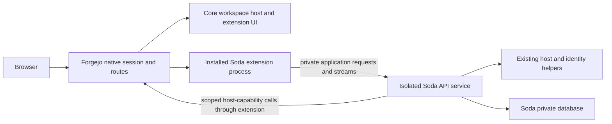
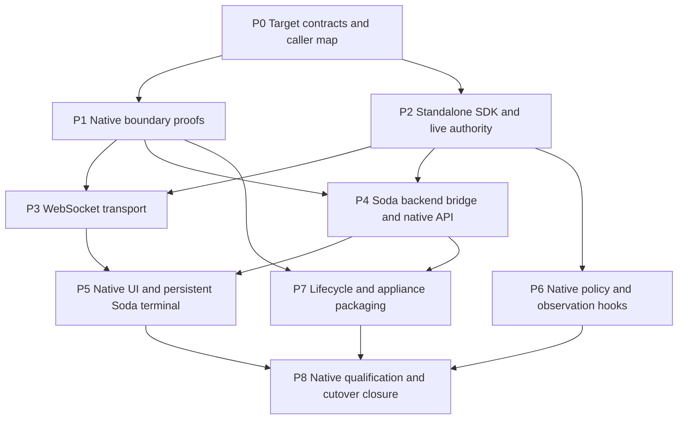

# Fountain: extensible Forgejo implementation plan

This is the remaining implementation plan for the native Forgejo extension
platform and its complete Soda integration. It starts from the extension
foundation already implemented in the `forgejo-ext` repository. It is an active
transition plan, not a claim that the planned interfaces exist. Absorb its final
contracts into the owning guides and remove this document when the transition is
complete, following the [documentation authority rules](../README.md#authority-rules).

The delivery is complete when Soda runs through independently packaged native
Forgejo contributions, uses native browser authority, retains a real terminal
while navigating Forgejo, keeps its privileged backend isolated, and ships through
the existing native appliance pipeline. A notes-panel demonstration is only the
foundation for that result.

## Starting point and remaining gap

Inspected baseline: Soda `c5fda072`, Forgejo extension commit `90a2fcf97d`, based
on Forgejo v15.0.9 LTS (`19b9b9d216bbfb501c18514bd1a8c980246ca3f7`). These are
planning inputs, not instructions to downgrade a checkout or discard later work.

| Area | Already implemented | Still required |
| --- | --- | --- |
| Package runtime | Administrator-installed process packages; manifest; private Unix HTTP; restart activation; install, replace, enable, disable | Independently consumable SDK, declared host capabilities, useful diagnostics, removal, mandatory-package behavior |
| Native contributions | Global, user, repository and site-admin pages; native menus/layouts; coarse route permissions | Soda pages and assets, narrower application authorization, correct operator navigation, preferred workspace entry |
| Request authority | Native session only; native actor/repository context; credential/header stripping | Live authority handles, callback capabilities, explicit operation authorization, separate Soda service bridge |
| Persistent browser host | Native pages in a frame beside retained extension panels; history and cached-document handling | Real Lit/xterm terminal, continuous stream authorization, account-change handling, automatic entry preserving product behavior |
| Backend transport | Buffered ordinary HTTP, 30-second deadline, 8 MiB body bounds | WebSocket transport and cancellation across the actual session middleware and containers |
| Core extensibility | Package discovery and page/panel registration | A concrete native policy hook with complete caller coverage; selected observation events |
| Soda adoption | Existing OAuth adapter, shell, template customizations and service remain | Native replacement, old-path deletion, isolated backend integration, updated owning contracts |
| Delivery | Local macOS arm64 host/example builds and browser evidence | Native Linux container proof, patched appliance image, separate Soda package, installation and qualification |

The foundation has focused Go and browser checks, actual Chrome navigation and
cache-restoration checks, and package replacement evidence showing unchanged host
bytes and retained notes. It has not proved a Soda terminal, Linux container
execution, session-safe streaming, or a qualified appliance release. Existing Soda
tests exercise the current OAuth and shell implementation until ported.

## Target architecture and decisions

1. **Keep a small downstream native substrate.** Core owns session admission,
   native contribution placement, a persistent workspace host, explicit host
   capabilities, and selected policy/event seams. Soda owns product behavior.
   Do not export Forgejo internals, database handles, or arbitrary service calls.
2. **Keep the Soda service isolated.** It currently runs as UID 2000 with its
   own database, configuration and host/identity helper access; Forgejo runs as
   UID 1000 with its data directory. The extension is a thin native-authority and
   UI/transport adapter. Moving all Soda backend code into Forgejo would expose
   those resources to Forgejo and every installed extension sharing its user.
3. **Use a narrow private bridge, with core-validated authority.** Give the
   extension access only to a dedicated application IPC endpoint. The Soda
   service validates a live, scoped admission through the host capability path;
   plain actor headers or socket access alone are not authentication. No broad
   `/run/soda` mount, database mount, grant key, host-helper socket, or Podman API
   is added to Forgejo. Prove the two-way connection before choosing deployment
   permissions and before porting every endpoint.
4. **Native browser authority replaces the browser OAuth adapter.** Cookies and
   raw session IDs remain inside the native host. There is no temporary new
   OAuth-backed extension implementation to remove later. Preserve the separate
   broker/account-custody and factory grant mechanisms described by
   [Credentials](../reference/credentials.md); they are not browser adapter code.
5. **Prove streaming first for memory and file sessions.** Inspect the effective
   fixture configuration first. Other providers must reject extension streams
   explicitly until their revocation semantics are proved; ordinary extension
   HTTP remains usable. This avoids promising identical provider behavior without
   evidence or building a replacement session system.
6. **Use mature upstream session/transport mechanisms where they work.** The
   pinned `go-chi/session` already has `IgnoreReleaseForWebSocket`; integrating it
   still requires real response-writer and invalidation proofs. A second browser
   credential or independent authentication database is not the solution.
7. **Add policy at the actual common native seam.** A small dependency-neutral
   callback can cover user creation/rename without moving every caller into a new
   service hierarchy. Notifications cannot veto operations. Add durable delivery
   only for a demonstrated obligation that cannot be met by reading current state.
8. **Packages remain administrator-trusted.** Process separation is a lifecycle
   boundary, not a sandbox. Same-origin extension JavaScript and same-user backend
   processes are trusted. The private bridge limits access to Soda's privileged
   service; it does not promise isolation from a malicious installed extension.

Three independently reworded Jev consultations agreed on native-boundary-first
delivery, memory/file-first streaming, and the common neutral hook. Three further
consultations agreed on preserving the separate Soda backend through a private
bridge. Requests, responses and wording/equivalence audits are retained in ignored
planning evidence. Agreement is advice, not proof; the gates below provide proof.

## Dependency order and parallel ownership

Use three implementation lanes, with one integrator reviewing their shared
contracts. Use Codex implementation agents; the explicit instruction excluding
Muse applies throughout this work.

| Lane | Owned changes | Dependencies and handoffs |
| --- | --- | --- |
| Native authority and core hooks | Forgejo session integration, admission registry, host capabilities, policy/event seams, security checks | Publishes the smallest typed SDK contract before consumer work; reviews authority at every transport handoff |
| Runtime, SDK and delivery | SDK extraction, package lifecycle, private transport, Linux image probe and existing release integration | Can extract unchanged SDK types early; waits for native probes before release orchestration |
| Soda consumer and browser | Existing Soda API/auth owners, thin extension executable, Lit entrypoints, terminal workspace, deletion of replaced integration | Inventories and prepares entrypoints early; integrates against actual authority and streaming contracts |

Assign files before parallel edits. The integrator owns cross-repository interface
changes, documentation decisions, final acceptance and commit boundaries. Do not
have two agents independently invent bridge DTOs, authentication semantics or
release drivers. Reuse existing agents and evidence; each review answers a concrete
remaining question rather than restarting an architecture audit.

## P0 — Establish the target contracts and exact caller map

**Deliverables**

- Update the intended architecture in [Overview](../architecture/overview.md) and
  [Trust](../architecture/trust.md): replace the current explicit no-fork decision,
  native browser authority, trusted extensions, isolated Soda service, and retained
  host/identity boundaries. Update the intended [Spaces](../product/spaces.md)
  behavior for the core-owned workspace host. Reference docs change when the
  corresponding interface actually lands, not ahead of working code.
- Map each current browser request to its actor, repository, operation and Soda
  policy requirements. Start with `internal/web/api/environment_authority.go`,
  `repositories.go`, `environments_create.go`, and `internal/web/auth/forgejo_keys.go`.
  Include identity/project controls and operator operations, not only Spaces reads.
- Separate browser OAuth/session code from Forgejo credential custody, Git helper
  access, factory grants, service credentials and account provisioning. Name the
  exact obsolete callers before removing anything from the shared auth area.
- Define the initial public SDK fields and contribution authorization callback.
  JSON identifiers consumed by JavaScript use decimal strings consistently with
  Soda's existing rule; replace the unreleased numeric actor-ID shape and all its
  callers together. Do not add compatibility readers or protocol negotiation.
- Choose one source owner for each contract using [Go ownership](go.md). Keep
  `web/auth` responsible for web authority, `web/api` for product HTTP/WS, existing
  domain packages for domain behavior, and `web` for composition. Update the
  ownership guide and architecture test together only if new ownership is needed.

**Acceptance:** the caller map accounts for every route and UI mount being moved;
the SDK and product authorization rules have one owner; the intended architecture
no longer contradicts the approved extension direction. No full build is needed.

## P1 — Prove the native boundaries before orchestration

Run these small probes in parallel where independent. Store development receipts
under ignored `.artifacts/`. On a development Linux host, all task workspace,
build, cache, state and temporary paths belong under `/home`.
P1 uses the smallest vertical slice of the P0 contract; it does not wait for a
finished SDK or every callback. Promote successful probe code into P2–P4 instead
of maintaining a parallel prototype or building a general framework for the probe.

### P1a: Actual session middleware and long-lived response

- Run one echo WebSocket through the real Forgejo web middleware, native login,
  wrapper stack and selected session provider. Use a real HTTP/TLS server and
  client; a response recorder cannot establish that connection hijacking works.
- Inspect the effective session configuration. The inspected Forgejo setting
  defaults to memory; the image template sets a provider configuration path but
  does not establish the selected provider. Both pass through `VirtualSession`.
- Exercise the pinned upstream WebSocket release option and necessary response
  writer forwarding, including Forgejo's context wrapper, deferred session writer
  and compression behavior. Do not assume a setting alone makes upgrades work.
- For both memory and file: pause an authenticated request, complete logout,
  release the paused handler, and verify that neither it nor the stream can
  recreate authorization. Also prove session regeneration, expiry and provider
  failure behavior. Inspect the same native session authority, not a Soda cookie.
- A session recheck must not extend expiry accidentally. File-provider reads can
  touch timestamps; raw file release can recreate a destroyed SID. Account for
  `VirtualSession` behavior explicitly rather than assuming every missing-ID read
  creates a file. Notifications accelerate cancellation but are not durable proof.

**Exit evidence:** successful upgrade through the actual wrappers, denied stale
authority after each invalidation, and no delayed session write restoring access.
If the assumption fails, fix the bounded native seam or revise the design before
building the consumer or production pipeline around it.

### P1b: Actual Linux image and package runtime

- Inspect the pinned image's executable location, entrypoint, user, runtime
  dependencies and `/data` permissions without dumping secret-bearing inspection
  output. Build the fork and example for the native Linux development target.
- Put that binary into a task-owned derivative of the pinned image and install a
  separately built example package. Prove child execution, Unix sockets, data
  writes, package lock, stop/start and package replacement under the actual
  container/user/SELinux configuration.
- Record host and package hashes before/after replacement and retained example
  data. Reuse the resulting development image for driver changes that do not alter
  shipping bytes. Do not start with a full appliance/media build.

**Exit evidence:** the real container runs the fork and independent package, with
native architecture evidence and working persistent data permissions.

### P1c: Isolated service bridge

- Connect the extension and existing Soda service using a dedicated private IPC
  mount and the scoped host callback path. Prove one current-actor read and one
  authorized mutation before migrating more routes. Reuse mature Go HTTP/Unix
  transport; do not add a new privileged daemon or a general credential service.
- The core validates an opaque admission bound to the extension instance and
  operation. Soda receives only the required authoritative identity/context and
  checks its own policy. Reject fabricated handles, copied actor headers, wrong
  extension/operation use, expired handles and calls after the owning process ends.
- Prove actual UID/GID and label permissions in both directions. Forgejo and
  extension processes must still be unable to open Soda's database, secrets and
  host/identity helper sockets; project workloads cannot reach the bridge.
- Verify cancellation, service failure and stream disconnect propagation. No
  request may turn a transport failure into an authenticated fallback.

**Exit evidence:** one native authenticated read/mutation crosses the bridge,
forgery and unauthorized mutations fail, and the existing private resources remain
inaccessible from Forgejo. Socket access by itself is never sufficient authority.

Keep this proof on the native extension route. A separate Caddy authentication
subrequest would create another admission path and only authenticate a WebSocket
handshake. It is not an assumed shortcut around live authority. If native evidence
requires reconsidering that choice, account explicitly for original-method/Origin
checks as well as continuous revocation before changing the architecture.

## P2 — Finish the authoring SDK and live native authority

**Source owners:** Forgejo `modules/extensions`, `services/extensions`,
`routers/web/extensions`; standalone SDK module and independent example.

- Extract only the public protocol types, server entrypoint, request context and
  capability client into a standalone Go module. Keep installation, internal
  models and host lifecycle code out. Host, example and Soda consume one definition
  of the wire contract; no duplicate DTO or forwarding compatibility package.
- Keep a single current protocol for this unreleased work. Unsupported inputs fail
  clearly. Pin the SDK/toolchain and document an independently buildable package,
  manifest, private data directory, asset URLs, startup, cleanup and failure model.
- Prove a clean external consumer without checking out the Forgejo source tree.
  A task-local module proxy can prove the module boundary before external
  publication; the final public module path must use an owner-controlled namespace.
  Do not invent a published repository or make publication a prerequisite for
  local development.
- Add host-owned request/stream admission handles. Bind each to the native session
  generation, actor, extension instance, contribution, permitted action and any
  explicitly admitted stable repository ID. Make validation and registration
  atomic with invalidation so logout cannot race a newly registered live stream.
  Never expose raw native cookies or session IDs to the extension or Soda service.
- Separately expose a host-verified opaque session-generation binding for browser
  mounts and multi-request flows. It is stable within one native authenticated
  session generation, but is not an authentication credential and grants no access
  without current native authentication. Validate it against the current session
  on each step; never silently rebind an old page or in-progress operation after
  account switching. Replace existing cross-request `ContextID` and CSRF bindings
  deliberately rather than confusing them with ephemeral request admissions.
- Implement the first narrow capabilities required by actual Soda callers:
  current actor; repository identity/code permission; visible owned-repository
  search; organization ownership; actor public SSH keys. Use bounded pagination
  and explicit errors. Recheck current native authorization on each call.
- Bind callback channels to the registered extension instance. An extension cannot
  choose an arbitrary actor or turn a read capability into a write capability.
  Enforce declared capabilities in the host, not just in SDK documentation.
- Add a bounded contribution authorization callback where Soda needs narrower
  visibility/access than native scope. Core native guards run first and cannot be
  relaxed by an extension. Apply the same rule to navigation and direct routes.
  A callback failure denies the affected application contribution.

**Acceptance:** an external example builds against the SDK; a real Soda repository
picker and SSH-key read work through native authority without browser OAuth;
forged actor/repository input and lost permission fail; optional display context
cannot grant panel repository authority. No arbitrary core mutation API is added.

## P3 — Carry real terminal WebSockets safely

**Depends on:** P1a/P1c proof and P2 admission/callback contract.

- Extend the private host/extension/Soda HTTP path for WebSocket upgrades using
  upstream transport support. Preserve strict same-origin admission, native
  session requirements, endpoint authorization and subpath-safe supplied URLs.
  Strip cookies, Authorization and user-supplied authority headers; forward only
  the protocol headers needed for the handshake and terminal subprotocol.
- Use the current [Terminal](../reference/terminal.md) contract to set handshake,
  message, connection and buffering bounds. Stream with backpressure rather than
  applying the ordinary buffered 8 MiB/30-second response path. Bound startup and
  idle behavior without putting a short HTTP deadline on a live terminal.
- Keep core authority attached to the whole stream. Close both transport
  directions on logout, session invalidation/expiry, account restriction,
  repository or membership loss, extension death, Soda failure and host shutdown.
  Repository/operation rechecks use current native state plus Soda's membership
  policy, not the repository currently displayed in the frame.
- Start from the existing Soda 15-second authority heartbeat and 5-second check
  timeout where polling is needed; retain immediate invalidation signals for
  faster cancellation. Document and test the resulting bound. Never claim
  instantaneous permission revocation merely because an event exists.
- Cancellation detaches browser execution/attachment authority. It does not erase
  projects, kill retained shells, remove Linux users or discard keys. Preserve the
  distinction between hiding a terminal, disconnecting it, and explicitly ending
  a managed session.

**Acceptance:** one real tmux-backed terminal carries input/output through all
layers; permission loss and native logout close access within the documented
bound; a stale request cannot restore access; extension/backend failure leaves no
orphan proxy stream. The HTTP path retains its existing body and deadline bounds.

SSE remains a separate, explicit platform follow-up: it has no demonstrated Soda
caller in this migration. It would need incremental flushing, cancellation and
session writeback proof; removing the current content-type rejection is not an
implementation of that contract.

## P4 — Move Soda browser APIs onto the native extension boundary

**Source owners:** Soda `internal/web/auth`, `internal/web/api`, existing domain
packages, the extension executable, and narrowly scoped service configuration.

- Build the Soda extension as a separate executable/package with its own frontend
  assets. Its private adapter forwards application requests to the existing Soda
  service and exposes only the bounded native callback operations that service
  needs. Keep database and privileged integration logic in their existing owners.
- Replace browser adapter authentication at the actual API entrypoints with
  core-validated admission. Preserve per-operation Soda authorization: operator
  stable ID, repository permission, environment membership, project access and
  credential-grant authority. A signed-in actor alone is insufficient.
- Port Spaces listing/creation/joining, repository settings, terminal reserve,
  create/attach/end, project access controls, public-key reads, identity controls,
  and operator runner/Tailnet operations according to the P0 caller map.
  Retain unsafe-method origin protection through the full proxy chain.
- Use the existing environment creation flow for an already selected Forgejo
  repository. It creates Soda project state and invokes the host; it does not need
  a new core repository-create operation or automatic provisioning event.
- Preserve broker/account custody, factory grants and Git/publication credentials.
  Browser admission is not a substitute for a factory actor's bounded authority.
  Retain deliberate denial of unsupported account/operation combinations.
- Remove browser OAuth login/return, adapter cookie/session and expected-user
  workaround callers once replaced. Remove their routes, config, provisioning,
  tests and documentation together. Do not remove shared credential custody by
  name matching, and do not keep the old browser auth as a fallback.

Preserve cross-request session continuity for terminal Reserve→Create and broker
enrollment→callback using P2's native generation binding. Retain origin/CSRF
protection for mutations. Logout between steps, another tab signing in as a
different account, or a stale cached page must invalidate the old flow rather
than execute it under the new actor.

**Acceptance:** native login alone supports the complete mapped Soda browser API;
direct requests cannot bypass native or Soda policy; browser credentials never
reach Soda; legacy browser adapter entrypoints are gone; existing nonbrowser
credential and factory authorization checks continue to pass. The two multi-request
flows succeed normally and fail after logout/account switch without silently
adopting the new session or actor.

## P5 — Port the complete Soda UI and persistent workspace

**Source owners:** existing `frontend/spaces`, `frontend/runners`,
`frontend/tailnet`, related native integration modules, Forgejo workspace host,
Soda asset staging and affected presentation templates.

| Existing surface | Native destination and retained behavior |
| --- | --- |
| Spaces page (`sodaspaces-page.ts`) | Global extension page; existing project list/actions and explicit create/join behavior |
| Repository Spaces (`soda-repository-spaces.ts`) | Native repository contribution/settings; exact read/write/admin policy required by each operation |
| Workspace (`sodaspaces-workspace.ts`, `sodaspaces-terminal.ts`) | Persistent extension panel; retained Lit element, xterm renderer, socket and selected terminal target |
| User/project identity and access controls | Appropriate native user/repository contribution; preserve existing membership and grant decisions |
| Runners and Tailnet pages | Operator-authorized contribution in an accessible native scope, with operator policy enforced on navigation and API |

The factory remains its protected operator CLI; there is no factory dashboard to
port. Issues, pull requests, reviews and Actions remain native Forgejo pages.
Identity launch and connection actions already belong to Spaces and need their
API authority ported, not an invented additional dashboard.

- Reuse existing Lit components and terminal logic through small extension
  entrypoints. Do not rewrite the UI or rebuild xterm state merely to change its
  host. Bootstrap authoritative context through the protected extension API;
  browser mount context is not an authorization source.
- Preserve the operator distinction: Soda's configured operator stable ID is not
  equivalent to Forgejo site-admin. A generic admin-only page would incorrectly
  exclude a non-admin operator. Use P2's narrowing callback with a global/user
  contribution as appropriate; never broaden core site-admin access.
- Add a generic preferred workspace entry policy so the enabled Soda integration
  automatically hosts eligible native pages, preserving the product's current
  intended behavior. Retain explicit authentication, installation, external and
  credential-flow exclusions. Keep one outer host and no nested drawers/frames.
  Supply path/subpath information through the host contract. Update the canonical
  Spaces route contract to the chosen native workspace URL; no legacy shell alias
  or second route-encoding implementation is required.
- Keep the terminal element in its stable parent while native pages navigate.
  Frame navigation may update display/navigation context, but cannot change the
  attached repository, project, user or tmux session. Selecting another terminal
  is a separate explicit operation. Do not create/start/join merely by opening UI.
- Finish native link/form navigation, back/forward, dirty-form cancellation,
  redirects, mobile layout and keyboard/focus behavior. On cached-document return,
  revalidate the account before showing stale private state or resuming access.
  Reload can remount the client and reattach an authorized retained shell; it is
  not evidence that the same browser socket survived.
- Delete replaced `sodaspaces-shell.ts`, `sodaspaces-frame.ts`,
  `internal/web/api/shell.go`, `soda-view` dispatch, connection/settings/workspace
  injection and old footer/drawer bootstrap paths with their callers and tests.
  Remove only template overrides superseded by native contributions. Preserve
  canonical branding, attribution, and independent presentation customizations
  until an actual native replacement covers each one.
- Update asset builds, staging inventories and browser fixtures with the same
  change. Audit each retained template by purpose so the cutover does not silently
  drop repository actions, notifications, the repository switcher, appearance
  controls or other existing native presentation. In particular, the existing
  `custom/footer.tmpl` combines some of those features with old drawer bootstrap;
  `custom/header.tmpl` and `custom/extra_links.tmpl` also serve independent styling
  and theme behavior. Do not delete those files wholesale as shell cleanup.

**Acceptance:** the actual Soda workspace works beside representative native
pages; navigation preserves the same terminal DOM element, xterm instance, socket
and underlying shell; changing the frame repository never retargets it. Native
forms, auth exits, history, cached restoration, operator access and responsive
layout pass real browser checks. The former Soda shell is no longer shipped.

## P6 — Add concrete core policies and observation events

**Can run in parallel with P3–P5 after P2.** Source owners are the actual native
operation seams and a small dependency-neutral extension hook contract.

- First implement the concrete username policy needed for Linux project members.
  Inspect `models/user.createUser` and `services/user.renameUser`; creation does
  not funnel through a shared `services/user.CreateUser`. Cover self-signup,
  administrator UI/API, external-auth creation, import paths and participating
  CLI callers. Record the actual caller coverage rather than assuming one router
  hook reaches every writer.
- Run native validation/authorization first and policy before the first
  irreversible effect, including filesystem creation/rename as well as database
  commit. Inspect callers already inside transactions before choosing the exact
  insertion point: do not hold database locks across unbounded extension RPC.
  Use bounded timeouts, deterministic policy ordering, structured allow/deny
  errors and no recursive core mutations or secret-bearing payloads.
- The policy checks only known universally invalid/reserved Linux-member names.
  Preserve existing identities and still check actual project-local account
  collisions when joining. Do not silently rename Linux accounts or treat
  organization/nonhuman identities as interactive Linux users.
- Ensure mandatory policies cannot be bypassed by missing, disabled or crashed
  packages. Handle offline/online CLI explicitly: a shared hook loader or existing
  authenticated control path must enforce the rule, and inability to obtain a
  mandatory decision must fail closed. The current web-only manager and package
  lock do not yet solve this. Order initial bootstrap before mandatory activation;
  do not introduce an undocumented permanent bootstrap exemption.
- Add only selected observation events needed for UI refresh, authority
  invalidation or existing Soda bookkeeping. Define payload, timing and caller
  coverage for each. Existing notifier callbacks are void, have differing timing,
  and do not imply post-commit or complete delivery. Consumers refresh current
  state after missed observations; live authorization never depends on delivery.
- Do not provision/delete environments automatically on repository events, veto
  every repository operation, or introduce a global durable event bus without a
  concrete product requirement. Existing projects and shells are retained when
  attachment authority is revoked.

**Acceptance:** a forbidden new name/rename is rejected consistently through the
real supported entrypoints, including CLI behavior and an unavailable mandatory
policy; ordinary native validation still wins where appropriate. Each introduced
event has an actual consumer, documented delivery semantics and a focused check.
Denial, timeout and unavailable mandatory policy leave neither committed identity
changes nor created/renamed native paths.

## P7 — Finish lifecycle operations and appliance packaging

**Depends on:** P1 Linux/bridge evidence; complete service contract from P4.

- Add concise package startup/exit diagnostics, status/health output and useful
  operator errors without logging admission handles or credentials. On a late
  crash, cancel live admissions and expose the unavailable state. Restart-based
  activation remains sufficient; no hot reload or restart supervisor is required.
- Define required package IDs for the appliance and fail startup/activation when
  they are absent, disabled or invalid. Required policy decisions fail closed
  after a runtime crash. Do not replace the current fail-closed startup with a
  blanket fail-open package scan that silently removes Soda policies.
- Add locked package removal while the runtime is stopped. Default removal keeps
  the package's private data; any explicit purge identifies that package's exact
  data directory and respects required-package checks. Preserve replacement
  staging, file limits, symlink rejection and data retention. No broad cleanup.
- Update `appliance/forgejo.Containerfile` to ship the actual patched binary.
  The current file only overlays presentation assets on a stock image. Pin source,
  upstream base, toolchain and image identity; verify entrypoint and native runtime
  dependencies established by P1b rather than guessing a binary path.
- Produce the Soda extension package separately from the host image and retained
  Soda service image. Stage its manifest, executable and assets; install/replace
  only while Forgejo is stopped. Specify deterministic first-install/bootstrap,
  required activation, replacement and service restart ordering. A package-only
  update must not rebuild Forgejo or erase existing Soda/extension data.
- Wire the three components and narrow IPC permissions through existing appliance
  units and configuration. Keep Caddy's public routing consistent with native
  extension URLs; remove replaced browser-adapter routes when no actual caller
  remains. Do not change shared networking or trust as an incidental workaround.
- Extend existing `internal/release/build/production.go`, payload/staging inventory
  and installed checks to identify the fork and independent package. Reuse
  `tools/soda-build` and its candidate provenance. Record source revisions,
  architecture and content hashes; do not create another release orchestrator or
  pretend an unsupported production phase has been implemented.
- Include corresponding source, license notices and existing canonical assets
  for the modified Forgejo, SDK and extension dependencies. The present stock-image
  assumptions in licensing notes must be revisited. A license generator with
  ignored errors is not proof of a complete distribution.

**Acceptance:** a small native Linux development image boots the intended host,
package and isolated Soda service; mandatory policy activation is deterministic;
package replacement preserves data and host bytes; installed inventory identifies
the real artifacts; package failure is observable and cannot silently disable a
required policy. Full release qualification follows P8, not this development run.

## P8 — Qualify the integrated result and close the transition

Run the smallest affected checks as each milestone lands. Once the actual terminal,
native policies and container boundary work, run the integrated native development
journey. Production qualification has an additional existing prerequisite:
`tools/soda-build` currently rejects non-development dispatch with
`production builds removed; development only`. The final protected native
qualification/delivery path is not a command ready to run today.

Account for that release dependency explicitly, through the existing
[release workflow](release.md), [release architecture](../architecture/release.md)
and [native support tools](native-support.md):

- The release owner must connect the actual native installation, selected upgrade
  and recovery observations to protected admission of the exact candidate/media
  hashes. Extend the current `internal/acceptance` and `internal/release/deliver`
  owners; do not create a second qualification engine for extensions.
- Wire the protected controller and finalization/custody boundary only after those
  native observations work. Producer success or fixture signing is not admission.
  Failures, cancellation, missing evidence and mismatched bytes must remain
  non-qualified and unable to publish. Do not merely remove the development-only
  guard. The current payload accepts no qualified upgrade paths; advertise one
  only after actual native evidence supports it.
- Qualify a fresh committed candidate after these prerequisites, preserving the
  separation between qualification and separately authorized signing/publication.
  Completing the extension development milestones can precede this wider release
  work, but it must not be called a production-qualified Fountain appliance.

Retained failed-run artifacts may support clearly labelled development checks; a
failed release is never resumed or relabelled as qualified. Driver-only fixes do
not automatically require rebuilding binaries.

| Contract | Required evidence |
| --- | --- |
| Native auth | Native login succeeds; anonymous/token/Basic/proxy credentials and spoofed context fail; unsafe cross-origin calls fail |
| Cross-request continuity | Terminal Reserve→Create and broker enrollment→callback succeed only for their original native session generation; logout/account switch and stale tabs cannot adopt a new actor |
| Live authority | Memory/file logout, regeneration, expiry and delayed-release race fail closed; account/repository/membership changes revoke access within the stated bound |
| Soda service isolation | Native read/mutation succeeds over narrow IPC; Forgejo cannot read Soda DB/secrets/helper sockets; project workloads cannot reach the bridge |
| Native contributions | Correct page/nav visibility, direct-route denial, repository permissions, non-admin operator access and non-operator denial |
| Real workspace | Same element/xterm/socket/shell across native navigation; explicit terminal target, history/form behavior, cached-account revalidation and subpath/mobile checks |
| Terminal semantics | Reserve/create/attach remain separate; opening does not create/join/start; disconnect preserves shell; explicit End has its documented effect |
| Core hooks | Actual signup/admin/API/external-auth/import/CLI paths covered; timeout/crash/missing mandatory package cannot bypass policy or leave identity/filesystem side effects |
| SDK and lifecycle | External build without host checkout; declared capability denial; install/replace/remove/required-package behavior; retained data and unchanged host bytes on package-only update |
| Cutover | Old browser OAuth/shell/dispatch assets and staging entries removed; retained broker/factory credentials still pass their authorization checks |
| Distribution | Patched host, SDK, package, service, architecture and notices/source identified by candidate inventory; native installed journey matches those bytes |

For Soda changes, select the affected Go packages plus `go test ./internal/archcheck/`
when boundaries change, applicable TypeScript/lint checks, frontend/Forgejo suites
and existing installed journeys. For Forgejo, run affected extension/session/core
operation Go tests and frontend checks. Add real-browser/native fixtures only for
the boundaries that unit tests cannot establish. Port existing drivers before
creating another harness; avoid source-string tests that merely mirror new code.

Qualify Linux x86_64 and aarch64 independently on native targets when each is
advertised. Cross-compilation and the completed macOS arm64 development evidence
do not qualify either Linux target. Do not block useful development on the sibling
architecture, but do not declare the two-architecture delivery complete from one.

Update the owning reference guides as their interfaces land:

| Owner | Final change to absorb |
| --- | --- |
| [Forgejo](../reference/forgejo.md) | Native extension integration, remaining presentation overrides and upstream maintenance boundary |
| [API](../reference/api.md) | Actual native extension routes, authority requirements and removed browser adapter routes |
| [Credentials](../reference/credentials.md) | Removed browser OAuth session versus retained broker/factory/account custody |
| [Terminal](../reference/terminal.md) | Native stream admission, disconnect/revocation semantics and supported session providers |
| [Configuration](../reference/configuration.md) | Required package, bridge and service settings; removed adapter settings |
| [Operator setup](../guides/operator-setup.md) and [Installation](../guides/installation.md) | Bootstrap, activation, package replacement and real artifact/service ordering |
| [Release architecture](../architecture/release.md) and [Release workflow](release.md) | Fork/package provenance and existing pipeline integration |
| [Testing](testing.md), [Local testing](../guides/local-testing.md), [Native support](native-support.md) | Current fixture and qualification entrypoints |
| Forgejo `contrib/extensions/README.md` and standalone SDK documentation | Authoring, capability, policy, event and lifecycle contracts that actually exist |

Retain concise receipts in commit history and ignored artifacts, not new permanent
status documents. Remove this plan after its requirements and remaining explicit
limitations have been absorbed into their owners.

## Extension platform follow-ups with separate entry criteria

These are accounted for, but do not block the current Soda integration without an
actual caller or explicit added requirement.

| Follow-up | Implementation trigger and bounded path |
| --- | --- |
| SSE | A caller requires event streaming: add explicit stream declaration, incremental flush/cancellation and actual session-release proof |
| Additional session providers | A deployment needs one: inspect its existing read/release/destroy semantics, prove the same race/revocation contract, then enable streams for it |
| Native core mutations | A real extension needs a specific write: wrap the existing native service with explicit actor/action authorization, bounded DTO and normal audit behavior; no arbitrary internal API |
| Additional policy hooks | A product needs a concrete veto: identify the common seam and all callers, timing and failure behavior before exposing it |
| Durable events | A concrete committed operation must reach a consumer despite restart: implement the smallest transactionally coupled delivery mechanism for that obligation, not a universal event subsystem |
| More presentation extension points | An existing retained template customization needs native replacement: add the smallest reusable slot/contribution and remove that override with its callers |

No marketplace, remote package downloader, untrusted-code sandbox, arbitrary Go
interception, hot reload, general compatibility layer or whole-Forgejo UI rewrite
is part of this delivery. Those are separate products or requirements, not hidden
prerequisites for an independently extensible host.

## Maintenance, execution boundaries and definition of done

The fork needs an explicit upstream maintenance owner and reproducible update
procedure: keep the extension patch attributable against the pinned LTS, assess
actual upstream security/maintenance releases, refresh source/image pins together,
and repeat the affected session, capability, native-route and package contracts.
Do not mix an incidental upstream major upgrade into this transition. Record
unsupported providers/features in the current authoring guide rather than silently
falling back to another authentication scheme.

Development implementation, bounded provider calls, focused tests and task-owned
fixtures follow the existing task authorization. External publication, production
appliance activation, changes to unrelated/shared trust or networking, and material
new cost remain distinct scope boundaries unless explicitly authorized. Prepare a
concrete reviewed artifact before requesting any such final action. Public module
namespace selection can remain pending without preventing local implementation.

The delivery is finished only when all of the following are true:

- An independently built Soda package supplies the mapped native pages and
  persistent workspace without rebuilding the Forgejo host.
- Native login is sufficient; operation permissions are current, enforced at the
  core and Soda boundaries, and no browser adapter credential remains.
- A real persistent terminal survives native navigation and loses attachment
  authority correctly, while retained shells and projects survive disconnects.
- The isolated Soda service retains exclusive access to its database, secrets and
  privileged helpers; the new bridge has actual native container evidence.
- Required policies cover their real native and CLI callers and fail closed;
  introduced observations have honest, tested delivery semantics.
- The standalone SDK, diagnostics, package lifecycle and separately staged package
  work outside the Forgejo source tree and in the native appliance image.
- Replaced code, configuration, templates, assets and tests are removed together;
  surviving product behavior and credential custody remain covered.
- The existing pipeline identifies and qualifies the actual native artifacts for
  each advertised architecture, with source/notices and upstream maintenance
  accounted for. Development success is not presented as release qualification.
- Owning guides describe the final implementation, explicit optional work is
  separated, and this completed transition plan is absorbed and removed.
