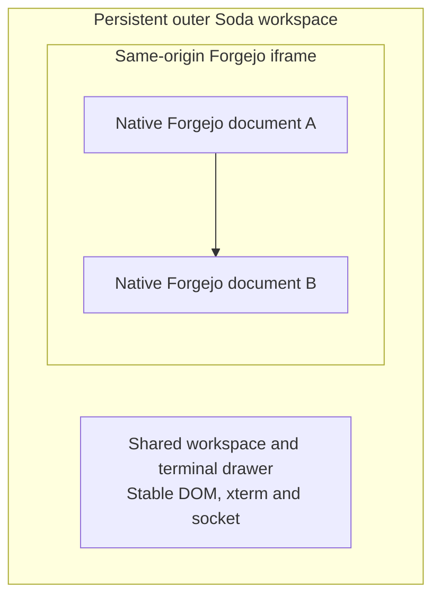

# Persistent workspace: Forgejo iframe implementation plan

**Updated 13 September 2026. Status: implementation plan authored; implementation,
browser feasibility, native acceptance and delivery pending.**

The user clarified that browsing Forgejo must leave the live terminal view intact,
then requested a complete iframe implementation plan including the other options.
The [terminal continuity target](terminal-integration.md#target-uninterrupted-forge-browsing)
owns that requirement. This document owns the proposed browser composition,
implementation sequence, alternatives and this workstream's status.

The detailed planning candidate is **one persistent outer Soda workspace with the
terminal mounted directly in it and native Forgejo pages inside a same-origin
iframe**. This does not select an outer host URL, a replacement authentication
system, a Forgejo fork or every presentation choice. Section 3 records the remaining
decisions and the recommended investigation order.

This request authorizes documentation. It does not start source implementation,
tests/builds, fixture writes, provider operations, deployment or cleanup. Future
execution follows the applicable session instructions and the
[current permissions](implementation-status.md#current-permissions); work already
covered by a future grant should proceed without repeated handoffs.

## 1. Problem, evidence and scope

Source inspected at `168f8cc`, with a clean working tree before this documentation.
The appliance source pins stock Forgejo 15.0.7 in
[forgejo.container](../appliance/services/forgejo.container).
These findings describe source and browser mechanisms, not current installed behavior.

| Observation | Consequence |
| --- | --- |
| [sodaspaces.ts](../frontend/spaces/sodaspaces.ts) calls workspace disposal on `pagehide` and mounts a fresh owner on document restoration. | Ordinary whole-page browsing replaces the drawer owner. |
| [sodaspaces-terminal.ts](../frontend/spaces/sodaspaces-terminal.ts) closes its socket, disposes xterm and clears its screen during disposal; disconnection from the DOM also disposes it. | Retaining the native terminal ID does not retain the browser terminal. |
| [sodaspaces-workspace.ts](../frontend/spaces/sodaspaces-workspace.ts) reads saved layout, creates slots and restores exact terminal IDs. | Current navigation recovery rebuilds views, which misses the clarified requirement. |
| Workspace `kind: page/native` and its initial context are currently bound at configuration time. | A shared class alone is insufficient for switching presentation while retaining one owner. |
| [custom/footer.tmpl](../appliance/forgejo/templates/custom/footer.tmpl) and [soda-native-page.ts](../assets/branding/forgejo/soda-native-page.ts) independently bootstrap their current native surfaces. | Embedded pages must not create a competing workspace. |
| [proxy.Caddyfile](../appliance/config/proxy.Caddyfile) already routes Soda and Forgejo under one external origin. | Same-origin composition has an existing deployment foundation. |
| Stock Forgejo 15.0.7 defaults to `X-Frame-Options: SAMEORIGIN`. Soda's [backend](../internal/web/server.go) separately emits restrictive CSP including `frame-ancestors 'none'`. | Native Forgejo framing is plausible; shell hosting and authentication/error responses require separate inspection. Neither is a reason to strip security headers globally. |

The Forgejo framing default is documented in its
[versioned configuration guide](https://forgejo.org/docs/v15.0/admin/config-cheat-sheet/#cors-cors).
Retained exact upstream source is in
`.artifacts/research/h01-0f43b9f/v15.0.7/forgejo/`; it is research material, not a
new production source dependency. Effective response headers remain to be checked.

This work changes browser composition and navigation ownership. Reuse the existing
Lit workspace, xterm, protected APIs, native project membership and managed tmux
implementation. No need for a database or native runtime migration has been
identified. A subsequently demonstrated need is a separate scope decision.

Desktop viewers, AI-run terminals and modern CLI rendering remain their existing
workstreams. The shell can accommodate later views without implementing them here.
Ordinary Git/HTTP APIs, Git/LFS/package traffic, native permissions and administrative
operations keep their existing owners.

## 2. Proposed composition and ownership

The iframe supplies an independent document navigation boundary. It does not
guarantee a separate browser process or provide isolation from trusted same-origin
JavaScript. [Browser iframe model](https://developer.mozilla.org/en-US/docs/Web/HTML/Reference/Elements/iframe)

| Owner | Proposed responsibility |
| --- | --- |
| Outer workspace | Lifetime of workspace/terminal hosts, split geometry, visible surface, selected workspace state and the approved frame/URL integration. |
| Forgejo frame | Native documents, page scripts, forms, validation, route permissions, redirects, editors, native draft protection and the agreed native chrome. |
| Shared connection module | Original-actor bootstrap, existing OAuth entry and coordinated logout; explicit integration between documents. |
| Protected Soda endpoints | Session, actor, CSRF/Origin and operation-specific authority; actual terminal/project operations. |
| Native terminal owner | Shell lifetime, exact IDs, writer admission, attachment and explicit End under the existing contract. |

The proposed shell mounts one shared workspace. It does not clone the terminal,
move it between documents, or remove/reinsert its host to switch presentation.
Forgejo links normally navigate the existing child context using upstream behavior.

Establish that persistent owner before the first terminal is opened. Mounting a
terminal in the old native document and then navigating into a new shell would
repeat the original interruption. An already-open legacy document cannot transfer
its live renderer across a replacement document; entry with existing work is a
separate, explicit recovery/transition case under D3 and the delivery plan.

A narrow child integration may report the committed page and native actor/repository
hints and delegate workspace controls. It must not copy the Forgejo page body,
duplicate native permissions, or turn page hints into terminal instructions.
Choose the smallest direct same-origin interface that meets the selected composition;
`postMessage` is a possible mechanism, not a requirement for a new event bus.

Retire the actual outer owner on its real departure or authorization retirement.
Child `pagehide` is not outer `pagehide`. Existing terminal lifecycle listeners
remain valuable when they belong to the correct document.

## 3. Decisions to resolve before production routing

The iframe direction is developed here; the following details are **open**, not
silently selected by the plan. Stages 0-1 turn provisional candidates into choices
supported by feasibility evidence, then update their owning guides. A later implementation can proceed through independent work while
unrelated decisions remain open.

| ID | Decision and candidates | Recommended investigation and dependency |
| --- | --- | --- |
| D1 | Outer host: reuse a bounded Forgejo dashboard presentation, or add a dedicated Soda HTML shell in the existing namespace. | Investigate the existing native host first. Select before production entry/auth routing. |
| D2 | Address bar: dedicated workspace URL representing the child destination, or ordinary canonical Forgejo URLs with shell-aware entry routing. | Prove both link/history consequences before selecting. The former is a narrower initial candidate, not an approved URL contract. |
| D3 | Entry scope: activate the persistent shell when opening the workspace, or make it the default authenticated browsing shell. | Prefer the narrower workspace-entry investigation. Decide how an already-open native draft and terminal enter that mode. |
| D4 | Full Spaces/drawer transitions and chrome ownership. | Recommend changing presentation within the same outer owner. Decide which document owns global navbar/profile/notifications and how old Spaces links reach that owner. |
| D5 | Layout and focus details, including drawer placement and compact presentation. | Reuse the existing measured layout. Current drawings put the drawer on the right; the user's incident description said left. Confirm placement in design review; continuity alone does not authorize a layout reversal. |
| D6 | Authentication navigation: which flows deliberately leave the outer shell and how fixed entry returns recover. | Preserve the existing OAuth mechanism; first investigate its explicit top-level entry path. Popup authentication or arbitrary return URLs are not selected. |
| D7 | Browser/device coverage and retained acceptance target. | Use the project's supported browser set and actual usage; identify the native terminal-ready fixture and operator before native work. Do not invent a universal browser guarantee from Chromium-only checks. |

### Host options in detail

**Existing native dashboard host:** the current
[dashboard template](../appliance/forgejo/templates/user/dashboard/dashboard.tmpl)
already supplies real native account gates and an actor through its selected body.
However, `base/head` includes a native navbar and `base/footer` initializes stock
JavaScript. Framing another full Forgejo page could duplicate header, profile,
notifications and workspace entry. Select one owner for those controls; do not fake
installation state, manufacture template context or copy the entire template tree
to suppress them. This option must satisfy the
[native host contract](forgejo-soda-pages-plan.md#3-native-page-host-and-ownership).

**Dedicated Soda HTML shell:** the existing same-origin namespace provides routing,
but a new HTML host requires a scoped Go handler, assets/CSP and explicit login/actor
handoff. Earlier Go page shells were deliberately retired. Reintroducing one is a
documented host decision, not incidental scaffolding or reuse of an existing API
response as HTML. Preserve the separation of native Forgejo and Soda sessions.

**Canonical Forgejo URLs:** this is an entry strategy, not another terminal backend.
A direct request must unambiguously select the shell or the native child document
without recursion. A changed address bar alone does not make reload/server entry
work. Do not obtain that behavior by HTML relaying, borrowing cookies, adding a
Forgejo fork or intercepting Git/API traffic. If the documented integration surface
cannot support it, report that limitation and compare the dedicated workspace URL.

For a workspace URL, any stored/encoded child destination is an untrusted navigation
locator. Keep it local to the selected native origin and admitted browsing routes;
exclude credentials and authentication transaction parameters. It is not a new
arbitrary OAuth return destination. Final syntax, storage and bounds belong to D2.

## 4. Interaction and lifecycle design

These are the proposed implementation obligations for the iframe candidate, derived
from the continuity target and the existing native/workspace contracts. Details
that depend on D1-D6 remain proposals until that decision is recorded.

| Trigger | Expected behavior to implement and verify |
| --- | --- |
| Navigate repositories, files, issues, PRs, search, ordinary settings or administration | Navigate the child document while preserving authorized terminal owners. Native route eligibility still applies. |
| Native form submit, validation response or redirect | Forgejo performs its own operation once. A resulting document load stays within the frame where appropriate; no terminal lifecycle request is induced. |
| Navigate to another repository | Update only the contextual page hint. Selected workspace project, original account and terminal IDs do not follow it automatically. Preserve explicit This page semantics. |
| Hide/show, resize or compact Forge/Terminal switch | Change presentation and valid terminal dimensions; keep owners connected. Hidden surfaces lose input focus/accessibility exposure appropriately. |
| Full Spaces/drawer transition | If D4 selects same-owner presentation, change projection in place and retain the desired pane tree and native frame draft. Do not navigate to or mount a second workspace. |
| Back/Forward or fragment navigation within the forge | Show the expected native destination once, preserve terminal identity, and coordinate the selected outer URL representation. |
| Cancel a native unsaved-form departure | Keep the existing frame document, URL, draft/value/selection and terminal. Do not commit the parent location merely on a click. |
| Open in another tab/window | Preserve normal explicit browser intent. The new window has its own workspace lifetime and cannot steal an existing writer. |
| Download, external link or authentication destination | Follow the reviewed D2/D6 navigation policy. Do not turn the frame into an arbitrary website viewer or silently navigate away from the persistent shell as a repair. |
| Frame unavailable, blocked, error page or slow response | Leave the outer terminal intact while its own authorization is valid. Feedback and explicit recovery target the frame; no native form or terminal operation is replayed. |
| Logout, account mismatch or actual loss of authority | Retire affected private controls and access using the existing owners. Never adopt a later actor or use navigation hints to reauthorize. |
| Actual outer reload, top-level departure, browser loss or genuine socket loss | Apply the existing exact-ID recovery/native-lifetime contract. These are separate from ordinary child navigation. |

### History and entry work

Define one history strategy before implementation. Child navigations already
participate in the tab's session history; a blind parent `pushState` after every
frame load can add duplicate entries. The outer URL must reflect committed outcomes,
including redirects and fragments, without creating parent/child feedback loops.
[HTML session history](https://html.spec.whatwg.org/dev/browsing-the-web.html)

Specify direct signed-in and signed-out bookmarks, copied links, browser Reload,
modified clicks, Back/Forward, links to full Spaces, and all existing fixed bookmark
bridges. A raw current dashboard query is not a universally reliable signed-out
entry: native remember-me/login redirects can discard it. Reuse the demonstrated
[native login-entry contract](forgejo-soda-pages-plan.md#3-native-page-host-and-ownership).

Do not serialize Forgejo form drafts into Soda storage or replay a POST on history
restoration. Keep draft warnings native to the child document. The frame's `load`
event alone is not proof that the expected application page loaded successfully;
inspect the admitted child document and its explicit integration marker where
available, without adding an independent page scraper or recovery poller.

### Workspace changes needed

Separate the immutable actor/session/native terminal binding from mutable
presentation and current-page hints. Audit every use of `WorkspaceContext.kind`:
it currently influences creation/management behavior as well as layout. Preserve
those decided behaviors while making selected surface changes possible.

Keep the flat terminal owner layer and existing per-terminal identity. An existing
renderer must not be destroyed by changing a Lit key, swapping its ancestor,
reparenting across documents, or rebuilding the full workspace on a child page event.
Use the existing hide/split/layout mechanisms and public xterm measurements.

Suppress the old drawer bootstrap only for an explicitly recognized embedded
composition. Unknown/invalid composition markers must not suppress native gates
or create shell recursion. Handle embedded full Spaces links through the selected
outer owner; unrelated Runners/Tailnet/repository controls retain their authority
and must not start another terminal workspace.

## 5. Security and authentication work

The [architecture](architecture.md#frontend-and-session-boundary),
[credentials](dashboard-credentials.md), and
[native connection/logout contract](forgejo-soda-pages-plan.md#4-connection-and-logout-contract)
remain the authorities. Same origin does not merge Soda and Forgejo sessions.

| Boundary | Implementation work and proof |
| --- | --- |
| Shared origin | Treat native Forgejo scripts and the terminal shell as sharing trust. A same-origin iframe is not protection against a compromised Forgejo script. |
| Outer framing | Define a scoped outer-response policy preventing unauthorized embedding of the workspace. A proposed `frame-ancestors 'none'` can coexist with that workspace loading its own child. |
| Child framing | Preserve Forgejo's intended same-origin framing and its raw-content protections. Check actual response headers and redirects; do not globally strip CSP or X-Frame-Options. |
| Loaded destinations | Restrict the proposed shell's frame sources to the intended native origin. Preserve distinct treatment of repository-served content, external sites and authentication endpoints. |
| Optional message interface | If used, check exact origin, expected child window, message shape and current navigation context. Ignore callbacks from retired documents. Same-origin checks do not authenticate a compromised same-origin script. |
| Secrets and authority | Keep session/CSRF values in their existing in-memory/request boundaries; no credentials in frame URLs, bridge messages, layout storage, logs or screenshots. Page/repository hints grant no authority. |
| Native operation access | Preserve server checks on actual protected requests and streams. No copied browser permission cache or parent-side grant can replace them. |

The framing directions are distinct: `frame-src` controls what a page embeds;
`frame-ancestors` controls who may embed that page.
[CSP framing directions](https://developer.mozilla.org/en-US/docs/Web/HTTP/Reference/Headers/Content-Security-Policy/frame-src)
If a message interface is selected, follow the browser's
[origin/source validation rules](https://developer.mozilla.org/en-US/docs/Web/API/Window/postMessage#security_concerns).

Do not claim a sandbox provides isolation while enabling everything Forgejo needs.
In particular, same-origin content with scripts and same-origin sandbox permissions
can remove the sandbox. Decide any actual sandbox/Permissions Policy restrictions
from demonstrated native feature needs and verify forms, downloads, dialogs and
authentication. [Sandbox limitations](https://developer.mozilla.org/en-US/docs/Web/HTML/Reference/Elements/iframe#sandbox)

### Connection and logout sequence

1. Bootstrap the original actor through the selected host and reuse the existing
   matching Soda session. Native actor observations remain consistency inputs.
2. Make child page changes visible to the existing connection owner without
   re-running OAuth or rotating credentials on every native navigation.
3. Adapt `soda-connection.ts`'s own-document navbar lookup and sign-out activation
   to the selected chrome owner. There must be one coordinator for a sign-out
   action, preserving native POST behavior and partial-failure feedback.
4. Verify same-window parent/child and cross-tab retirement, pending OAuth,
   callback-before/after-cancel, stale child callbacks and account mismatch. Existing
   localStorage retirement signals are UI hints, not backend authorization.
5. Keep failed/denied/expired connection handling explicit. A new native login or
   a changed child actor cannot silently acquire new credentials for the old owner.
6. Select the top-level/external authentication path under D6. Native consent,
   password/activation/2FA gates and Soda error/CSP responses must work there.
   Authentication that deliberately leaves the outer document is an explicit
   lifecycle case, not ordinary forge browsing.
7. Keep logout as revocation/detachment under the native terminal contract, not
   automatic End of the managed shell. Preserve already defined shared-impact
   project actions and the limits of non-atomic Forgejo/Soda logout.

## 6. Implementation stages and dependencies

These are work units and reviewable exits, not repeated permission prompts. Execute
only within the applicable grant. Extend the existing owners; proposed new modules
are added only where their responsibilities cannot fit those owners directly.

| Stage | Work | Exit evidence |
| --- | --- | --- |
| 0. Bound the feasibility work | Record provisional D1-D6 candidates with concrete route/chrome examples and unresolved choices. Identify available synthetic/native-HTML evidence and the execution owner for any fixture used. | A bounded investigation can start; native terminal-target selection and its separate grant do not block synthetic work. |
| 1. Prove the frame boundary | Use a bounded local browser candidate for the proposed host and stock pinned Forgejo child. Begin with an inert outer identity marker; exercise actual frame navigation and admitted response headers. Use results to resolve D1/D2 and the related entry/chrome choices. | Child documents change while the outer marker/document does not; the selected entry/history mechanism has evidence. Update owning contracts for decided behavior; label synthetic results. |
| 2. Preserve the real workspace owner | Separate mutable presentation/page hints from immutable identity; mount the real shared workspace and real xterm outside the frame. Extend the existing synthetic operation model. | Same component/renderer/socket survives child navigation, selected surface changes and resizing; no duplicate creation or writer ownership. |
| 3. Wire native composition | Integrate selected host, drawer trigger, embedded-marker handling, full Spaces entry and native chrome. Suppress competing child workspace bootstraps; retain native routes/forms/scripts. | Exactly one workspace owner, no frame recursion or duplicate global controls; native page families still initialize and operate. |
| 4. Complete auth and security integration | Implement section 5 using existing connection/backend owners; make any selected route/CSP adjustment narrowly scoped. | Real native login/logout and explicit failure cases pass; private state and access retire correctly; no credential bridge or broad header weakening. |
| 5. Complete URLs and navigation | Implement the selected D2 strategy, committed destination updates, fixed bookmarks/returns and Back/Forward; cover forms, redirects, fragments and new tabs. | One coherent URL/history contract; canceled departures remain canceled; native writes occur once; browser entry reaches the documented surface. |
| 6. Finish presentation and failure behavior | Apply established tokens/measurements; review split/full/compact layouts, focus, accessible frame title, keyboard, screen reader traversal, draft handling and frame failure feedback. | Both surfaces remain usable; typing reaches only the focused surface; frame failure does not dispose an authorized terminal. |
| 7. Complete integration regression coverage | Run the smallest affected type/source/build/component and real native-page checks. Exercise the approved ordinary browsing matrix with ownership counters. Retain distinct outer-reload/transport-loss tests. | Exact-source evidence meets section 7 for browser/Forgejo scope; gaps remain explicit. |
| 8. Retire replaced source paths and qualify artifacts | Remove only demonstrated navigation-specific remount paths and obsolete assertions. Wire the canonical payload/cache epoch, rerun affected checks after removal, and build/check the matching candidate. | Final candidate contains one composition path and retained true-recovery behavior; exact artifact inventory and source evidence agree. |
| 9. Installed acceptance and delivery | Under target/action approval, deliver that candidate to the selected terminal-ready fixture and run real browser/native input and continuity checks. Record candidate, target, effects and evidence. | Same live browser owners and native shell survive navigation on that candidate; delivery/limitations retained in the existing owners. |

Stages 1-2 can use the existing synthetic environment after source work is authorized.
Real native HTML/authentication work in stages 1, 3-7 uses the existing fixture owner
and its actual permissions. Do not attach a real terminal to a partially wired
authentication candidate. Stages 4 and 5 share entry/history/auth files and need one
integration owner even if investigations run in parallel.

Resolve the host/entry/chrome choices needed by stage 3 before its production wiring,
and the authentication/URL choices before stages 4-5. D7's browser coverage informs
acceptance; its native terminal-target decision is required only before stage 9.
An unavailable native target must not gate the earlier synthetic/component work.

### Existing source and build owners

| Concern | Files to inspect/extend |
| --- | --- |
| Drawer markup and composition entry | [custom/footer.tmpl](../appliance/forgejo/templates/custom/footer.tmpl), [sodaspaces.ts](../frontend/spaces/sodaspaces.ts) |
| Native host and page entry | [dashboard.tmpl](../appliance/forgejo/templates/user/dashboard/dashboard.tmpl), [soda-native-page.ts](../assets/branding/forgejo/soda-native-page.ts), [soda-settings-link.ts](../assets/branding/forgejo/soda-settings-link.ts) |
| Shared workspace/mode/layout | [sodaspaces-workspace.ts](../frontend/spaces/sodaspaces-workspace.ts), [sodaspaces-page.ts](../frontend/spaces/sodaspaces-page.ts), [sodaspaces-layout.ts](../frontend/spaces/sodaspaces-layout.ts), associated views/CSS |
| Renderer/transport lifetime | [sodaspaces-terminal.ts](../frontend/spaces/sodaspaces-terminal.ts); preserve its existing native API contract |
| Connection and sign-out | [soda-connection.ts](../frontend/spaces/soda-connection.ts), [auth.go](../internal/web/auth.go), existing connection/credential tests |
| Conditional new HTML host/CSP | [server.go](../internal/web/server.go), existing page/route handlers and tests; needed only if D1 selects backend hosting |
| Conditional ingress change | [proxy.Caddyfile](../appliance/config/proxy.Caddyfile); needed only when the selected route strategy requires it |
| Browser emission and complete payload | [build-forgejo.ts](../scripts/build-forgejo.ts), [forgejo-payload.json](../internal/nativebuild/forgejo-payload.json), [custom/header.tmpl](../appliance/forgejo/templates/custom/header.tmpl) |

The browser build already scans the source directories and requires exact agreement
with the one payload inventory. Reuse it for any shell/bridge modules and canonical
styles. Preserve whole-module-graph cache versioning, lazy shared Lit and locked xterm
assets. Do not introduce another bundle inventory, CDN or navigation dependency as
incidental scaffolding. Tests and packaging must exercise the emitted candidate,
not a separate hand-written application.

## 7. Acceptance and evidence

### Decisive continuity proof

Before browsing, capture identity references/counters for the outer Document,
workspace element, terminal element/host, xterm instance and input/screen nodes,
and WebSocket. Use existing test injection seams around the real renderer and
socket constructors where needed; do not add a production identity registry for tests.

Navigate actual links and approved native forms. Verify that the child document
changes while those outer objects stay connected, identical and undisposed.
No reservation, Create, Attach, End, socket closure or replacement attributable
to navigation may occur. Legitimate input, heartbeat and resize traffic remains
allowed. Native user-requested writes are distinct from terminal lifecycle effects.

Exercise ongoing output and input after returning focus, selected session/panes,
scrollback position and selection, and an interactive CLI in the authorized native
journey. Native ID/PID/start identity and in-memory state support native continuity;
they do not substitute for browser object/socket proof.

### Browser and native-flow matrix

| Group | Representative cases |
| --- | --- |
| Ordinary browsing | Repository home, files/blame, issues, PR/diff/review, search/pagination, Actions views/logs already available, settings/admin routes allowed to the actor; repeated and cross-repository navigation. |
| Native edits | Draft then cancel leave, successful and rejected submit, validation, native redirect/reload, upload/download, review/editor startup; verify no duplicated operation or lost draft on a canceled departure. |
| Browser navigation | Back/Forward, fragments, copied/deep links, modified click/new tab, initial signed-out entry, explicit outer reload and actual outer history restoration. |
| Workspace presentation | Hide/show, resize, approved split/full transition, compact Forge/Terminal, terminal tabs and multiple existing terminals where their ownership/layout is affected. |
| Focus/accessibility | Keyboard-only traversal, labelled frame, returning to terminal input, native dialog bounds, screen reader navigation, mobile virtual keyboard and measured narrow layouts on the selected targets. |
| Authentication | Matching existing session, first consent when needed, denial/missing scope, original-actor mismatch, native/Soda partial logout, pending/late OAuth, cross-tab sign-out and terminal authority loss. |
| Errors/stale events | Blocked/unavailable frame, native error/permission page, child navigation during a pending observation, ignored retired-child signals; no automatic mutation replay or outer-page replacement as recovery. |
| Outer recovery | Actual reload/close or transport loss may recreate browser owners and attach the exact surviving terminal; missing/ended targets never create a replacement. |

A single real terminal can establish the basic navigation property. Extend to
multiple existing terminals where workspace projection, hidden ownership or writer
isolation changed; do not prescribe the entire native six-session matrix merely
because it exists. The chosen CLI navigation journey does not finish the independent
[Codex CLI/Claude Code/Pi compatibility question](terminal-integration.md#open-product-question--browser-terminal-compatibility).

### Evidence ladder and existing checks

| Evidence class | Existing owners and what it proves |
| --- | --- |
| Source/type/contract | `bun run typecheck`; focused Go/payload/template checks only for changed owners. Static reasoning and typed wiring, not a running terminal. |
| Real-renderer component/browser | [workspace.test.ts](../tests/frontend/workspace.test.ts), [workspace-journey.test.ts](../tests/frontend/workspace-journey.test.ts), [spaces-page.test.ts](../tests/frontend/spaces-page.test.ts), [drawer-layout.test.ts](../tests/frontend/drawer-layout.test.ts) and existing workspace fixtures. Real emitted components/xterm with explicitly synthetic operation/socket peers. |
| Synthetic renderer lifecycle | [terminal.test.ts](../tests/frontend/terminal.test.ts) and its terminal fixture use a fake renderer and transport. They prove lifecycle logic; they do not establish real-xterm identity, screen behavior or native continuity. |
| Native Forgejo integration | [native-pages.test.ts](../tests/forgejo/native-pages.test.ts), [native-connection.test.ts](../tests/forgejo/native-connection.test.ts), [test-spaces-page.ts](../scripts/test-spaces-page.ts) and `TestNativeConnectionFixture`. Real native documents/login plus the fixture's declared synthetic operation boundary. |
| Browser asset packaging | [lit-build.test.ts](../tests/forgejo/lit-build.test.ts), canonical payload/nativebuild checks and emitted module graph. Complete bytes/imports/cache identity, not installed behavior. |
| Matching-native candidate | Existing `build-native.sh ARCH` / `check-native.sh ARCH` prerequisites and artifact verification. Native preparation is not installed acceptance. |
| Installed journey | [sodaspaces-workspace-journey.ts](../tests/installed/sodaspaces-workspace-journey.ts), shared installed controls and [sodaspaces-cli.ts](../tests/installed/sodaspaces-cli.ts), extended only for the authorized journey. Exact target/candidate browser and native effects. |

Prepare browser assets once and use the affected suites; commands, prerequisites and
effects belong to [TypeScript](typescript.md#local-source-checks) and
[native validation](native-validation.md). Reuse valid evidence rather than
requiring a redundant aggregate sequence.

**The native page suite is stateful:** `bun run test:pages` uses the authorized
local Forgejo and creates fixture OAuth/isolated database/evidence state. It is not
a read-only alternative to installed testing. Confirm custody and action scope first.

Preserve true BFCache proof separately from synthetic/routed consumers. Existing
native-connection tests deliberately avoid request interception for that observation;
a manually dispatched `pageshow` is not proof of actual browser caching behavior.
Existing disposal-on-outer-pagehide tests remain valid after the iframe change.

## 8. Source retirement, rollout and failure handling

Classify existing mechanisms by their actual responsibility before removal:

| Mechanism | Disposition |
| --- | --- |
| Drawer destruction/recreation caused only by ordinary child navigation | Replace with stable shell ownership after the new path passes; retire obsolete assertions for that path. |
| Current layout and exact terminal locators | Keep for actual outer re-entry and user layout; avoid a new cache format unless a demonstrated requirement needs one. |
| Exact-ID inspect/attach | Keep for genuine disconnection, outer reload and returning to surviving work. |
| Native tmux/systemd lifetime, writer admission, explicit End | Keep; document composition does not replace these responsibilities. |
| Actor/CSRF binding, logout retirement, cancellation and stale-callback guards | Keep and bind to the correct outer/child lifetime. Do not delete them with navigation teardown. |
| Old full Spaces/drawer links and fixed login bridges | Update their exact callers according to D2/D4/D6; retain admitted bookmarks. No generic return router. |
| Independent terminal compatibility or Project OS work | Preserve its status and evidence boundaries. No claim that iframe acceptance completes it. |

Run affected checks on the final source after retirement. Record one coherent
presentation epoch and payload; inspect old open outer documents plus newly loaded
child documents during an asset transition so a mixed module graph cannot create
a second owner or adopt a new actor. Do not force a blanket browser reload during
ordinary navigation to conceal incompatible assets.

Before installed work, consult the live task grant and
[Spaces first-use handoff](implementation-status.md#spaces-first-use-journey).
That handoff records the current actor/fixture limitations and preference for local
synthetic frontend work; it does not establish an available terminal-ready fixture.
Do not copy its mutable hold deadlines or assume old target approvals are renewed.

Use the [installation](installation.md) and [support effect](native-support.md)
owners for exact-target maintenance. Build/export first, identify exact artifacts
and changed files, obtain the applicable delivery grant, preserve consistent
backups, and have one execution owner. Do not create users/projects, restart
services/VMs, extend holds or use real providers merely to unblock an observer.

If a stage partly succeeds, record what changed and what failed before further
action. A failed frame/observer does not authorize replaying a form, project Create,
terminal Create or End. Any approved rollback concerns compatible exact application
artifacts and their effects; never restore an old database, project root or VM disk
over later writes. Changing back to the previous UI would restore the known
navigation interruption and cannot be reported as meeting the new requirement.

Record retained delivery and acceptance in the existing handoff/history owners,
with candidate revision, artifact identity, target, checked browsers, native effects
and remaining limitations. Cleanup applies only to explicitly approved exact resources.

## 9. All alternatives and reconsideration criteria

The table keeps the previously discussed choices visible. The iframe direction is
the detailed planning candidate. Other rows are alternatives or supporting mechanisms,
not additional implementation work.

### Browser composition and navigation alternatives

| Option | Benefit and cost | When to reconsider |
| --- | --- | --- |
| **1. Stable shell, direct terminal, same-origin Forgejo iframe** | Preserves native Forgejo document lifecycle; requires host, history, auth and focus integration. Shared-origin trust remains. | Leading candidate; proceed only after its concrete native/browser proof. |
| **2. Stable shell with sibling terminal and Forgejo iframes** | Adds separate CSS/document environments while preserving lifetime. More documents and coordination; same persistence mechanism. | A demonstrated terminal document/style ownership issue justifies the second frame. |
| **Cross-origin iframe variant** | Can establish a stronger browser-origin boundary, but requires deliberate cookie/auth/message/frame-policy and deployment design. Different origin does not automatically mean different site or cookie scope. | An explicit security-isolation or deployment requirement justifies changing the current trust model. |
| **3. HTMX with an untouched terminal region** | One document, coherent layout/focus and potential performance gains; existing library. Requires Forgejo widget/config/dirty-form/redirect lifecycle integration across all admitted routes. | The owner prioritizes single-document navigation and accepts the complete retrofit/maintenance scope. |
| **4. Turbo Drive/permanent elements** | Supplies visits/history/head handling, with another framework and the same native lifecycle adaptation. Element relocation must not trigger terminal disposal. | Concrete Turbo facilities reduce total ownership compared with HTMX. |
| **Custom PJAX or DOM morphing** | Full control, but Soda owns navigation/history plus Forgejo lifecycle compatibility. A restricted GET-only subset only partly meets the browsing target. | A deliberately bounded browsing scope and a demonstrated gap in established mechanisms justify it. |
| **5a. Upstream Forgejo persistent-navigation lifecycle** | Potential upstream ownership of mount/unmount/config/navigation behavior; acceptance and delivery are uncertain. Inspected 15.0.7/16.0.3 are not ready-made solutions. | A real upstream mechanism or accepted contribution exists. Upgrading alone is not evidence. |
| **5b. Downstream fork or replacement forge frontend** | Full routing control with broad workflow, security and upgrade ownership. Current no-fork/product boundaries remain. | A separate explicit product decision accepts that responsibility after narrower approaches fail. |

For the HTMX alternative, Forgejo 15.0.7 pins HTMX 2.0.8 and Idiomorph 0.3.0.
Native initializers run from `web_src/js/index.js`'s initial-DOM callback;
`repo-diff.js` captures page configuration at module evaluation;
`common-global.js` performs native redirects/reloads; dirty-form handling uses
`beforeunload`. Those are source-specific retrofit costs, not defects in HTMX.

HTMX's [pinned boost behavior](https://github.com/bigskysoftware/htmx/blob/v2.0.8/www/content/attributes/hx-boost.md)
can be scoped to leave the terminal outside replacement, but Forgejo's current
[`HX-Redirect`](https://htmx.org/headers/hx-redirect/) requests a full reload.
Turbo's [long-lived application guidance](https://turbo.hotwired.dev/handbook/building)
likewise requires lifecycle adaptation. Neither preservation attribute by itself
establishes continuously connected terminal ownership.

### Alternatives that change the user experience or delivery model

| Option | Assessment and selection condition |
| --- | --- |
| **6. Separate persistent Spaces tab/window** | Reuses the full Spaces surface. Keep that document open and browse Forgejo elsewhere. Changes the integrated drawer experience and requires deliberate handling of writer ownership. |
| **Browser-native split view** | Places existing Spaces and Forgejo side by side with little application work; browser availability and user arrangement govern the experience. An alternative UX, not an implemented Soda drawer fix. |
| **Native SSH terminal beside Forgejo** | Independent terminal lifetime and existing native access path; changes the browser workflow. Remains an alternative only if the owner accepts that experience. |
| **7. Browser extension side panel** | Persistent browser-owned surface beside navigation; adds browser-specific installation, distribution and auth integration. Select only as a new client surface. |
| **8. Desktop client with independent views** | Can retain a Spaces/terminal view while Forgejo navigates. Adds desktop packaging, updates, security and platform ownership. A native renderer would be another independent choice. |

Browser split support is documented by
[Chrome](https://support.google.com/chrome/answer/16971124?co=GENIE.Platform%3DDesktop&hl=en)
and [Edge](https://www.microsoft.com/en-us/edge/features/split-screen).
[Chrome side panels](https://developer.chrome.com/docs/extensions/reference/api/sidePanel)
and [Firefox sidebars](https://developer.mozilla.org/en-US/docs/Mozilla/Add-ons/WebExtensions/user_interface/Sidebars)
are distinct extension APIs; Chrome requires a packaged local panel resource.
[Electron WebContentsView](https://www.electronjs.org/docs/latest/api/web-contents-view)
supports independent desktop views. These capabilities do not establish Soda client
authentication or deployment proof.

### Mechanisms that do not meet the target alone

| Mechanism | Limitation |
| --- | --- |
| Terminal iframe inside today's navigating Forgejo page | The parent still owns the child lifetime; parent replacement destroys the terminal frame. |
| SharedWorker-held socket or headless terminal | May retain transport/computation across some navigation, but the page's DOM/input/view still needs reconstruction. Adds another handoff model. |
| Service worker | Event-driven background lifecycle does not preserve a terminal document or supply durable renderer/socket ownership. |
| Document Picture-in-Picture | The opener's navigation closes the PiP window. It can complement an already persistent shell, but cannot keep a terminal alive when launched from today's navigating document. |
| BFCache | May restore a previous document with paused execution; does not keep that document's terminal live alongside the next forge page. |
| Cross-document View Transitions | Animates replacement documents; visual continuity does not preserve the terminal instance. |
| Screen snapshots, replay or faster reconnect | Reconstructs the interrupted view and therefore misses the normal-navigation requirement. Existing genuine-loss recovery still has value. |
| Native tmux persistence | Preserves native work, not the browser renderer. Reuse it alongside the selected browser solution. |
| WebTransport or another terminal renderer | Changes transport or emulation, not the lifetime of the document containing the view. |
| Patching out pagehide disposal or adding preservation attributes alone | A replaced browser document still cannot retain its live DOM. Removing retirement can also break real departure/authorization handling. |

Primary browser references:
[iframe lifecycle](https://html.spec.whatwg.org/multipage/iframe-embed-object.html#the-iframe-element),
[worker lifetime](https://html.spec.whatwg.org/multipage/workers.html#the-worker's-lifetime),
[service worker lifetime](https://www.w3.org/TR/service-workers/#service-worker-lifetime),
[Document Picture-in-Picture](https://wicg.github.io/document-picture-in-picture/),
[BFCache](https://web.dev/articles/bfcache), and
[cross-document View Transitions](https://developer.chrome.com/docs/web-platform/view-transitions/cross-document).

## 10. Workstream status

| Item | Status |
| --- | --- |
| Clarified uninterrupted-browser-terminal requirement | Recorded in the terminal owner. |
| Coordinated alternatives and source/security research | Completed at source/documentation scope on 13 September 2026. |
| Complete iframe plan and alternatives | Authored in this document. |
| D1-D7 host/URL/entry/presentation/auth/coverage decisions | Open; recommended investigation order recorded. |
| Stages 0-9 implementation and acceptance | Pending; no implementation or operations performed by this planning task. |
| Documentation validation | Local links/anchors and Markdown fence balance checked; whitespace checked for the new plan and owning-guide diffs. No tests, builds or runtime acceptance performed. |
| Native fixture, delivery and cleanup | No new grant; consult current handoff and session instructions. |

This status is independent of the completed Lit ports, first-use journey, Tailnet,
Runners and release workstreams. Their progress is not reset or claimed by this plan.
