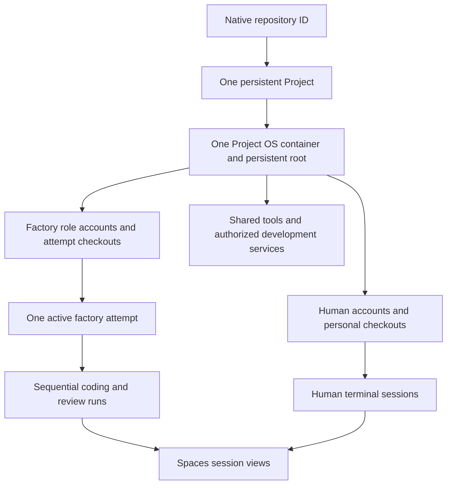

# Projects

A **Project** is the lasting shared development environment for one native
repository on an appliance. Human development and the
[factory](overview.md#software-factory-workflow) use the same Project OS container,
with separate accounts, checkouts and supervised executions. An issue, branch,
worktree or agent run does not create another Project or factory container.

This document owns the target environment model, creation, joining and persistence.
[Spaces](spaces.md#sessions-and-views) owns how sessions are presented and controlled;
[Trust](../architecture/trust.md#project-execution-boundary) owns their authority.
[Project OS](../reference/project-os.md) describes the current runtime interfaces.

## Environment relationships

| Entity | Identity and lifetime |
| --- | --- |
| Repository | Stable native repository ID, independent of its name or URL; owns issues, branches and PRs. |
| Project | One durable repository association and environment reservation on the appliance; outlives attempts and browser sessions. |
| Project container | The Project's primary running environment and retained root. Stop/start reuses it; neither a directory nor a browser locator is a container identity. Nested service containers remain Project workloads. |
| Checkout / worktree | An explicitly owned working directory and Git state inside the Project; not a machine or session. Human directories persist independently of factory work. |
| Attempt | One bounded issue effort; owns its coding branch, checkout and temporary resources across sequential runs. Limits and readiness belong to the [operating rules](overview.md#concurrency-and-usage-limits). |
| Agent run | One role assignment against recorded inputs, with a fresh execution identity, process scope, transient home/configuration and provider lease. Finishing the process does not finish the attempt or erase its checkout. |
| Execution session | A supervised human terminal or one factory run's actual CLI process. It can exist without a browser attachment. |
| Spaces view | An authorized attachment to a particular session, not an execution grant or a lifetime owner. Several views may refer to the same session. |

The factory reuses the repository's associated Project, including one first created
for human development. It does not search for an arbitrary compatible container or
maintain a second persistent environment for automation. Container/process
incarnations and session bindings are checked separately from the lasting Project
ID; restarting a container cannot revive an old process or credential binding.

## Accounts and checkout ownership

Human accounts and homes belong to explicitly joined members. Factory work uses
two persistent nonhuman role accounts, one for coding and one for review; these
are not memberships or provider identities. Each invocation gets fresh transient
run state under its role account. Role permissions and credential boundaries are
owned by [Trust](../architecture/trust.md#project-execution-boundary).

- **Human work:** retain each person's native Git workflow and personal checkouts.
  The factory does not borrow their checkout, dotfiles, keys or CLI credentials.
- **Coding work:** assign one branch and coding checkout to the attempt. Preserve
  unfinished changes across correction runs and pauses. A native linked worktree
  within the coding account's own Git store is allowed; it is an allocation detail,
  not another environment.
- **Review work:** prepare a fresh checkout of the exact published candidate for
  each review, with independent writable Git metadata and no coding conversation
  or local configuration. The reviewer may run checks and write disposable test
  output, but does not publish candidate edits.

Human, coding and reviewing roles must not share writable Git administration.
Linked worktrees share common repository state and use shared configuration by
default, so they are not the boundary between these roles
([upstream Git worktree reference](https://git-scm.com/docs/git-worktree)). The
published native candidate is the handoff from coding to review. Source preparation
uses authorized native repository access; this does not restore Soda-managed Git
credential mediation or put publisher credentials into agent sessions.

Human takeover stops the factory execution and completes credential return or
revocation before making its candidate and unfinished changes available in the
member's own checkout and terminal. The person acts with their own credentials;
they do not attach for input as the factory account. Join is required for that
human terminal, not for merely observing authorized factory work. Handback follows
the [intervention rules](overview.md#human-intervention).

## Preparing the environment

The immutable Project OS profile supplies the base system. Repository-approved
tool versions, setup instructions and development-service requirements supply the
working environment. Resolve those inputs from the accepted base and authorized
configuration before execution, then record the source revision and preparation
result with the attempt. Candidate changes to setup remain proposed changes; they
do not authorize privileged mutation of the shared Project.

Reuse installed compatible tools and explicitly assigned service endpoints.
Agents may prepare dependencies and test data within their own writable areas;
they cannot administer shared tools, the workload engine or human service data.
Destructive tests require assigned disposable data. A missing prerequisite or
required privileged change leaves work waiting for environment preparation, rather
than letting an issue grant root or silently replacing the Project.

This chooses the product boundary, not a new environment manifest format. Native
provisioning and tool/service preparation must be verified against the selected
Project OS before an implementation plan depends on them.

## Creation and ownership

- A repository's human owner may create its project environment.
- Owner-authorized factory setup may include standing permission to create and
  start that environment automatically. Reuse an existing reservation; factory
  enablement does not bypass creation authority or create a human membership.
- Organization-owned creation is unsupported.
- Environment and member visibility resolve current native ownership by stable
  repository ID (including organization `is_owner`) or explicit Soda operator
  authority. A stored creator is not permanent authorization.
- Creation chooses an immutable **Project OS profile**. Existing environments keep
  their original profile; there is no live distro/desktop switcher.

Unsupported ownership, profile or incomplete provisioning requires intervention.
Do not fall back to a separate factory worker or replace a retained root.

## Selected profiles

The first factory uses the supported Rocky headless Project OS foundation: native
accounts, shared tools, persistent roots, access and maintenance. Fedora variants
and graphical desktops are [deferred](scope.md#deferred).

| Profile | Distribution | Interface |
| --- | --- | --- |
| Rocky headless | Rocky Linux | Terminal (default) |

Mise is required in the supported Project OS. A future Runner OS remains separate
from developer environments; [local CI execution](../reference/runners.md) is deferred.

Profiles describe initial userspace and interface, not independent backends.
Server-side code resolves a bounded profile ID to installed, architecture-compatible
artifacts. The browser must not supply arbitrary image references, package lists or
runtime flags.

## Explicit joining

**Join project** creates the intended project-local Linux account, installs
any explicitly selected external-SSH public keys, and records membership only after
confirmed native success.

- The creator must Join as well.
- Account-only Join without external SSH keys follows the Project OS access contract.
- A database row, mock or manual checklist is not Join.
- Never request a private SSH key.
- Join requires the acting Forgejo grant’s current repository code-write permission
  (`permissions.push`). Public visibility, read-only repository access, existing
  membership and Soda operator authority do not grant execution access.
- Managed browser-terminal creation, attachment, inventory, control and heartbeats,
  and installation of project SSH keys, require that same current write permission.
  Missing native permissions deny execution. Readers may still inspect project state.
- Permission loss refuses new Soda execution actions and disconnects browser
  attachments when their next authority check fails. Retained Linux accounts, data,
  existing managed shells and previously installed SSH keys remain; native SSH and
  independent processes are not automatically revoked.
- Stable Forgejo identity binds membership to its original Linux login. Native rename
  or transfer does not silently remap Linux users, ownership or installed keys.

Developers have Linux accounts **inside projects**, not human host accounts or homes.

## Persistence

Normal startup starts the **existing** container. Preserve accounts, homes, SSH host
keys, installed packages and tools, shared files, configuration, dirty work and
service volumes across stop/start and host reboot.

Factory cancellation or run completion stops only the assigned execution and
returns its lease. It must leave human terminals, SSH, services and the Project
running. Remove only recorded, exclusively owned temporary resources after their
processes and credential use have ended. Preserve unfinished attempt work while
blocked, paused or awaiting intervention; successful completion may release its
owned checkout and scratch without touching personal work or service volumes.

**Project Stop** is broader and requires current
[Project lifecycle authority](../architecture/trust.md#project-execution-boundary),
as does Start. Hold factory admission, coordinate agent termination and credential
return, then stop the container and its live workloads. Human
terminals, SSH and services are interrupted, while durable files remain. An issue
event cannot undo this hold. An explicit Start clears the Project lifecycle hold
and starts its existing root; other factory pauses and grants still apply. Start
does not restart an old agent conversation or restore dead terminal processes.

Unexpected shutdown or interrupted credential return requires reconciliation and
the [factory interruption rules](overview.md#human-intervention). A surviving
Project ID or checkout is not proof that an execution or lease may resume.

Never use `--rm`, `--replace`, pruning or deletion as repair.

Projects are a trusted-team namespaced boundary, not hostile-tenant isolation.

## Access

Project access is ordinary `user@project-ip`, SSH/PTY/SCP/SFTP and native service
ports. Clients need a real route; host Tailnet enrollment alone does not provide it.

Managed browser terminals use the member's existing project-local account and home.
Opening a terminal must not create, join or start a project, and must not expose
host root. See [Terminal](../reference/terminal.md).

## Related guides

- Everyday use: [Develop in a project](../guides/develop.md)
- Nested workloads: [Project services](../guides/project-services.md)
- Packaged CLIs: [Project CLIs](../guides/project-clis.md)
- Spaces entry: [Spaces](spaces.md)
