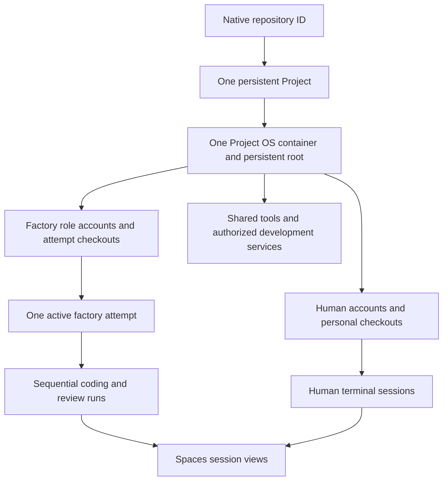

# Projects

A **Project** is the lasting shared development environment for one native
repository on an appliance. Human development and the
[factory](overview.md#software-factory-workflow) use the same Project OS container,
with separate accounts, checkouts and supervised executions. An issue, branch,
worktree or agent run does not create another Project or factory container.

This document owns the target environment model, preparation, creation, joining and persistence.
[Spaces](spaces.md#sessions-and-views) owns how sessions are presented and controlled;
[Trust](../architecture/trust.md#project-execution-boundary) owns their authority.
[Project OS](../reference/project-os.md) describes the current runtime interfaces.

## Environment relationships

| Entity | Identity and lifetime |
| --- | --- |
| Repository | Stable native repository ID, independent of its name or URL; owns issues, branches and PRs. |
| Project | One durable repository association and environment reservation on the appliance; outlives attempts and browser sessions. |
| Project container | The Project's primary running environment and retained root. Stop/start reuses it; neither a directory nor a browser locator is a container identity. Nested service containers remain Project workloads. |
| Checkout / worktree | An explicitly owned working directory and Git state inside the Project; not a machine or session. Human directories persist independently of factory work. |
| Attempt | One bounded issue effort; owns its coding branch, checkout and temporary resources across sequential runs. Limits and readiness belong to the [operating rules](overview.md#concurrency-and-usage-limits). |
| Agent run | One role assignment against recorded inputs, with a fresh execution identity, process scope, transient home/configuration and provider lease. Finishing the process does not finish the attempt or erase its checkout. |
| Execution session | A supervised human terminal or one factory run's actual CLI process. It can exist without a browser attachment. |
| Spaces view | An authorized attachment to a particular session, not an execution grant or a lifetime owner. Several views may refer to the same session. |

The factory reuses the repository's associated Project, including one first created
for human development. It does not search for an arbitrary compatible container or
maintain a second persistent environment for automation. Container/process
incarnations and session bindings are checked separately from the lasting Project
ID; restarting a container cannot revive an old process or credential binding.

## Accounts and checkout ownership

Human accounts and homes belong to explicitly joined members. Factory work uses
two persistent nonhuman role accounts, one for coding and one for review; these
are not memberships or provider identities. Each invocation gets fresh transient
run state under its role account. Role permissions and credential boundaries are
owned by [Trust](../architecture/trust.md#project-execution-boundary).

- **Human work:** retain each person's native Git workflow and personal checkouts.
  The factory does not borrow their checkout, dotfiles, keys or CLI credentials.
- **Coding work:** assign one branch and coding checkout to the attempt. Preserve
  unfinished changes across correction runs and pauses. A native linked worktree
  within the coding account's own Git store is allowed; it is an allocation detail,
  not another environment.
- **Review work:** prepare a fresh checkout of the exact published candidate for
  each review, with independent writable Git metadata and no coding conversation
  or local configuration. The reviewer may run checks and write disposable test
  output, but does not publish candidate edits.

Human, coding and reviewing roles must not share writable Git administration.
Linked worktrees share common repository state and use shared configuration by
default, so they are not the boundary between these roles
([upstream Git worktree reference](https://git-scm.com/docs/git-worktree)). The
published native candidate is the handoff from coding to review. Source preparation
uses authorized native repository access; this does not restore Soda-managed Git
credential mediation or put publisher credentials into agent sessions.

Human takeover stops the factory execution and completes credential return or
revocation before making its candidate and unfinished changes available in the
member's own checkout and terminal. The person acts with their own credentials;
they do not attach for input as the factory account. Join is required for that
human terminal, not for merely observing authorized factory work. Handback follows
the [intervention rules](overview.md#human-intervention).

## Preparing the environment

The first path uses **native Project administration for shared prerequisites,
then automatic unprivileged repository setup and readiness checks**. The immutable
Project OS profile supplies the initial system; it does not describe every later
installed package or prove that a repository builds. Once prepared, the persistent
environment is reused across attempts. Missing shared prerequisites cause an
actionable preparation wait, not a root grant to an agent or a replacement Project.

### Approved preparation inputs

Use the repository's existing tool declarations, package manifests/locks, setup
scripts and native service definitions. Do not introduce a Soda environment
manifest or another package/service manager. A code-write-authorized maintainer
accepts the preparation requirements at an exact source commit from the approved
base, alongside explicit Project configuration. Record the approval revision,
approver and source references in Soda's existing authority/attempt records.
Issue prose and agent suggestions cannot approve their own setup.

Acceptance can cover later attempts whose selected definitions and effective
inputs are unchanged; an unrelated base commit does not require another approval.
Record each attempt's actual source commit. Changed selected requirements need
fresh acceptance, and withdrawal of the approval or its required human authority
invalidates affected preparation under the existing factory withdrawal rules.

The accepted inputs identify required tools and versions, setup entry points and
working directories, allowed writable resources, service requirements and readiness
checks. Bind the effective referenced configuration, not just a top-level filename.
Resolve version ranges to exact installed versions for the preparation result;
do not silently follow a changed branch, script, plugin or floating selection.
Keep authoritative inputs in controller/admin-owned storage. A human or agent
checkout, or the group-writable `/srv/project/shared`, cannot be that trust source.

Maintainer acceptance specifies the desired environment, not permission to run
repository instructions as root. Project administrators separately review privileged
effects, including native service includes, environment interpolation, build inputs,
image selection, mounts, ports and persistent data. The
[privilege boundary](../architecture/trust.md#project-preparation-authority) governs
who can execute those changes. Approval of a parent file does not authorize later
agent edits to referenced files or values.

### Preparation sequence

1. **Acquire the existing Project.** Under current lifecycle authority and any
   standing owner grant, create the supported profile if absent or start/reuse its
   retained root. Confirm the actual profile and container incarnation. Fixed
   privileged assistance establishes the two non-login factory roles and their
   protected directory layout; it does not use human Join or grant wheel/SSH.
2. **Check shared prerequisites.** Reuse compatible installed tools and assigned
   services. If an OS package, shared runtime, root-owned configuration or service
   is missing, name the unmet requirement and wait for native Project administration.
   Administrators use ordinary `dnf`, mise and Compose/systemd, with protected
   approved inputs. Soda does not add a general or typed privileged installation
   service for this first path. Common build prerequisites belong in Project OS
   packaging; a missing baseline tool is not a reason for every issue to install it.
3. **Prepare the assigned checkout.** Resolve and record installed tool executables
   and required environment in a controlled administrative context. Launch setup
   directly as the assigned factory role, with explicit tool paths/PATH and fresh
   private home/configuration/cache. Do not source human dotfiles, activate mise
   shims, or let a controller/root `mise exec`, `mise run` or `mise env` evaluate a
   repository checkout. Execute the setup entry point and its policy/helper
   references from the protected approved snapshot, using the assigned checkout
   as working input, not as the authority for which setup script to run. Repository
   code and dependency install hooks have only that ordinary role's permissions.
4. **Verify usability as the role.** Check the actual tools, writable dependency
   and build paths, assigned service access and a repository-specific smoke check.
   Record success before leasing provider credentials or starting an AI CLI.
   Repeat private setup and checks for a fresh review checkout at the published
   candidate; coder state is not reviewer preparation evidence.

Private preparation can install application dependencies into role-owned
`node_modules`, virtual environments and equivalent build directories. Ordinary
candidate package/lockfile changes can therefore be tested using the approved
toolchain; record the candidate and dependency inputs used. Candidate edits to
authoritative toolchain selection, setup policy or shared service configuration
remain proposals until separately adopted. This does not require human approval
of every ordinary code/dependency edit, and none of these edits grants shared
write access. Setup receives neither provider credentials nor native publisher
credentials. A private dependency source needing additional access stays waiting
until that access has a separately authorized supported path.

### Services and readiness evidence

Project administrators provision persistent development services through the
[native workload path](../guides/project-services.md). Assign each factory role the
required endpoint and narrowly scoped native service credentials, plus explicitly
disposable test databases, schemas, directories or other resources. The grant must
be enforced by the service/filesystem, not merely described in a prompt. An open
endpoint that also permits destroying human data is not a safe assignment. Agents
receive no shared engine socket or service-administration credentials; service
secrets stay out of prompts and receipts. Role-owned temporary test processes are
allowed within the supervised execution and resource limits.

Destructive tests and migrations may affect only assigned disposable data.
Provisioning or migrating shared human service data requires explicit native
administration. Process success alone is insufficient: test connectivity and the
needed permissions from the role, and check service health using the approved
probe. Preserve human workloads and volumes when a run ends.

An attempt's preparation result binds its environment approval revision, Project
profile and actual container incarnation, role/checkout commit, resolved tool
versions/paths, setup inputs/result and assigned service/resource identities with
their observed checks. Secret references may identify access; secret values are
not evidence. Reuse a compatible shared installation, but recheck its actual
state and prepare each run's private configuration. A restarted/replaced service
requires fresh identity and access/health checks. The boot marker, an image
digest, a previous attempt's success or an agent's claim cannot establish readiness.

### Changes and failed preparation

Hold affected factory work before shared maintenance. Stop its runs, finish
credential return and invalidate outstanding write authority before changing
approved shared inputs; coordinate any human/service interruption with the Project
administrator. Retain the same root and protected data, then record the new actual
state and rerun readiness checks. Native root/wheel is trusted to respect this
hold; Soda does not claim to fence arbitrary out-of-band root changes atomically.
Detected drift invalidates affected readiness and triggers the existing
[withdrawal/reassessment rules](overview.md#human-intervention). Stop/start requires
fresh runtime and service checks, never resurrection of an old run or lease.

A failed setup records the failed prerequisite and any partial effects. Timeout
or controller loss is an uncertain result until the assigned processes are stopped
and effects inspected. Retry only a known safe/idempotent step or recreate
exclusively owned disposable state after quiescence; never blindly repeat shared
migrations, delete human data or reset the whole Project. Bound preparation by the
applicable execution/resource allowances; waits release execution capacity and
hold no provider lease. Retrying preparation does not replenish attempt limits.

## Creation and ownership

- A repository's human owner may create its project environment.
- Owner-authorized factory setup may include standing permission to create and
  start that environment automatically. Reuse an existing reservation; factory
  enablement does not bypass creation authority or create a human membership.
- Organization-owned creation is unsupported.
- Environment and member visibility resolve current native ownership by stable
  repository ID (including organization `is_owner`) or explicit Soda operator
  authority. A stored creator is not permanent authorization.
- Creation chooses an immutable **Project OS profile**. Existing environments keep
  their original profile; there is no live distro/desktop switcher.

Unsupported ownership, profile or incomplete provisioning requires intervention.
Do not fall back to a separate factory worker or replace a retained root.

## Selected profiles

The first factory uses the supported Rocky headless Project OS foundation: native
accounts, shared tools, persistent roots, access and maintenance. Fedora variants
and graphical desktops are [deferred](scope.md#deferred).

| Profile | Distribution | Interface |
| --- | --- | --- |
| Rocky headless | Rocky Linux | Terminal (default) |

Mise is required in the supported Project OS. A future Runner OS remains separate
from developer environments; local CI execution is [deferred](scope.md#deferred).

Profiles describe initial userspace and interface, not independent backends.
Server-side code resolves a bounded profile ID to installed, architecture-compatible
artifacts. The browser must not supply arbitrary image references, package lists or
runtime flags.

## Explicit joining

**Join project** creates the intended project-local Linux account, installs
any explicitly selected external-SSH public keys, and records membership only after
confirmed native success.

- The creator must Join as well.
- Account-only Join without external SSH keys follows the Project OS access contract.
- A database row, mock or manual checklist is not Join.
- Never request a private SSH key.
- Join requires the acting Forgejo grant’s current repository code-write permission
  (`permissions.push`). Public visibility, read-only repository access, existing
  membership and Soda operator authority do not grant execution access.
- Managed browser-terminal creation, attachment, inventory, control and heartbeats,
  and installation of project SSH keys, require that same current write permission.
  Missing native permissions deny execution. Readers may still inspect project state.
- Permission loss refuses new Soda execution actions and disconnects browser
  attachments when their next authority check fails. Retained Linux accounts, data,
  existing managed shells and previously installed SSH keys remain; native SSH and
  independent processes are not automatically revoked.
- Stable Forgejo identity binds membership to its original Linux login. Native rename
  or transfer does not silently remap Linux users, ownership or installed keys.

Developers have Linux accounts **inside projects**, not human host accounts or homes.

Removing the last saved development-access public key requires explicit
confirmation. Saved-key removal does not itself establish that previously
installed native SSH access has been revoked.

## Persistence

Normal startup starts the **existing** container. Preserve accounts, homes, SSH host
keys, installed packages and tools, shared files, configuration, dirty work and
service volumes across stop/start and host reboot.

Factory cancellation or run completion stops only the assigned execution and
returns its lease. It must leave human terminals, SSH, services and the Project
running. Remove only recorded, exclusively owned temporary resources after their
processes and credential use have ended. Preserve unfinished attempt work while
blocked, paused or awaiting intervention; successful completion may release its
owned checkout and scratch without touching personal work or service volumes.

**Project Stop** is broader and requires current
[Project lifecycle authority](../architecture/trust.md#project-execution-boundary),
as does Start. Hold factory admission, coordinate agent termination and credential
return, then stop the container and its live workloads. Human
terminals, SSH and services are interrupted, while durable files remain. An issue
event cannot undo this hold. An explicit Start clears the Project lifecycle hold
and starts its existing root; other factory pauses and grants still apply. Start
does not restart an old agent conversation or restore dead terminal processes.

Unexpected shutdown or interrupted credential return requires reconciliation and
the [factory interruption rules](overview.md#human-intervention). A surviving
Project ID or checkout is not proof that an execution or lease may resume.

Never use `--rm`, `--replace`, pruning or deletion as repair.

Projects are a trusted-team namespaced boundary, not hostile-tenant isolation.

## Access

Project access is ordinary `user@project-ip`, SSH/PTY/SCP/SFTP and native service
ports. Clients need a real route; host Tailnet enrollment alone does not provide it.

Managed browser terminals use the member's existing project-local account and home.
Opening a terminal must not create, join or start a project, and must not expose
host root. See [Terminal](../reference/terminal.md).

## Related guides

- Everyday use: [Develop in a project](../guides/develop.md)
- Nested workloads: [Project services](../guides/project-services.md)
- Packaged CLIs: [Project CLIs](../guides/project-clis.md)
- Spaces entry: [Spaces](spaces.md)
