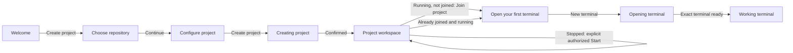

# Sodaspaces implementation plan

This document owns Sodaspaces product scope. The [combined native-pages/Runners
plan](native-pages-runners-plan.md) alone owns their remaining coordination and
Cockpit runner retirement. The separately selected [Tailnet plan](tailnet-integration-plan.md)
owns host/project networking and the last Soda Cockpit extension's retirement;
unrelated Project OS/services/CLI work is not absorbed into either.
Installed revisions, acceptance gaps and active grants belong to the
[current handoff](development-handoff.md), with receipts in [history](implementation-history.md).

Provide one **Sodaspaces button beside Forgejo's repository actions**, opening a
**right-side shared-environment drawer**, plus global **Spaces** navigation and a
full workspace page. No new Forgejo repository tab; tabs inside the drawer and
Spaces panes are required. Both surfaces share Lit components, not separate frontends.

Detailed requirements stay with their owners:

- [Persistent workspace](persistent-workspace-plan.md): requested iframe implementation
  plan, navigation alternatives and independent status. The [terminal continuity target](terminal-integration.md#target-uninterrupted-forge-browsing)
  supersedes reattachment as acceptance for ordinary Forgejo browsing; source work is pending.
- [Native page integration](forgejo-soda-pages-plan.md): native hosts, fixed bookmark
  bridges, initial connection and coordinated logout; no separate Go page shells.
- [Full-page](spaces-design.md) and [drawer](spaces-drawer-design.md) designs: UX,
  subject to that native host/connection contract.
- [Lit](lit.md) and its [implementation guide](lit-migration-plan.md): shared rendering;
  [terminal integration](terminal-integration.md): exact sessions and native lifetime.
- [Frontend improvement](frontend-improvement-plan.md): canonical tokens, template
  diagnostics, typed composition and source/build ownership.
- [Upstream-first review](refactoring-plan.md): bounded maintenance recommendations.

Older shell/phase descriptions below retain design history, not alternate entry,
release, permission or completion instructions.

The [CoreOS product strategy](os-product-strategy.md) is longer-term host guidance.
Capacity/recovery/boot work, the separate Rocky 10.2 retained-root decision and
credential onboarding are not prerequisites to the Lit source ports.

The [manual installer correction](coreos-installer-plan.md#manual-install-decision--10-september-2026)
records the subsequent password-only USB/VM flow, separate post-boot SSH enrollment
and complete fresh-install validation work. The [media direction](installation.md#publication-direction)
is ISO first, a recommended prepared QCOW2 next, and the matching Soda payload in
the media; a host OCI remains optional. [Update ownership](os-product-strategy.md#update-ownership)
separates native CoreOS updates from Soda releases and Services app upgrades.
These documented directions do not claim implementation, authorize media publication
or block independent selected developer work.

## Project OS foundation

The [Project OS baseline](project-os.md) consolidates the existing Rocky + mise,
account/sudo, shared-state, SSH/credential, native-service and persistence contracts.
Every selected Rocky/Fedora headless/KDE profile inherits that foundation. KDE is
graphical access to the same project account, home, tools and services; no separate
desktop machine or VM backend is selected by the distro/interface choice.
The [ownership map](project-os.md#one-foundation-for-every-profile) keeps the existing
development, workload, CLI, terminal and maintenance plans authoritative.
All profiles must meet the [batteries-included contract](project-os.md#batteries-included-by-default):
Soda supplies and wires standard tools, build prerequisites, workload support and
the chosen interface. Personal preferences and repository-specific versions remain
choices; requiring users to assemble the ordinary foundation is an implementation gap.
Its concrete gaps remain native tmux safety/required-tool coverage, real zero-key
onboarding and agreed Git credentials; the existing session mechanism is preserved
while the Lit workspace is implemented. Current Forgejo
administration and already issued Linux sudo/SSH rights are distinct, not synchronized.

Required additions to retained roots use [bounded same-root native maintenance](project-os.md#deliver-required-additions-without-replacing-roots),
not image replacement, installation on Open or a fleet updater. The exact recipe and
native cgroup/continuity proof belong to the terminal feature before existing-target
delivery. No separate OS-planning phase is a prerequisite for that source work.
No project/package/capability changes or execution scope are granted by the baseline.

## Spaces page — implementation and remaining work

The [first-use journey implementation plan](#first-use-journey-implementation-plan)
below records the selected September 2026 welcome-to-terminal redesign and its
independent progress. The [design owner](spaces-design.md#first-use-journey--selected-13-september-2026)
contains the agreed states and visual references.

The user explicitly requested **design first for multiple simultaneous terminals
across multiple projects**. After online research, the [revised Spaces design](spaces-design.md)
now specifies project/session navigation, local tabs, direct splits/resize/maximize,
attention separate from connection state, compact drawer/mobile behavior and bounded
implementation. [Static design sheets](design/spaces/README.md) replace the earlier
interactive mockup as the review material—no new server/port. The grid-preset selector,
arbitrary four-pane limit and first-slice bulk actions are removed from the proposal.
Semantic agent statuses require real explicit signals, not inferred output activity.
Concurrency and the Spaces entry point now have an initial local implementation;
the broader design specification is not completed UX/native acceptance. The page must be a usable
multi-project workspace, not only an environment catalog. Current installed single-
terminal evidence remains bounded by the handoff; this request does not imply a
Rocky rollout, project recreation or other native execution.

This replaces the earlier exclusion of an environment catalog. It is a bounded Soda
feature, not restoration of either old standalone frontend or Forgejo workflow adapters.

- **Global navigation:** add Spaces after Explore, alongside Issues, Pull requests
  and Milestones, through supported native template hooks/overrides. The selected
  global settings entry/page for Sodarunners is restricted to the **Soda operator**, not any
  Forgejo site administrator. Retain Cockpit Runners until its replacement works.
- **Page ownership:** a Soda-owned, server-rendered Go/template page at
  `/-/soda/spaces`, inside the existing proxy namespace. This deliberately extends
  the Go service with bounded Soda-owned HTML; Forgejo-owned workflows stay native.
  Lit owns only Soda's interactive workspace inside that HTML shell. No Forgejo
  executable changes, iframe, HTML relay or replacement of native workflows.
- **Listing:** show the environments this actor is authorized to see, with repository,
  membership and observed running/stopped/unavailable state. Authorize before rendering
  rows, counts or metadata, using legitimate Soda associations and current acting-user
  authority. Preserve the existing membership/operator/degraded-read boundaries; no
  all-project dump filtered in JavaScript, copied permission inventory or provider
  failure disguised as an empty list. Bound enumeration and live inspection.
- **Authentication:** use Soda's existing secure session and Forgejo OAuth when needed.
  A normal HTML navigation derives its actor server-side, not from a client hint or
  Forgejo cookie. Add a fixed Spaces return destination bound to the OAuth transaction,
  not a caller-supplied redirect URL. Preserve PKCE/state, encrypted grants, logout-
  winning behavior, fresh operation-specific authorization and API actor/CSRF checks.
  Same origin is not a shared session; native-only logout is not atomic Soda logout.
- **One workspace:** the page has project/session navigation and pane-local tabs;
  the drawer is its single-visible-terminal projection, not another catalog/owner.
  Opening/restoring never creates, joins, starts or repairs a project or replays input.
  Full-page navigation preserves exact session IDs and the saved pane tree, not DOM
  objects across documents. One writer per ID still wins across windows.
- **Selected page shell:** use the design's Soda-owned Go shell, canonical assets,
  fixed native links and explicitly labelled Soda account. Shared CSS does not supply
  native CSRF/session/notification context; do not load native scripts against invented
  context, copy upstream authentication, relay HTML or borrow cookies. The Lit plan
  includes page-only CSP, styling/clipboard, fixed OAuth return and staging checks.

The authorized collection, navbar/page, fixed OAuth return and shared multi-session
UI are source-implemented and locally tested, including step-5 measured panes and
compact projections, observed unread/lifecycle attention and extended driver fixtures.
Concurrent native/CLI acceptance remains pending.
The [Lit sequence](lit-migration-plan.md#4-ordered-implementation-slices) now specifies
concrete owners and exits for these features. Validate authentication/expiry/logout,
denied/unavailable listings, per-ID actions and same-session drawer use across both
entry points. Existing drawer checks are not Spaces-page evidence; missing broad
native continuity proof remains an acceptance obligation, not a reason to rewrite
already implemented tmux or postpone independent Lit/source work.

## First-use journey implementation plan

**Updated 13 September 2026. Status: design direction selected; step-by-step
implementation guide authored; application implementation and journey acceptance
pending.** This workstream owns the bounded
Spaces first-use redesign, separately from Tailnet, Forgejo-wide redesign and the
broader Project OS/Services/AI roadmap. The current request is to document the plan;
no application code, installed service or project state is changed by this work.
Execution permissions remain in the [current handoff](development-handoff.md#current-permissions).

### Outcome and completion boundary

A developer can enter native **Spaces**, understand what a project provides, select
an eligible repository on this Forgejo, configure and explicitly create a project,
join it and open a usable browser terminal. The working workspace then supports
normal terminal navigation without presenting setup, SSH, pane layout and project
administration as competing first-use actions.

The [first-use design](spaces-design.md#first-use-journey--selected-13-september-2026)
owns copy, layout, mockups, conditional states, accessibility and control placement.
Keep those requirements there rather than maintaining a second design in this plan.
Creation, membership and terminal admission retain their existing owning contracts.
The user-selected first-use path is complete at **usable terminal input**, not at
“project created” or a rendered empty terminal rectangle. Broader release acceptance
and native multi-terminal evidence retain their existing scope.

### Existing implementation and gaps

Source inspection for this plan found the following; these are source facts, not
installed proof or claims about the capabilities of uninspected upstream APIs.

| Area | Existing owner | Bounded work |
| --- | --- | --- |
| Native page and workspace | `frontend/spaces/sodaspaces-page.ts`, `sodaspaces-workspace.ts`, `sodaspaces-workspace-view.ts` | Add first-use/setup views and the selected-project header to the existing Lit owner; preserve renderer slots and pane tree |
| Collection and identity | `frontend/spaces/sodaspaces-api.ts`, `internal/web/spaces.go`, `internal/forgejo/` | Reuse authorized project inventory; resolve global repository discovery against the selected Forgejo version and current OAuth scopes |
| Project creation and membership | `frontend/spaces/sodaspaces-project.ts`, `internal/web/environments_api.go` | Reuse explicit Create and Join; compose their outcomes into the journey rather than introducing another mutation implementation |
| Configuration | `sodaspaces-environment-view.ts`, `sodaspaces-network.ts`, `internal/web/project_profiles.go` | Reuse real installed profile and network selection/admission; no new profile backend |
| New terminal | `sodaspaces-workspace.ts` / `sodaspaces-workspace-view.ts` | Current UI opens a project/name dialog; add direct creation for a visible selected project/account while retaining existing admission and exact pending-entry logic |
| Work surface and presentation | `frontend/spaces/sodaspaces-terminal*`, `sodaspaces-layout.ts`, shared Spaces CSS | Preserve native terminal and layout mechanisms; change labels, hierarchy, menus and token-based styling |

Current Create checks **human repository ownership** and rejects organization-owned
creation. Do not infer creation authority from repository visibility, collaborator
access or the sample `acme/api` label. Current creation does not Join; Join can use
`ssh_keys: none` for browser-only access. The [API guide](dashboard-api.md) owns that
contract and its remaining native proof. Only the installed Rocky headless profile
is admitted today; [Project OS](project-os.md#selected-environment-profiles) owns the
future choices. The repository-wide `.artifacts/design/spaces-empty-state/` images
are generated concepts with illustrative data, not an eligibility specification.

### Implementation sequence and exits

Execute steps 1–15 in the existing J1–J5 order. Add the listed tests alongside each
behavior change, not after assembling the whole UI. Use coherent commits at stage
boundaries; keep this workstream's progress below current. Checkbox completion means
the stated exit has evidence, not that native delivery happened.

Before editing application code, inspect `git status`, the current handoff and the
selected design. Use the canonical checkout and pinned toolchain. The
[TypeScript guide](typescript.md) owns prerequisites and test effects; the
[Lit guide](lit.md) owns rendering and component boundaries. Read those rather than
introducing a setup controller, state-machine framework or separate frontend.

#### J1 — Establish the repository picker contract

**Files:** `internal/forgejo/`, `internal/web/environments_api.go`,
`internal/web/environment_authority.go`, `frontend/spaces/sodaspaces-api.ts` and
`docs/dashboard-api.md`. A focused repository-list client/handler file is reasonable
if needed. The implemented bounded `GET /api/repositories` contract is now owned
by [the API guide](dashboard-api.md#spaces-repository-discovery).

##### Step 1 — Resolve the upstream discovery operation

- [x] Confirm the selected Forgejo image in `appliance/services/forgejo.container`.
  Guide inspection found **15.0.7**. Its tagged
  [`repo.Search`](https://codeberg.org/forgejo/forgejo/src/tag/v15.0.7/routers/api/v1/repo/repo.go)
  implements `GET /repos/search` with `q`, `uid`, `exclusive`, `private`, `page`
  and `limit`; tagged
  [`user.ListMyRepos`](https://codeberg.org/forgejo/forgejo/src/tag/v15.0.7/routers/api/v1/user/repo.go)
  provides a paginated `GET /user/repos`. These are upstream capabilities, not new
  Soda methods. Check their route middleware and effective OAuth read scopes before
  selecting one. Do not implement global search by filtering only one list page.
- [x] Prefer upstream owner-filtered search for creation discovery if its effective
  grant behavior fits. Derive the owner from the authenticated actor, never from a
  browser-supplied user ID. Existing shared projects still come from `/api/spaces`.
  Check returned identity/ownership rather than trusting a search filter as authority.
- [x] Record the selected upstream request, pagination semantics and private-repository
  behavior in the API owner when implementing it. Reuse `Client.request`, bounded
  response decoding, `RepositoryByID` and effective-consent checks where applicable.
  Keep credentials server-side; no provider adapter or incidental dependency upgrade.

**Check:** add `httptest` client cases in `internal/forgejo/` for query encoding,
paging, authenticated requests, malformed/oversized responses and provider failures.
These establish Soda client behavior, not real-provider acceptance.

##### Step 2 — Implement the protected picker projection

- [x] Add only the bounded read operation the picker needs and register it through
  the existing `apiProtected` route owner. Document its path, accepted query fields,
  limits, result shape and failures in `docs/dashboard-api.md` in the same commit.
- [x] Return stable repository IDs and display names, server-evaluated eligibility,
  and authorized existing-project/reservation outcomes. Separate more pages or
  incomplete results from a confirmed empty result. Choose explicit query/page,
  response-byte, request-duration and concurrency bounds; test their actual edges.
- [x] Reuse current acting-user repository and project-read authority before exposing
  project metadata. Visibility, creation permission and permission to open an existing
  project are distinct. Do not publish a hidden project's existence or aggregate count.
- [x] Leave final Create reauthorization and unique reservation in
  `apiCreateEnvironment`. Picker reads perform no provisioning, membership, terminal
  or network mutation. Recheck the original session before publishing delayed results.

**Check:** personal owner versus collaborator/organization/site-admin eligibility;
private and inaccessible repositories; ownership transfer; existing and incomplete
reservations; unknown/repeated/oversized query fields; empty, partial and failed
reads; logout/actor change during a delayed provider response. Extend the existing
`internal/web/` authorization tests, using the real handler and synthetic peers.

##### Step 3 — Add the typed browser caller

- [x] Add a runtime-validated picker response beside existing decoders in
  `sodaspaces-api.ts`. Validate identity, bounds and mutually consistent outcomes;
  do not cast parsed JSON into a trusted interface.
- [x] Call it through the workspace's existing actor-bound request path. Associate
  requests with the active query/page and session; ignore superseded responses and
  retire pending reads on logout/disposal. Do not create another login/session owner.
- [x] Add decoder and request tests in `tests/frontend/spaces-api.test.ts` and the
  existing workspace fixture. Include out-of-order search completion and an actor
  change while a request is pending.

**J1 exit:** a real supported upstream operation can supply bounded, authorized
repository choices through the tested Soda contract. No UI choice grants creation
permission and no new OAuth scope or write token has been silently introduced.

#### J2 — Build welcome, selection and configuration

**Files:** `frontend/spaces/sodaspaces-page.ts`, `sodaspaces-workspace.ts`,
`sodaspaces-workspace-view.ts`, `sodaspaces-project.ts`,
`sodaspaces-environment-view.ts`, `sodaspaces-network.ts` and existing Spaces CSS.

##### Step 4 — Add the setup presentation to the existing workspace

- [x] Keep `mountSpacesPage` and the native Forgejo entry. Add the small typed
  presentation state needed for welcome, repository selection and configuration to
  `SodaSpaces`; keep it separate from the pane tree, terminal owners and server facts.
- [x] Render welcome only when `/api/spaces` confirms `complete: true` and no items.
  Loading, failure and incomplete-empty inventory need their own presentation. With
  existing projects, enter the workspace directly. Use the design owner's exact copy
  and control hierarchy, not a second specification in the implementation.
- [x] Add stateless typed render helpers alongside `sodaspaces-workspace-view.ts` as
  needed. Keep terminal host nodes stable while switching setup/workspace/settings.
  Preserve the previous workspace when starting another project's setup; Cancel
  restores it without closing shells or overwriting the pane tree.

**Check:** extend `tests/frontend/workspace.test.ts` and
`tests/frontend/fixtures/workspace-fixture.ts`: loading never flashes welcome;
incomplete/failed reads never claim no projects; returning users bypass onboarding;
starting and cancelling setup with live terminals preserves owner identity.

##### Step 5 — Build repository selection and the native creation handoff

- [x] Wire Create project to the picker, then implement radio selection, search,
  paging, Continue and Back using J1's typed results. Store the selected repository
  ID, not its label or list index. No implicit first-row selection.
- [x] Preserve nonsecret choices during Back/Change in the active flow; invalidate
  choices when current authorization no longer permits them. Render existing-project
  Open or incomplete-reservation guidance from authorized results, never another Create.
- [x] Link Create a new repository to Forgejo's existing native repository creation
  route using the supported sub-URL context. On return, refresh choices and require
  deliberate selection; no custom callback, automatic selection or project mutation.
- [x] Wire How Spaces works to existing user help. Update
  `docs/public/30-Use-Soda/20-projects-and-workspaces.md` for the selected explanation
  rather than adding an unrelated onboarding site.

**Check:** keyboard radio/search/paging use, empty search versus no eligible repository,
long owner/name labels, stable selection across pages, Back/Change focus, native
handoff under a sub-URL and no writes from selection or navigation.

##### Step 6 — Compose configuration from the project owner

- [x] Use the selected repository to load the existing project/profile/Tailnet option
  reads. Reuse `SodaProjectControls` drafts and admission through a small typed
  presentation interface or setup mode as needed. `mountProjectControls` currently
  exposes refresh/readiness/invalidation/disposal, not a public Create API; do not
  bypass its private guards with a second workspace POST implementation.
- [x] Render only installed profile choices from the API. Preserve the selected
  repository identity and the design's optional Tailnet behavior. Changing repository
  must invalidate repository-bound profile/network observations before submission.
- [x] Keep readiness and failures scoped: unavailable profiles block creation;
  unavailable optional network management does not block explicit Off creation.
  If a selected network option becomes invalid, require review rather than silently
  changing the submitted choice. Keep SSH forms outside setup.

**Check:** extend `tests/frontend/repository-settings.test.ts` and
`tests/frontend/drawer-controls.test.ts` with emitted-component cases where possible;
exercise delayed profile results, changed repository, missing profile, Tailnet Off,
changed network binding and draft preservation. Native-only cases remain separately
labelled; a skipped native case is not source coverage.

**J2 exit:** welcome, picker and configuration use typed data and existing owners;
only the final Create button can submit project creation. New helpers, if extracted,
are staged with the normal module graph rather than served as raw TypeScript.

#### J3 — Integrate Create, Join and readiness

**Files:** `sodaspaces-project.ts`, `sodaspaces-workspace.ts`, their view helpers,
`internal/web/environments_api.go` if an affected response contract needs a change.

##### Step 7 — Connect explicit Create and its confirmed result

- [x] Submit through `SodaProjectControls.mutate` and its existing command admission.
  Capture the repository, selected profile and optional network intent at dispatch;
  disable duplicate submissions synchronously. Configuration renders pending state
  without manufacturing native progress percentages.
- [x] Validate the confirmed response against that captured identity. Use the existing
  `soda-project-changed` notification to trigger readback, not to infer readiness or
  trigger Join. If the setup view needs a richer outcome, expose only a typed result
  from this same owner; do not add a generic command bus.
- [x] Refresh authorized project/detail state and select the created project. Show the
  sidebar only after confirmation; do not guess success from a timeout or receipt of
  an arbitrary JSON object.

**Check:** one POST for a deliberate click/double-click sequence, correct repository
and option binding, no late result publication after actor change, and no automatic
Join, separate lifecycle Start, or terminal creation after Create. Native provisioning
may itself return a running project; that is not a reason to send another Start.

##### Step 8 — Keep uncertain creation recoverable without replay

- [x] Inspect `apiCreateEnvironment`'s retained-reservation error responses and the
  browser error path. The current request helper reduces failures to status/code;
  preserve validated project identity from an admitted error when available, or
  recover it through the existing repository-scoped read. Never trust a raw Location
  or arbitrary error URL as a new target.
- [x] Distinguish rejection before reservation, retained incomplete reservation and
  transport/readback uncertainty. Keep the original repository/known project ID and
  offer read-only inspection or operator guidance. Reload must observe, not resubmit.
- [x] Keep successful provisioning separate from optional Tailnet outcome. Network
  follow-up belongs to the Network view; it must not send Create again.

**Check:** lost response, malformed success, returned incomplete reservation, failed
result persistence, conflict with another creator, logout during dispatch and network
setup failure after provisioning. Assert mutation counts and retained identities,
not merely the presence of an error message.

##### Step 9 — Present Start, Join or first-terminal readiness

- [x] Derive the primary action from fresh provisioned/running/membership/authority
  facts using existing project reads. Do not treat a sidebar selection as a target
  change for a pending operation or an existing terminal.
- [x] Keep Start an explicit authorized lifecycle command. Keep Join a separate
  command using `{"ssh_keys":"none"}` for this browser-only journey. Reuse their
  current owner and validate readback before presenting the next step.
- [x] Show the actual account login from confirmed membership. Failed optional
  external-SSH/key reads must not become a browser-terminal prerequisite; isolate
  those reads in the Access presentation if the shared refresh currently couples them.
- [x] Before declaring the project has no terminals, inspect the authorized inventory
  including hidden/existing entries. Partial inventory is uncertainty, not permission
  to invent a first-terminal state. Offer the appropriate existing-terminal navigation.

**Check:** stopped authorized/denied, incomplete project, running not joined, pending
and failed Join, already joined, unsupported login, keyless membership, hidden terminal
and incomplete inventory. Assert separate clicks and original account/target identity.

**J3 exit:** confirmed creation and explicit membership lead to an accurate terminal
entry state; uncertainty is actionable without duplicate resources or chained writes.

#### J4 — Complete the working terminal transition

**Files:** `sodaspaces-workspace.ts`, `sodaspaces-workspace-view.ts`,
`sodaspaces-project-view.ts`, the existing terminal facade and Spaces CSS.

##### Step 10 — Open the first terminal without a naming dialog

- [x] Route selected-project New terminal into the existing `createTerminal()` path
  with a default `Terminal N` name and an existing valid destination pane. Retain a
  chooser only where project/account targeting is genuinely ambiguous.
- [x] Reuse `addSlot` and the terminal facade's `open` path. Preserve native ID
  allocation, publication before Create, exact pending recovery and all admission
  guards from the [terminal contract](terminal-integration.md). Do not allocate a
  replacement ID to repair an observer or an uncertain Create.
- [x] Show Opening for that entry until its exact terminal is usable. Then expose its
  tab/sidebar row and place New terminal in the header, only once. Focus the shell
  after user-requested attachment; background updates must not steal focus.

**Check:** extend `tests/frontend/workspace.test.ts`, `terminal.test.ts` and
`workspace-journey.test.ts`: no mandatory naming dialog, one reservation/Create path,
correct default name, project/destination race, capacity refusal, pending response
loss, another writer, focus and subsequent Rename. Test usable input/output against
the synthetic peer while labelling it separately from native shell proof.

##### Step 11 — Finish project navigation and contextual controls

- [x] Add the selected-project header and sidebar selection without retargeting
  mixed-project terminal slots. Keep project search conditional as specified by the
  design. A hidden terminal stays discoverable without another Create.
- [x] Present Project settings through the same project owner as Overview/Access/
  Network, with Back restoring the workspace. Keep optional SSH there and reuse
  existing lifecycle confirmations and coordinated native sign-out.
- [x] Move terminal and pane actions into their contextual menus. Preserve distinct
  Hide, named End, split/move and shared-project Stop semantics. Retain keyboard
  alternatives and disclose Reconnect at the affected terminal.
- [x] Update `docs/spaces-drawer-design.md` only for labels/composition actually
  changed in shared controls. Do not rebuild the repository drawer or global
  administration navigation as part of this journey.

**Check:** selected project versus focused terminal identity, settings Back, hidden
terminal rediscovery, exact End/Cancel target, split/move without shell creation,
keyboard menu use and the existing page/drawer continuity cases.

##### Step 12 — Apply responsive styling without rebuilding terminal owners

- [x] Use existing `sodaspaces-workspace.css`, `sodaspaces-project.css` and canonical
  theme tokens. Apply the [selected responsive design](spaces-design.md#required-branches-and-responsive-behavior)
  to setup, settings and the populated workspace; avoid independent theme palettes.
- [x] Keep the measured pane projection and stable terminal host layer. Compact
  Projects navigation must not replace live renderers or overwrite the desired
  desktop layout. Handle short viewports, zoom and mobile keyboard geometry.
- [x] Check focus order, real labels, radio semantics, live pending/error announcements
  and touch targets in both themes. Use the canonical icons, not generated mockup art
  as production assets.

**Check:** extend `tests/frontend/spaces-layout.test.ts`, `spaces-attention.test.ts`
and affected drawer layout cases. Review 1440, 800, 640 and 390px with long names,
overflowing tabs and multiple panes. Capture actual UI with `scripts/screenshot.ts`
under the [capture guide](screenshot-capture.md); mockups are not implementation proof.

**J4 exit:** a running joined project opens one usable terminal through the existing
owner. The agreed full-page hierarchy works without breaking identity, lifetime,
layout restoration or the shared drawer.

#### J5 — Close journey acceptance and document delivery limits

##### Step 13 — Wire the emitted graph and run affected local checks

- [x] Register any new production modules in
  `internal/release/build/forgejo-payload.json` and keep `scripts/build-forgejo.ts`
  aligned. Bump the presentation epoch and all affected entry/style URLs together
  under the [TypeScript asset contract](typescript.md). Do not edit emitted files.
- [x] Extend the existing fixture/driver with the whole welcome-to-input sequence,
  recording each mutation and target. Verify Back, refresh, failed reads and normal
  re-entry generate no writes. Reuse existing terminal journey/navigation helpers
  rather than adding a second scenario runner.
- [x] Select the checks below for changed contracts. Run them with the documented
  prerequisites and no installed/provider opt-in flags for ordinary source testing.
  Reuse valid unchanged-source evidence rather than treating this as a mandatory
  aggregate build sequence.

| Change / evidence | Existing command or driver |
| --- | --- |
| Go picker, authorization or response behavior | `go test -race ./internal/forgejo ./internal/web` (or the affected named tests during iteration) |
| Strict browser types and Lit templates | `bun run typecheck` |
| Emitted production assets | `bun run build:forgejo` |
| Frontend/component behavior | `bun run test:frontend`; it prepares the emitted assets itself |
| Shared drawer geometry | `bun run test:layout` |
| Native hooks, presentation epoch and emitted closure | `bun run test:forgejo`; payload changes also select affected `internal/release/build` / `scripts` Go tests |
| Actual native-page HTML/CSP and connection | `bun run test:pages`, only with its authorized fixture prerequisites; operations are still synthetic |

Extend `tests/frontend/spaces-page.test.ts` and the native connection producer only
where the new entry/picker contract requires it. A skipped native-page test is not
coverage. Missing or declined fixture repair does not block independent source work;
record the missing evidence instead of starting or repairing retained services.

**Local exit:** report separately which source, emitted-browser, layout and native-HTML
checks actually passed. No native project/terminal claim follows from synthetic peers.

##### Step 14 — Prove the journey with a real project and terminal when authorized

- [ ] Consult the latest target handoff and confirm its current availability/hold.
  Select an eligible personal repository, supported installed profile, actor and exact
  project/membership/terminal effects under applicable approval. Native repository
  creation, Start, End, cleanup and any fixture/service lifecycle need their respective
  scope; this guide does not grant them. Leave Tailnet Off unless separately selected.
- [x] Extend the existing `tests/installed/sodaspaces.ts` journey and input/observer
  owners for this path. Use native login and protected file inputs; follow the owning
  [native validation](native-validation.md) and [support](native-support.md) guides
  before execution. Do not invent another browser login or mutate to repair a test.
- [ ] Walk welcome → selection → configuration → confirmed Create → explicit Join →
  New terminal. Observe one project, the actual actor membership and one native
  terminal. Type harmless input and verify output and the expected non-root account
  in the intended project using the native observer—not a browser label alone.
- [ ] Reload/re-enter and verify the same authorized terminal is discovered/attached
  without repeating Create or input. Run affected page/drawer cases within their
  approved scope. Preserve resources and failure evidence; no automatic teardown.

**Native exit:** native browser-to-shell input and exact identity/continuity are
recorded. Zero-project access smoke is insufficient. Wider CLI/concurrency acceptance
retains its terminal-owner scope; it is not silently claimed by this one-user journey.

##### Step 15 — Record completion and prepare a separate compatible delivery

- [x] Update the progress table below, user help and the workstream's handoff link.
  Put detailed revisions, commands, results, screenshots and limitations in
  `docs/implementation-history.md`. Distinguish authored tests, local passes,
  native journey proof and installation; leave unrun items explicitly pending.
- [x] If delivery is subsequently requested, identify the matching browser/backend
  revision and target's actual installed state. A new picker API cannot be delivered
  as frontend-only assets to a backend that lacks it. Follow
  [retained cutover](installation.md#retained-sodaspaces-cutover) for the separately
  authorized target/action; do not reuse old maintenance or VM-hold grants.
- [x] Report source completion even when native fixture approval/proof or delivery is
  pending. Do not require a sibling architecture, provider enrollment or unrelated
  desktop roadmap to finish this bounded source work.

**J5 exit:** completion claims match their evidence. The first-use journey is complete
only with native usable-input proof; documentation, implementation, local acceptance
and deployment each keep their own status.

### Current progress and next action

| Item | State |
| --- | --- |
| Agreed journey, desktop hierarchy and five selected mockups | Recorded in the design owner |
| Visual redesign reference completion | Working-terminal reference and separate terminal/pane menu details generated; [full local gallery](../.artifacts/design/spaces-empty-state/journey-gallery.html) available for review |
| Visual redesign layout foundation | Centered setup frame and full-height workspace implemented locally; [composition contract](spaces-design.md#page-compositions) and [local receipt](implementation-history.md#spaces-visual-layout-foundation) |
| Visual redesign welcome | Selected composition implemented locally: decorative cube, focused explanation, one red Create project action, quiet help and numbered orientation; [welcome contract](spaces-design.md#welcome-composition) and [receipt](implementation-history.md#spaces-welcome-refinement) |
| Visual redesign repository flow | Selection and configuration share a stable frame, aligned form/action tracks, explicit selection treatment and quiet navigation/progress; [contract](spaces-design.md#repository-selection-and-configuration) and [receipt](implementation-history.md#spaces-repository-flow-refinement) |
| Visual redesign workspace transition | Confirmed creation introduces the selected-project sidebar and identity/status header; Join and first-terminal states share centered content and aligned actions; [contract](spaces-design.md#project-workspace-and-contextual-actions) and [receipt](implementation-history.md#spaces-workspace-transition-refinement) |
| Visual redesign working terminal | Main canvas retained; header primary, selected tabs/sidebar rows and contextual Pane/Move/terminal menus refined locally; [contract](spaces-design.md#project-workspace-and-contextual-actions) and [receipt](implementation-history.md#spaces-working-terminal-refinement) |
| Visual redesign coherence | Shared hover/focus and feedback treatment, recovery compositions, Back focus restoration, bounded/dismissible menus and short-screen/long-name refinements implemented locally; [contract](spaces-design.md#interaction-and-recovery-finish) and [receipt](implementation-history.md#spaces-interaction-and-recovery-refinement) |
| Visual redesign rendered review | Selected references compared with emitted-component captures; corrected primary scale, panel growth, Back alignment, sidebar density, mobile clipping and terminal insets; [comparison gallery](../.artifacts/spaces-reference-comparison/index.html) and [receipt](implementation-history.md#spaces-rendered-reference-review) |
| Current presentation acceptance | Native localhost:24454 rereviewed and frontend updated: outer gutters removed with sidebar retained, tighter spacing and clearer access recovery. Local split/restore and responsive journeys pass. Normal Forgejo reconnect subsequently restored native reads; native input and exact-shell reload subsequently passed with `spaces-test`; user visual acceptance remains pending. [Receipt](implementation-history.md#spaces-full-width-native-rereview) |
| Local visual development | Real emitted frontend with a loopback mock HTTP/socket backend, scenario/fault/theme controls and automatic reload on this Mac; [run instructions](local-testing.md#spaces-frontend-development-on-this-computer) and [receipt](implementation-history.md#spaces-local-development-fixture) |
| Understandable Join recovery | Local source/preview replace generic outcome warnings with account-specific explanations and Check join status; a confirmed join advances without another Join request. Native deployment remains pending. [Receipt](implementation-history.md#spaces-join-error-clarity) |
| Username admission | Requested convenience; exact 15.0.7 creation/rename paths inspected. Custom Forgejo build not authorized; the [architecture correction](architecture.md#username-blocking-proposal-and-understated-build-ownership) records the understated proposal. [Admission contract](forgejo-frontend-integration.md#spaces-compatible-usernames) remains unimplemented and undeployed. |
| Plan and reconciliation of conflicting full-page design requirements | Authored; documentation only |
| File-level implementation guide, steps 1–15 under J1–J5 | Authored with per-step checks and separate local/native/delivery exits |
| J1–J4 source implementation, steps 1–12 | Implemented through existing Go/Lit/project/terminal owners |
| J5 step 13: source, emitted browser and layout | Passed within the scoped [source receipt](implementation-history.md#spaces-first-use-source-and-local-journey) |
| J5 step 14: native journey | Passed with approved `spaces-test`: native Create → Join → terminal input → reload to the same shell; [receipt](implementation-history.md#spaces-real-terminal-acceptance) |
| J5 step 15: help, status and requested delivery | Updated; matching `e8998ee` browser/backend delivered with fresh backups |
| Deployment / retained-target changes | Installed on the selected fresh VM; epoch `2026-09-13.spaces-first-use-1`; original private repo/project preserved; second approved repo/project has membership and a running real terminal |

Steps 1–13 have source/local evidence; checked items do not claim exhaustive native
acceptance or installation. Component screenshots use synthetic APIs/transport and
have no native Forgejo header. The native-owned terminal admission/identity helpers
now accommodate the displayed default name without silently adding Rename. The
bounded first-use scenario reuses the native login, input and process observers;
[original installed evidence](implementation-history.md#spaces-native-delivery-and-account-collision)
was partial; the [additional-actor pass](implementation-history.md#spaces-real-terminal-acceptance)
now proves native input and exact-shell reattachment on the current installation.

**Current development path:** the owner chose the local mock backend for continued
frontend iteration and visual review on this Mac. Use its scenario controls to
review the journey without remote deployment. Native J5 step 14 separately passed
with the subsequently approved `spaces-test` actor/project. The original `operator`
actor still conflicts with the image's UID-11 system account; its account and retained
root were preserved. Local simulated terminals remain distinct from native proof.

## Product correction — development workspace, not a modal form

The drawer is where the developer does their work, not an onboarding panel pointing
them elsewhere for development. These layout requirements are user-selected;
full implementation and acceptance are pending. The first source slice now has a
non-modal resizable aside, full-height Terminal/Environment/Access views and same-
component focus/Hide continuity. Managed single-session navigation/Refresh restore
and finite retention are implemented; `22d8591` has bounded installed browser evidence.
Incoming native pane/header adaptations also have separately scoped preview evidence.
The shared multi-session Lit workspace and direct layouts now have local source/browser
coverage. Broader native coexistence/continuity and browser-only onboarding/Git remain
unimplemented or incompletely verified.
See the [current component contract](terminal-integration.md).

The [detailed drawer design](spaces-drawer-design.md) now complements the full-page
Spaces design: usable native browsing/comments on the left, all-open-session tabs
on the right, a temporary right-only session switcher, explicit project identity,
management views and same-session full-page/compact transitions. Static sheets
illustrate those contracts; the advanced projections/native reflow still need
implementation and multi-session/native coexistence acceptance. No new endpoint or
preview port is selected.

- **Non-modal desktop split view**, initially approximately half native Soda/Forgejo
  page and half Sodaspaces, with an adjustable divider. No dimmed backdrop, inert
  native page, outside-click dismissal or focus trap. Native forms, scrolling,
  navigation, menus and notifications must work while a terminal is running. Reflow
  native content to its actual pane width; merely uncovering half an unchanged
  full-width page is insufficient. Keep stock routing and unsaved-form protections.
- **Compact drawer top bar with tabs.** Terminal session tabs and an explicit new-
  terminal action use that space; Environment and Access/Git controls belong in
  separate views, not cards above the terminal. The selected terminal occupies the
  entire remaining drawer width and height, without a fixed-height nested console or
  a scrolling management page around it. Tab switching preserves existing sessions.
  These are drawer tabs, not replacement Forgejo repository navigation.
- **Both sides remain useful together.** Clicking or typing in the native pane, using
  another browser/app tab or hiding the drawer does not immediately end development.
  On narrow screens retain an explicit way to switch between native page and workspace
  without killing sessions; do not shrink both panes into unusable columns.
- **Stable workspace and session identity across native navigation.** Native Forgejo
  loads whole pages, so CSS and removal of blur listeners alone cannot deliver this.
  Follow the [uninterrupted-browsing target](terminal-integration.md#target-uninterrupted-forge-browsing)
  and the requested [iframe implementation plan](persistent-workspace-plan.md).
  The existing whole-document teardown/reattachment is a source gap against that
  target. Exact-ID recovery remains relevant to real reloads and transport loss;
  never relaunch a shell and call it restoration. Native routes and authorization
  remain Forgejo-owned. The former no-iframe choice is reopened for the planned
  same-origin composition; other alternatives are documented without being selected.
- **Native shell lifetime, authorized attachment lifetime.** Follow the owning
  [terminal contract](terminal-integration.md#managed-terminal-implementation-and-proof-limits).
  Browser closure/logout does not End native work. Abandoned shells consume native
  capacity; access remains bounded and authorized. No retention/Keep/Return, permanent
  uncertain slots or automatic Create replay.
- **Separate Hide, End terminal and Stop environment.** End affects that terminal;
  Stop is the existing authorized shared-impact operation. No automatic container
  stop on browser inactivity, loss of focus or drawer closure. Explicit Soda logout
  and confirmed loss of authority end affected browser access; native-only logout
  is not magically atomic Soda/SSH logout. Keep the actual acting identity explicit.
  Bounded reattachment must preserve fresh authorization and logout-winning races,
  not weaken them to retain a renderer.

### Resumable terminal decision — tmux

**Keep the implemented stock Rocky-packaged tmux mechanism**, behind
xterm and the existing authenticated Soda/native-helper boundary. Soda owns browser
tabs and access policy; project-local tmux owns the live shell, terminal screen and
bounded history. No separate web-terminal server, replacement frontend or custom
terminal emulator. Earlier isolated native evidence belongs to its recorded
implementation. The selected native-lifetime revision is source work, not current
native acceptance or delivery; see the handoff.

The decisive comparison is attach-only behavior. Reviewed shpool **v0.11.4** has no
require-existing option in its CLI or attach protocol; its server can create a new
shell when the named session is missing or has exited. Listing first still races.
Tmux **3.2a**, the base version published by Rocky 9 for both target architectures,
already supports explicit creation and exact existing-session attachment with server
autostart disabled. No custom latest-tmux build is needed for those mechanisms.
See the [source comparison and native contract](terminal-integration.md#selected-persistence-mechanism--tmux-source-candidate),
including tmux's scrollback trade-off and remaining package/runtime checks.

Use **one private foreground tmux server/session per managed browser terminal**, as
its original project account, with project-local systemd/cgroup supervision and
bounded preparation. End targets that concrete boundary, not another terminal or
ordinary SSH/tmux. The [native contract](terminal-integration.md#bounded-native-ownership)
owns startup, socket validation, attachment-only expiry and normal empty-server exit. Browser tabs
remain the primary UI; hide tmux's status bar by default, retain native copy-mode/
splits and do not force ordinary SSH logins into a Soda-managed session.

Reuse the implemented transport/renderer, native identity checks and one-writer
exclusion. The selected [allocation/lookup contract](dashboard-api.md#one-use-allocation-before-create)
uses one server-issued ID and native one-use permission, not request-ID correlation,
web lifetime custody or cleanup receipts. Native inventory supports recovery across
web restart. Missing/ended/expired targets never create replacement shells.

The remaining real shell/editor/build/history/network and cleanup/failure proof is
required for the new feature's acceptance and separately approved delivery. Independent
source work can proceed; no new package/root/capability action is granted. The prior
isolated same-root maintenance is recorded in the handoff, not a universal updater.

### SSH directions and the proposed Git setup

The terminal itself uses the authenticated Soda/helper PTY, **not SSH**. Requiring
manual SSH-key entry to use it is an onboarding coupling, not a transport requirement.
The new source supplies a real account-only path through the API, helper and
project script, with empty managed keys and explicit password locking. Local
Go/script/emitted-browser checks passed; fresh native onboarding and retained delivery
remain pending. The UI defaults to no external SSH keys and offers an explicit saved-
key choice, never a row-only membership or implicit password SSH. Preserve real installation of selected keys when SSH is enabled.

For optional **device → project SSH**, offer the acting user's existing Forgejo
profile public keys rather than requiring duplicate pasting. Fetch through supported
acting-user APIs, let the user explicitly choose/review keys for this purpose and
apply through the real native account boundary. A public key does not reveal where
its private half lives: blindly trusting every profile key could also enable
workspace-to-workspace access using generated Git credentials. Do not silently copy
all keys or infer custody from a title. Keep the existing Soda saved keys and installed
files intact; this proposal is not a deletion/migration or automatic synchronization
policy. Later profile-key deletion does not automatically revoke installed project
access. Ordinary SSH remains optional and its routing/host trust must be honest.

For **project → Forgejo Git**, the user's key-generation suggestion is supported by
native mechanisms. The recommended candidate is a **different keypair for each user
in each project**, generated under that original project account. The private key
stays in that home with restrictive permissions, never in shared files, an image,
Soda's database, browser responses or logs. Only its public half is registered to the
actual user's Forgejo profile, with a clear project label, through an explicit enable-
Git action. Do not distribute one appliance-wide or per-user master private key to
all projects, borrow another person's key, or ask for a laptop private key.

That action must wire ordinary Git/SSH to the generated credential and the actual
advertised Forgejo Git endpoint, with independently trusted host-key verification;
registering a public-key row alone is not working Git access. Preserve existing
private keys, SSH/Git configuration and host pins; no overwrite, blind keyscan trust
or browser-origin-derived SSH address. A partial registration/setup outcome is
unconfirmed, not permission to generate another key or replay provider mutations.

**Credential model still needs agreement before implementation:** per-project
keypair storage does **not** make a Forgejo profile key repository-scoped. It uses the
person's normal native Git permissions across repositories. Project administrators
with sudo, and appliance root, can read a project-resident private key despite 0600
permissions. Explain that trust before enabling Git; do not promise hostile-tenant
isolation or silently substitute a deploy key/shared provider identity. An unattended
key also needs an explicit at-rest/passphrase decision. No keys or provider resources
have been generated or registered by this plan.

Selected-source basis, Forgejo **15.0.7**:

- `routers/api/v1/api.go` exposes `GET/POST /api/v1/user/keys` and own-key DELETE;
  `routers/api/v1/user/key.go` uses the acting user and upstream key validation/policy.
  Use paginated own-user listing without the optional global fingerprint query;
  validate ownership/type and bounds, not an arbitrary username or provider URL.
- User-category reads need `read:user`; writes need `write:user`, as selected by
  `requiredScopeLevel` and `models/auth/access_token_scope.go`. Soda currently requests
  only read scopes (`internal/web/auth.go`). Registration therefore needs explicit
  native user consent; no bootstrap/admin fallback, borrowed cookies or silent scope
  escalation. Upstream policy may deny key management. Native profile settings stay
  the authoritative key-management UI, not a duplicate Soda forge adapter.
- `routers/private/serv.go` resolves a user key's owner and checks that person's
  repository permissions. Deploy keys are a different identity/permission mechanism,
  not a transparent safer replacement for personal Git authorization.

**Acceptance must follow the real developer workflow:** create/join a real project
without manually supplying a device SSH key, enable the agreed personal Git access,
work entirely in full-size terminal tabs, and use native issues/code/forms on the
left concurrently. Independently verify the same shell processes and editor/build
state after switching panes/tabs, resizing, native navigation, reload and reconnection;
then verify expiry, logout/denial/Stop and unrelated-session preservation. Test real
clone/fetch/push with the acting user's permissions and protected key files under
separately declared provider/native scope. A prompt screenshot, synthetic layout pass
or the old blur-termination E2E is not acceptance of this revision.

## Minimum end-to-end user controls

This is the developer-facing **Sodaspaces addition**, not a replacement for native
Forgejo repository/collaboration controls or separate operator settings. It governs
completion of the new drawer; the historical delivery slices below are not a complete
current control checklist. Show only actions relevant to the observed state and actor,
not every button at once. The established native hooks now mount the complete
component through one non-modal aside shell; the previous duplicate API caller is
removed. The layout has step-5 local coverage, not complete native session continuity.
Retain the legitimate existing operation owners.

| Control | Required behavior | Current implementation gap |
| --- | --- | --- |
| Connect to Soda / Sign out | Forgejo OAuth, explicit acting account, honest local versus native logout boundary | Existing auth/API; preserve access to these actions in the replacement drawer |
| Create environment | Human repository owner explicitly creates one shared environment; creation never joins | Implemented/proved in original drawer; retain in replacement |
| Optional external SSH access | Review/use own Forgejo profile public keys without duplicate pasting; preserve existing saved keys and explicit native apply/revoke | Current saved-key/native Apply path is proved; explicit own-profile key read/select/Save has local source coverage; installed integration remains pending |
| Join environment | Provision a real account and any explicitly selected external-SSH keys, then record membership; show the original login | Account-only API/helper/script and default browser-only UI have local coverage; new native onboarding/delivery remain pending |
| Enable Git in this project | Explicit agreed personal credential setup using native Forgejo authority; no private-key upload/cross-project master key | Per-user/project key generation and profile registration are a proposal, not implementation or approved provider execution |
| Start / Stop | Authorized project administrator or explicit Soda operator acts on existing unit/container; shared-impact warning and explicit boot-start semantics | Mounted helper/API controls passed bounded native same-container/boot-policy/persistence proof |
| Terminal tabs / End terminal | Explicit new existing-account shells; preserve and reattach exact IDs; Hide differs from HTTP End and confirmed cleanup | Managed restore/retention has bounded installed proof; Lit controls, ID-keyed backend/name APIs, shared multi-session UI and measured layouts have local coverage; observed attention and extended driver source have local coverage; concurrent native/CLI acceptance remains pending |
| Copy SSH connection | Original login, current project IP and host fingerprint; ordinary SSH/editor access, honest reachability | Implemented/proved from recorded clients; intended laptop reachability still needs proof |
| Refresh status | Read actual state after changes/uncertainty; never replay a mutation or repair | Existing reads/refresh; preserve in replacement and extend for new controls |

Status, permissions, errors, persistence expectations, shared-impact warnings and
next-action guidance are required behavior, **not more controls**. A saved row or a
rendered button does not complete a native operation. No separate Restart, Rebuild,
Clone, dependency-install or workload-management buttons are needed: preserve ordinary
terminal/SSH, Git, mise and Podman workflows. No automatic create → join → start chain.

### Explicit development-key lifecycle — required, not automatic synchronization

The workflow now has a bounded own-account source implementation, not a cross-project
reconciler. Native key-rotation/revocation proof is still required. Saved-key removal excludes that key from future joins; it must **not**
claim that existing project access has been revoked. Let an existing member explicitly
apply their current saved key set to their own trusted project/account association,
showing additions/removals by fingerprint and confirming removal of the last key.
That project action must reach real native key installation/removal and report its
confirmed result or uncertainty. No caller-selected login, UID, host path or privileges.

Inspect the current root-owned `/etc/ssh/authorized_keys/<login>`/identity-marker
contract before implementing the update. Preserve unrelated keys/files, accounts,
homes and workloads; refuse ambiguous ownership/drift rather than inventing repair.
Never replay join or change administrator privileges to update keys. Show clearly
which selected project's future SSH logins were changed; other projects are unchanged
until explicitly acted on. No private-key upload, Forgejo Git-key mutation, automatic
propagation, global Linux offboarding or termination of unrelated authenticated SSH
sessions. Removing an SSH key is not revoking Soda OAuth/browser-terminal access.

Validate rotation end-to-end: add and apply a replacement, independently verify new-key
SSH, explicitly remove/apply the old key and verify old-key refusal, while preserving
other users and already authenticated sessions. New-key possession is tested by the
client; Soda never asks for its private key. Failed/uncertain native updates must not
be represented as successful revocation or automatically retried.

**Destroy:** optional for daily development but needed if self-service reclamation is
part of this version. Keep its explicit scope decision in the remaining-work list;
if selected, use owner-authorized dangerous actions with exact removal scope and
irreversible confirmation, never a peer of routine Start/Stop. No deletion is currently
implemented or authorized by this checklist.

**Completion:** exercise an owner and another developer through authentication,
create, key registration, join, start/work over terminal and SSH/editor, stop/start
with persistence, own key replacement/revocation, refresh and logout. Verify denials
and uncertain outcomes as well as success. Test Destroy only if separately selected
and scoped. Until these required controls reach real effects in the integrated native
UI, call delivered slices milestones—not complete end-to-end Sodaspaces management.

## Remaining work — ordered

The user also requested a services marketplace, repository AI issue/PR automation
and graphical workspaces for desktop AI apps and computer use. The
[feature proposal](services-and-ai-plan.md) records the proposed app lifetime,
Forgejo Actions ownership, current host-only runner gap and bounded review/fix
behavior. The user selected [Linux creation profiles](project-os.md#selected-environment-profiles):
Rocky headless, Rocky KDE, Fedora Server/headless and Fedora KDE, with Rocky/Fedora
GNOME deferred. Its [desktop section](services-and-ai-plan.md#4-desktop-workspaces)
proposes Terminal/Desktop views of the same Project OS in both page and drawer.
Fedora KDE is the first desktop compatibility target; investigate the existing
runtime before selecting any new backend. Current Linux app/computer-use limits
remain explicit compatibility facts, not reasons to change that selection. The
reviewed first candidates are global operator-managed services and repository-opt-in
trusted-contributor automation; those explicit defaults remain revisable product
choices, not parallel backends. Only Rocky headless is currently implemented. This
extends requested scope without changing existing project roots, provider authority
or deployment permission.

### Settings pages and OS selection

The user selected an OS dropdown and dedicated repository settings pages. Use the
following placement in the unified interface:

| Location | Contents and authority |
| --- | --- |
| Repository settings → Sodaspaces | Project OS selection before Create; existing project/profile/status, access summary and links to the real Spaces/drawer controls. Preserve current operation-specific project authority. |
| Repository settings → AI automation | Issue resolver and PR review/fix configuration, user-defined CLI commands and documented variables, eligible execution image, setup/tests, event policy, secret references, timeout and fix-round bound. Native repository/workflow/secret permissions govern writes. |
| Global Runners (`/admin?soda-view=runners`) | Operator-only local runner registration/service controls, configured slots, listener state and verified execution support. Repository owners do not administer host runners. |
| Planned global Tailnet (`/admin?soda-view=tailnet`) and project Network panel | Operator-only host/enrollment configuration; current environment administration controls that project's managed connection. UI/lifecycle and implementation are owned by the [Tailnet plan](tailnet-integration-plan.md), not implemented by this table. |
| Existing repository settings → Actions | Keep Forgejo's native runner visibility/registration scope, secrets and variables pages. These do not become local host-capacity controls. |

**Sodaspaces page:** use a single labelled **Project OS** dropdown containing the
available shipped profiles: Rocky headless, Rocky KDE, Fedora Server/headless and
Fedora KDE. Both GNOME variants remain deferred. This is the user-facing selector
for the canonical profile ID, replacing the earlier two-control UI suggestion.
Show a short explanation of headless versus KDE and the batteries-included
foundation. Do not expose internal engine flags or suggest choosing a profile
changes Forgejo's host OS.

Before the first environment exists, choose the profile and explicitly **Create
environment**. Reuse this selector and the same Create operation in the drawer;
do not maintain competing repository defaults or a second provisioning path.
Selection alone neither downloads nor starts anything. Resolve availability,
architecture and authorization server-side before reservation. The current source
only supports Rocky headless; future choices must not appear usable until their
complete native artifacts/integration are available.

For an existing environment, show its recorded creation profile and current observed
state. The [profile contract](project-os.md#selected-environment-profiles) owns immutable
profile/distro/version/interface/architecture/image/recipe metadata and legacy unknowns.
OS selection is read-only, with a clear explanation that changing distribution
or interface is not implemented for an existing persistent root. Do not infer the
current profile from the appliance's newest image default, overwrite legacy roots,
offer a destructive recreate shortcut or imply that Save converts the OS. Legacy
profile display must use trusted existing metadata and report unknowns honestly.
Reuse authorized Start/Stop/access actions and Open in Spaces/drawer; their existing
permissions, state and error handling remain with their current owners. A new settings
page does not broaden Create beyond the currently supported human repository owner.

**AI automation page:** separate Issue resolution and PR review/fixes within one
page, plus shared execution settings. A single native attempt retains the resolver
checkout and CLI state directory through issue → PR → review → same resolver command
fixes → review, with the finite round budget. CLI-specific conversation resumption
belongs to the user command, not a Soda provider adapter. A repository can enable
either event independently. Distinguish selecting
the project OS from selecting an eligible isolated AI job image; never run the job
inside a person's live project just because it has the same profile name. Supported CLI
dependencies follow the batteries-included integration contract. Show known local
listener state separately from native provider eligibility/availability,
and link to native Actions results and authorized live Spaces views.

Prepare configuration changes as reviewable native workflow changes, preserving
concurrent/manual edits and branch protection. Native Actions files/secrets remain
authoritative; there is no second effective AI policy in Soda's database. Distinguish
a proposed workflow change from the effective native configuration after its required
commit/merge, and show off/pending/effective state truthfully. Do not add a second
activation switch that disagrees with the workflow. No activation occurs by opening
a page. Secret fields
refer to native secret names/settings, never reveal saved values. The detailed
[AI command contract](services-and-ai-plan.md#user-defined-commands-and-variables)
owns variables, validated review results and workflow-backed configuration. The same
guide owns triggers, duplicate-event prevention, publication and loop semantics.

**Routing and integration:** extend the existing native repository settings menu
through official template customization, preserving all native entries and gates.
New Soda-owned pages live under the existing `/-/soda/` namespace with Go-rendered
HTML and shared Lit controls, using Soda's actual OAuth/session/CSRF protections.
Use `/-/soda/repositories/{repository_id}/settings/spaces` and
`/-/soda/repositories/{repository_id}/settings/ai`, plus
`/-/soda/settings/runners` for the operator page. The repository Sodaspaces and global Sodarunners routes now have source handlers;
AI settings remains a selected route, not an implemented handler. Resolve repository identity and native back-links from its
stable ID and fresh native authority, including rename/transfer handling. Bind each
OAuth return to an enumerated page kind and validated repository ID in the original
transaction; never accept an arbitrary return URL. Add bounded route/return tests
and preserve current fixed Spaces and native Forgejo returns. Keep native navigation
and honest
Soda actor context without copying a Forgejo authenticated page shell. Settings are
not a new top-level repository tab or an always-open drawer configuration panel.

The Soda operator entry must be available to the configured operator even when that
person is not a Forgejo site administrator; native site-admin status alone cannot
grant it. Server-side checks apply to every read and mutation, including deep links.
Keep Cockpit Runners and all its backing logic/tests until the replacement works.
Sodarunners now has a protected Go/Lit page, APIs and fixed root bridge with local
coverage; the [runner completion plan](native-pages-runners-plan.md#6-retire-only-the-cockpit-runner-presentation)
records the locally completed presentation/lifetime slice and proposed later
native/provider acceptance, preserved-state delivery and Cockpit removal. The page
still has a separate Soda-rendered shell. The user subsequently removed GitHub runner support; the local runner controls
and native client now support only Forgejo. Repository Sodaspaces settings and the shared Rocky-only selector/immutable
creation metadata now also have local source coverage (schema v8). The shared
explicit **Inspect current OS** control now reads the existing root’s bounded
OS-release/image facts without profile backfill, Start or repair. The Rocky recipe
adds native build/debug/development tooling and a gated ordinary-user installed
probe; expanded-image installation/compiler proof remains unrun. AI settings,
multiple OS artifacts, marketplace and desktop integration remain unimplemented;
none of these source checks is installed/native proof. Test unauthorized/stale actors, unavailable profiles, legacy project display,
failed provisioning, unsaved forms, concurrent workflow edits and native menu coexistence.

### Extension order and dependency boundaries

These are dependency-aware workstreams, not a requirement to finish every numbered
item before starting the next. The detailed Lit steps and historical evidence below
remain intact. Feature guides own detailed checks rather than competing roadmaps.

| Workstream | Actual prerequisite; independent work |
| --- | --- |
| Runner settings migration | Existing native runner logic plus the protected operator web/helper adapter; does not require OCI jobs, AI or desktop profiles |
| Marketplace | Catalog placement, fixed host operations and private app ingress; does not require new Project OS profiles or runner migration |
| OS selection | Canonical profile metadata, images and Create integration; expose only supported installed choices |
| Desktop view | Working account-owned KDE session and proven display/input transport; does not require computer use or AI automation |
| Issue/PR CLI automation | Isolated runner execution, command/result contract, trusted publication and run-owned terminal access; does not require KDE, personal projects or the new runner settings UI |
| Repository settings pages | Native extension links, bounded Soda routes/authority and real feature APIs; links or forms alone do not implement the associated feature |

1. Preserve the current Project OS and complete its outstanding browser-only Join,
   explicit credential and selected-CLI journeys under their existing contracts.
   Independent profile/package investigation can proceed alongside those gaps;
   claiming a complete new profile requires the applicable access journey to work.
2. Complete the batteries-included package/integration inventory and extend the
   existing image/build/staging owners for bounded Rocky/Fedora creation
   profiles. Resolve exact native inputs and persist the original profile at Create;
   reject unsupported/unavailable choices before reserving or provisioning. Check
   ordinary development without post-create operator package repairs. No live
   distro switching, dependency upgrades of retained roots or arbitrary image input.
3. Prove KDE startup as the project user, correct HOME/mise/groups, persistent app
   state, display isolation and display/input transport. Start with Fedora KDE and
   repeat affected checks for Rocky KDE. Record a concrete runtime blocker before
   proposing VM responsibilities; do not implement two speculative backends.
4. Add Desktop to the existing shared Lit page/drawer after a real authorized native
   attachment exists under the [desktop account/lifetime contract](project-os.md#desktop-session-and-access-boundary).
   That contract owns creating-context authority, finite last-viewer retention, single
   input control, usable Lock/unlock and preservation of the independent user manager.
   Preserve exact session identity across navigation and both
   surfaces; terminal End, desktop-session end, project Stop and AI Cancel have
   different scopes. Follow the separate [personal-terminal access/lifetime contract](terminal-integration.md).
5. Implement marketplace and AI features through their existing owners and the
   explicit first candidates in their guide: global operator-managed catalog apps
   and repository-opt-in trusted-contributor runs. A changed scope revises the
   candidate; it does not add a speculative project catalog or second scheduler.
   Headless issue/PR automation does not depend on desktop availability. Reuse the
   relevant Project OS tooling contracts for run images while keeping run checkout,
   credentials and execution lifetime separate from a person's ongoing work.
6. Validate each advertised profile/capability and finish its real creation/access/
   persistence journey before exposing it as available. Build, native fixtures,
   provider execution and retained-target delivery remain separately scoped. GNOME
   stays deferred. Keep actual outcomes in the handoff, not invented readiness states.

### Existing workspace completion and retained boundaries

1. **Complete scoped native/CLI proof of Spaces and its companion drawer.** The
   single [detailed sequence](lit-migration-plan.md) records locally completed steps
   1–5 and 6a/6b, including layout/projections, observed attention and extended driver
   source. The [frontend cleanup](frontend-improvement-plan.md#8-implementation-order-and-exits)
   is implemented with local combined checks. Step 6c still owns scoped native and
   selected-CLI proof; source readiness is not delivery or acceptance.
   Preserve existing native reattachment, management/access/security and
   incoming responsive Forgejo controls. Validate native-left/form coexistence and
   the remaining real session/cleanup matrix before claiming acceptance or delivery.
   Keyless real Join and the agreed Git-credential workflow remain separate follow-up
   source work, not silent dependencies or native mutations inside this UI port.
2. **Preserve the proved minimum environment/access controls above.** Bounded
   native Stop/Start and temporary-key replacement/revocation passed, along with
   fresh Create/Join/SSH. Distinct operator/provider and broader acceptance remain
   separate. Saved-key removal
   and explicit own-project key apply/revoke are implemented and mounted; obtain
   exact new native scope for any further key/lifecycle changes;
   do not treat a preferences update as revocation. Creation and joining already exist;
   retain them in the new drawer, not a second creation implementation. Start/Stop
   now have bounded helper/API/independent drawer source over the existing native
   systemd/Podman mechanisms. Validate these operations and independent
   component controls for the current authorized project administrator or explicit
   Soda operator, not arbitrary site admins/members. Start the existing unit/container;
   never recreate or repair. Warn that Stop interrupts everyone's shared workloads,
   terminals and SSH. Start enables host-boot start; Stop disables it. Preserve roots/accounts/keys/
   installed tools/data, and prove stop/start persistence under exact native scope.
   Check the full minimum-controls journey, not just newly added buttons.
3. **Settle Destroy scope before implementing deletion.** It remains deferred, not a
   missing button over an existing safe operation. Decide authority, exact project
   data/account/association removal, backup expectations and irreversible confirmation.
   Keep Forgejo repository/data ownership separate; no implicit repository deletion,
   automatic repair/rebuild or claimed rollback. If selected, implement and test only
   that bounded contract with separately authorized disposable data; otherwise state
   clearly that destruction is operator-managed/outside the product for this version.
4. **Finish runner parity and delivery in unified native operator settings.** The
   page/API/root bridge already have source and local coverage. Follow the
   [runner completion plan](native-pages-runners-plan.md#6-retire-only-the-cockpit-runner-presentation) for
   remaining source fixes, native/provider proof and coordinated Cockpit removal.
   Tailnet remains during the runner-only cutover; its separately selected
   [dashboard/project migration](tailnet-integration-plan.md) has its own parity and
   delivery. Soda operator and native provider authorities remain separate.
   Runner OS isolation, AI and caching are independent work.
5. **Complete operator/client delivery gaps.** Finish console welcome installation/
   interactive proof, intended laptop SSH/editor routes, actual Tailnet and both
   provider-runner journeys. Existing infra/fixture evidence is not laptop/provider
   acceptance. Use the existing feature and native-validation guides.
6. **Complete whole-candidate validation and packaging closure.** Regress native
   developer/admin workflows and Soda authorization; validate fresh and populated
   x86_64 installs, persistence and approved maintenance. Finish branding, package/tool,
   licensing and support-contract evidence, then independent native aarch64 acceptance.
   Do not make optional support media or an unimplemented fallback a new gate.
7. **Deliver approved milestones, then close acceptance.** For each retained rollout,
   obtain current paired backups, exact affected-component approval, byte binding and
   post-install checks. Preserve later writes and existing projects; old backups are
   not lossless rollback. A terminal milestone may ship before later management work;
   every delivered milestone still needs its relevant checks, not just a final sweep.

### Immediate next step — frontend cleanup, attention and scoped candidate proof

- Follow the [post-step-5 cleanup](lit-migration-plan.md#cleanup-after-step-5): mandatory
  shared tokens, enforced analyzer and one typed management view before broader
  extraction. Preserve any attention work already underway; no new renderer or
  native mechanism is selected. Include the cleanup exits in step 6b.
- Continue [Lit step 6a](lit-migration-plan.md#6a--observed-unread-and-lifecycle-attention) over the existing
  stable owners and original bindings. Keep unread observation bounded and current;
  do not infer semantic agent states or renew lifetime on focus/output.
- Follow the [current disposable layout contract](terminal-integration.md#current-workspace-layout-and-continuity), measured 56-column/12-row split viability, shared
  projections and document-local compact visibility. Its journey source ports and
  local fixtures are complete; actual installed execution still requires exact scope.
  Native form drafts/selection and terminal renderer/socket identity must survive.
- Keep actual unread/lifecycle attention in step 6, not fake filters during layout.
  Preserve original bindings, native lifetime, confirmed HTTP End/cleanup and unknown
  outcomes. Native safety failures and actual Codex CLI/Claude Code/Pi suitability
  remain acceptance obligations; ordinary SSH is the comparison, not browser proof.
- Distinguish local source checks, exact native build/export, approved fixture
  delivery/proof and separately approved retained rollout. Record failures and scope;
  no alternate preview endpoint, live service refresh, native fixture/lifecycle action
  or project recreation is implied by this planning.

This list is planning, not permission to stop retained environments, destroy data,
change provider/network resources or deploy. Detail only the next item when it is
ready to implement; no duplicate milestone register or generalized lifecycle system.

## Selected approach

- **Backend:** existing Go API, SQLite, encrypted Forgejo OAuth grants and restricted
  native helper, with the locally implemented Soda-owned Spaces Go/template
  page. Keep `soda-dashboard` and all persistent project/service identities.
- **Frontend:** stock Forgejo and its supported custom-template hooks, a non-modal
  native-page/workspace split view, scoped native styling, a Lit management component
  and small TypeScript adapters using the JSON API. The first aside/view-tab source slice is implemented and locally
  tested; genuine native route reflow and complete session continuity are pending.
  Reuse appropriate [presentation parts](../appliance/forgejo/README.md#presentation-component-contract)
  through a drawer-local root; `.soda-page` activates a full-page shell and must not
  wrap the drawer.
  [Lit](lit.md) now renders management and terminal controls through the existing
  Bun build, loaded on demand. Xterm's screen and transport lifetime remain imperative.
  Keep native forms/lists/scripts and Cockpit's separate stack.
  The [Lit implementation plan](lit-migration-plan.md) covers the two rendering ports
  and the real Spaces/shared-drawer feature, keeping native lifetime and delivery
  authority separate. It is the detailed sequence, not another parallel roadmap.
- **Routing candidate:** existing Caddy, with only `/-/soda/` sent to the Go backend
  on Forgejo's existing HTTPS origin. All other native routes stay with Forgejo.
  The isolated browser journey now exercises this routing; appliance cutover is separate.
  Preserve the public [robot-avatar route](avatars.md) within this namespace,
  including its credential-stripping proxy boundary.
- **Authority:** Forgejo owns identity, native sessions, permissions, Git keys,
  collaboration and administration. Soda owns its additional data and real
  environment/access integration—not copied roles or another password authority.
- **Environment model:** persistent and shared, with personal Linux accounts inside
  each project. Opening the drawer never creates, joins, starts or repairs anything.
  Sodaspaces is the developer's working surface, not disposable Codespaces or an
  instruction to assemble external SSH access. Terminal-native development is the
  selected interaction; no separate browser-editor framework is implied.

## Presentation foundation

Standardize existing custom pages before adding new ones. The current local
Forgejo preview composes shared page intros, empty content and guest theme controls,
with explicit toolbar, form and native-list CSS adapters. Page styles own only
page-specific layout. This is a presentation system inside Forgejo's customization
surface. Incoming preview evidence and isolated appliance evidence have separate
bytes/targets; neither validates the new Lit workspace. Do not convert native
forms/lists to web components. Review each override and its
script-sensitive markup against the exact selected Forgejo version on upgrades.

## Delivery sequence

**Historical delivery contracts/reference, not the next implementation checklist.**
The six original slices below retain their evidence links and prior requirements.
The current API/terminal guides and Lit sequence above supersede obsolete modal,
blur-ending, JavaScript-source and singleton-only UI instructions. Do not implement
these old slices again or use their tests as new Spaces/Lit/native acceptance.

Keep each slice coherent, with its focused tests and affected guide updates in the
same change. The [API guide](dashboard-api.md) describes today's retained endpoints;
planned changes here do not claim those contracts already exist. The two security
fixes landed as separate backend/test commits, moving new-join authorization ahead
of UI wiring. Preserve them while adding explicit actions to the proven read-only
caller; source tests and hidden buttons are not installed authorization proof.

Standing implementation/testing approval covers routine planned local work, including
isolated delivery tests; no repeated approval gate is needed for that scope. Record
exact candidates, targets, private inputs, effects and retention before execution.
Preserve all existing fixtures, projects, credentials and failed evidence. Unrelated
provider/host-network changes and retained-appliance cutover remain outside that
scope; this document itself grants no execution permission.

### 1. Establish the browser-to-backend contract

**Files:** `internal/{config,web,store}/`, `cmd/soda-setup/`,
`appliance/config/proxy.Caddyfile`, `appliance/bin/soda-activate` and their callers.

- Use the configured `forgejo_url` as the single browser origin. Retire the separate
  `public_url`/setup flag and distinct-origin activation rule in a coordinated
  configuration change, including strict-loader consumers such as `soda-runners`.
  Keep origin validation; do not put a path into an origin field. Native Forgejo's
  URL, WebAuthn RP-ID/origin, Git advertisement and private listeners stay unchanged.
- Proxy only the exact Soda namespace, forwarding its prefix unchanged; Go owns
  the mounted routes and generated links. Target paths are `/-/soda/api/...`,
  `/-/soda/login` and `/-/soda/oauth/callback`. Keep `/healthz` available internally.
  Verify path boundaries/normalization and native route collisions; do not capture
  Forgejo's `/api/`, `/user/`, `/assets/`, Git/LFS/package or other `/-/` routes.
- Give Soda uniquely named, host-only, Secure/HttpOnly/SameSite=Lax cookies scoped
  to `/-/soda/`. Define legacy-cookie and pending-login cutover behavior explicitly;
  do not accept ambiguous duplicate cookies or borrow Forgejo's session cookie.
  Cookie paths are not a security boundary between applications on one origin.
- Use the retained session/acting-grant checks. Compare native template context,
  Soda's session and fresh provider subject by stable user ID; disable environment
  actions on mismatch and offer explicit re-authentication. Check expected-actor
  mismatches server-side too, but treat client context as a guard, **not proof of a
  native session or authorization**. Define account-switch/stale-tab behavior;
  do not promise atomic logout across Forgejo, Soda and Linux.
- Keep exact-origin/CSRF/fetch-metadata and bounded-JSON checks, PKCE/single-use state,
  encrypted grants, refresh serialization and logout-winning persistence. Preserve
  Soda-only logout and actual upstream consent handling; no CORS relaxation,
  bootstrap-token fallback, automatic consent revocation or mutation replay.
- Bind return repository/expected-user IDs to the existing short-lived OAuth
  transaction. After validated callback, resolve the repository through the acting
  grant and reconstruct its native URL under configured Forgejo, optionally with
  a drawer-opening fragment. No arbitrary `return_to` or callback-selected URL;
  use configured Forgejo home if context is unavailable. Define only the necessary
  OAuth-state storage change and test existing schema-v3 preservation; do not revive
  the historical destination column as a general redirect mechanism.

**Exit:** contract tests cover routing/callbacks, anonymous and mismatched actors,
CSRF rejection, state replay/expiry, refresh/logout races and old-state handling.
Resolve identity/stale-tab rules before moving on. Verify the smallest real stock-
Forgejo OAuth/proxy browser round trip under approved fixture scope before enabling
mutation controls; mocks are not that proof. If supported mechanisms cannot meet
this contract, stop and explain the precise gap—no fork or substitute frontend.

#### OAuth callback and logout fix

**Source-implemented:** schema v5, conditional finalization/cancellation and focused
race/migration tests. The bounded isolated browser/proxy journey passed; deterministic
callback/logout races remain handler/store evidence, not browser race proof. Retained-
state rehearsal is still pending. The steps below record the selected contract.

**Files:** `internal/web/{auth,api}.go`, `internal/store/{store,login,grants,migrations}.go`
and their focused tests. Preserve the existing PKCE/state/cookie/actor/consent and
safe-return checks; no provider changes or global logout mechanism.

1. Promote the review's paused-callback/logout reproduction into a normal Go
   regression test. The invariant is **no usable session/grant can survive a
   successful Soda logout of the same login context**, even if callback response
   headers arrive later. Checking the old session before network I/O or merely
   clearing the OAuth cookie is insufficient.
2. Add one small persisted, opaque browser-login context, referenced by Soda sessions
   and OAuth transactions, never a new identity authority or public API field. Its
   current OAuth state hash is the pending-attempt marker; no extra generation
   counter or new browser cookie is needed. `/login` reuses the authenticated
   session's context, or a valid pending OAuth cookie's context
   for an anonymous flow, and atomically replaces that marker with the new attempt.
   A genuinely fresh anonymous start creates a context. A cancelled/expired bound
   attempt must never fall back to anonymous completion.
3. Keep OAuth state single-use before provider exchange. Retain the context marker
   while that exchange/identity/consent/repository lookup is in flight. Afterwards,
   one short store transaction must check the live context and matching marker,
   consume the marker, save the profile, rotate the session and insert its encrypted
   grant together. A missing/superseded marker fails closed with an explicit restart
   message and no profile/session/grant write or session-cookie replacement. Do not
   hold a database transaction or introduce a login-context lock across provider
   HTTP calls; keep the existing serialized grant refresh.
4. After the existing actor/CSRF checks, logout atomically invalidates that context,
   its pending attempt and attached session/grant. Carry the context from the
   authenticated request so an already-authorized logout still removes a replacement
   if callback commits first; do not rely solely on deleting the old cookie's row.
   If logout commits first, callback finalization fails. A late cookie for a deleted
   session is unusable. A stale, unauthenticated logout must not falsely report 204.
   Do not cancel another browser context or all sessions belonging to the user.
5. Preserve normal first sign-in and explicit later re-authentication. Superseded
   callbacks must not expire a newer flow's cookies. Keep context/attempt expiry
   bounded to the associated session/login lifetime; restarting the process cannot
   restore a cancelled attempt. Native Forgejo logout and Linux access stay separate.
6. Use an append-only migration for the bounded context records/references. Give
   existing Soda sessions independent contexts without changing token hashes,
   identities, expiry or grant ciphertext/key. Old pending OAuth rows lacking the
   cancellation binding must require a new sign-in, not gain an anonymous fallback.
   Update API/credential guides with that compatibility rule and rehearse before
   deployment; do not rewrite v4, downgrade markers or touch retained private state.

**Tests/exit:** deterministic barriers cover logout while exchange/return lookup is
paused, callback commit before an already-authorized logout, delayed Set-Cookie,
pending and claimed attempts, superseding sign-in, anonymous success, explicit
sign-in after logout, expiry/replay/restart and transaction failure. Verify no
resurrection, no stale profile changes, and unrelated sessions/grants preserved.
Retain refresh/logout tests. Genuine v3/v4 migration fixtures must preserve product
records/encrypted bytes and reject wrong/missing keys before schema changes. These
are Soda handler/store tests, not new upstream authentication conformance tests.

### 2. Make environment reads repository-scoped

**Files:** `internal/web/{environments_api,environment_authority}.go`,
`internal/forgejo/ownership.go` and `internal/store/`.

- Emit the native repository's stable ID from template context, not a parsed URL or
  owner/name guess. Treat it as untrusted input; resolve repository visibility and
  current ownership with the acting grant and existing `RepositoryByID` client.
- Replace the unused catalog read with a required repository-ID query on
  `GET /api/environments?repository_id=...` (under the new public prefix). Query the
  existing unique association directly, returning absent or one retained reservation,
  current repository context and derived action availability. Do not serialize all
  projects and filter in JavaScript, or mistake lookup failure for absence.
- Reuse detail/own-membership/live-observation and connection operations. Apply
  authorization to direct environment-ID callers too, without removing legitimate
  own-member degraded reads or explicit Soda operator visibility. Preserve
  `authority_unavailable`, original Linux logins and nullable native observations.
  No copied permission inventory or automatic Linux/key revocation is introduced.

**Exit:** tests cover absent/existing/incomplete state, inaccessible and invalid IDs,
rename/transfer, human/org-owner versus administrator boundaries, provider failure
and no cross-project disclosure through alternate routes.

#### Repository authorization fix

**Source-implemented:** required repository lookup, direct-ID read boundaries and
fresh new-join checks; focused denial/concurrency/degraded-access tests. The read-only
native read-only UI initially passed with absent views only. Stable-ID creation and
mutation controls subsequently passed local coverage and step 5's bounded native
helper-backed access journey, including a real running view. The following
steps record the implemented contract, not further execution permission.

**Files:** the step-2 owners above plus `internal/web/provider.go` where its existing
acting-grant handling is reused. No helper protocol, Linux account or permission
inventory redesign. Implement the new-join guard here, not when UI buttons arrive.

1. Promote the review's catalog → unauthorized new join reproduction into focused
   handler tests. Require bounded, canonical, single `repository_id` input for the
   collection read and use the unique stored association directly. Resolve native
   visibility first; denial/unavailability is never an empty successful lookup.
2. For a **new** join, load the retained association server-side and use its stable
   `RepositoryID`, never caller-supplied owner/repository/privilege fields. Require
   the actor's grant and actual `read:user` / `read:repository` consent; verify the
   fresh provider subject matches the Soda session and call `RepositoryByID` with
   that same grant. Use the verified current login for new Linux-name validation.
   Neither Soda operator nor generic site/org administrator status bypasses this
   new-join check. Native
   repository visibility suffices; do not invent an owner-only/write-role rule.
3. Complete authorization before disclosing provisioning state or invoking the
   helper. Missing/revoked grants, missing consent, subject mismatch, 403/404,
   malformed/oversized responses and provider failure must produce the existing
   sanitized authentication/denial/unavailable errors with **zero native account
   calls and no membership write**. Do not fall back to setup credentials, cached
   ownership or a prior drawer read. Recheck on each new-join request; permission
   can still change upstream afterwards, so promise no distributed atomicity.
4. Apply the read boundary to direct-ID detail/member callers too: an ordinary
   nonmember needs current repository visibility before metadata/native inspection.
   Keep explicit Soda operator inspection and existing members' legitimate degraded
   own-account/connection reads. Full member lists still require current human/org
   ownership or the configured Soda operator; visibility alone is not elevation.
   Connection remains own-membership-only. Reuse verified request-local context
   rather than duplicating provider calls or persisting copied permissions.
5. Existing-member joins stay non-mutating/idempotent and retain their original
   Linux login; do not reinstall keys or revoke access on provider failure. For
   authorized new members retain readiness/key/Linux-name checks, the fixed account
   helper, and membership only after confirmed success. Preserve honest native/
   persistence failures and no automatic retry. Adapt callers/errors to the removed
   catalog; stable-ID creation and drawer controls remain the separate step-4 work.

**Tests/exit:** cover valid own/collaborator joins; no grant/consent; denial, timeout,
invalid response and subject mismatch; rename/transfer; operator/admin non-bypass;
direct-ID disclosure; and provider access lost between a drawer read and join.
Assert helper-call and membership-write absence on every new-join denial. Preserve
original-login/idempotent/degraded own-member and explicit operator-read tests,
CSRF/actor checks, concurrent joins, native failure and result-persistence failure.
Run the full Go suite and focused web/store/Forgejo/config races for both fixes,
plus affected documentation checks. Read-only browser/proxy proof passed at the
recorded scope; helper-backed native access proof remains step 5. Neither mocked
helper success nor these fixes revoke existing Linux accounts, keys, SSH sessions
or workloads.

### 3. Deliver the read-only button and drawer

**Bounded x86_64 exit passed at `ee8091a`:** source/DOM/conflict tests, production
native build/aggregate checks, actual stage/export verification and the
[opt-in native journey](native-validation.md#read-only-sodaspaces-browser-probe)
against exported hooks/branding and the built dashboard image passed. OAuth, native
tab transitions and BFCache were real; only absent-environment views were native.
This is not appliance installation or existing-project/runtime acceptance. Hook/assets,
source tests, packaging fixtures and the opt-in native journey landed in separate
slices. This completed gate permits step-4 implementation, not a claim that mutation
controls or native provisioning have passed.

**New product source:** `appliance/forgejo/templates/custom/{header,footer}.tmpl`
and `frontend/spaces/sodaspaces.{css,js}`. No new backend endpoint,
schema change, frontend build, component library or upstream executable is planned.

#### Native context and authenticated reads

1. Use the exact stock 15.0.7 hooks: `custom/header` loads our local CSS;
   `custom/footer` emits hidden Soda-owned markup and loads our script after the
   native script tag. `routers/common/auth.go` supplies `.IsSigned`/`.SignedUserID`;
   `services/context/repo.go` supplies `.Repository.ID`. Emit IDs in escaped HTML
   data attributes, not inline executable JSON or parsed owner/name URLs. Guard
   absent/broken/being-created repository context. Keep IDs as canonical decimal
   strings through JavaScript, including values above its safe Number range.
2. Respect native `AppSubUrl` for local asset URLs and verify the effective custom
   asset configuration; never assume a CDN contains Soda's files. The supported
   API deployment remains origin-only with fixed `/-/soda/`, not a new subpath mode.
   Missing/invalid repository context, a malformed signed actor or unsupported
   placement means no active mount, not guessed endpoints. Anonymous context remains
   valid for explicit sign-in. Do not alter `base/head_script` or native `window.config`.
3. Follow the [bootstrap-bound operation contract](forgejo-soda-pages-plan.md#bootstrap-bound-operations)
   on explicit open. Compare the bootstrap actor with the native page; protected
   reads and writes enforce actual provider authority, not duplicate browser probes.
   Anonymous/mismatched pages get explicit sign-in/re-authentication, never the
   bootstrap actor silently substituted for the page actor. Login links carry only
   the validated repository ID and, when signed in, expected native user ID.
4. Keep explicit **Sign out of Soda** separate: use the displayed, bootstrapped
   Soda actor and its in-memory CSRF token with the protected JSON logout endpoint.
   This is not environment permission or native Forgejo/Linux logout. Neither OAuth
   navigation nor logout runs merely from opening the drawer. Stale/409 login failures
   require another explicit start rather than an automatic redirect/retry loop.
5. After identity matching, call the required repository-scoped collection read.
   Zero items means absent; one item selects the detail read. Validate IDs against
   the requested repository and selected environment before rendering. Denial or
   provider failure is never absence; do not fall back to a catalog or cached ID.
   Preserve `authority_unavailable`, nullable observations and original own login.
   Member-list, key and connection endpoints are not needed in this slice.
6. Use a small GET/JSON reader with same-origin credentials, no-store, redirect
   rejection, a 64-KiB response cap (including actual streamed bytes) and checks for
   required field types. Build only fixed Soda paths; use text/value assignment,
   never response HTML. Keep CSRF and results in memory, not browser storage/logs.
   Abort/discard reads on Close; a request generation prevents late responses from
   overwriting a reopened drawer. A new open/Refresh starts a fresh check sequence.
7. On pagehide, loss of visibility/window focus, or BFCache restoration, invalidate
   the sequence and clear Soda's displayed data. On resume, keep environment reads
   disabled until a **full native-page reload** obtains fresh template context.
   Offer an explicit Reload action; do not auto-reload away unsaved native form edits,
   scrape a fetched page, or treat another Soda API read as fresh native identity.
   Guard initial pageshow/focus so normal load is not a reload loop. Keep native
   beforeunload behavior intact. This is snapshot consistency, not live native-session
   authentication or atomic cross-system logout.

#### Read-only drawer behavior

- Mount once per document: move only our `type="button"` into
  `.repo-header .repo-buttons`; leave native actions/forms/listeners intact. Missing
  or ambiguous mounts fail closed, with no polling or general DOM-repair framework.
- Use browser `showModal()`/`close()` and the [verified native styling](forgejo-frontend-integration.md#minimal-button-drawer-and-loading-candidate).
  Provide a labelled, right-aligned `<dialog>`, filling scrolling content wrapper,
  keyboard focus entry/return, Escape, backdrop and Close. Scope CSS to Soda-owned
  elements; apply loading classes to content, never the positioned dialog. Keep
  Close usable, status readable and `aria-busy` truthful at narrow/wide widths.
- Render checking, explicit authentication/mismatch, absent, provisioned/running,
  stopped, incomplete, denied and unavailable states. Distinguish the stored
  provisioning result from a live observation; neither an IP nor running status
  proves client reachability. Show actual actor/repository and any verified own
  project login. No Create, key-save, Join, SSH/copy, lifecycle or terminal controls,
  including dormant/hidden versions; those belong to step 4 or later.
- Exact `#sodaspaces` may reopen the drawer after OAuth; it grants no authority and
  still starts the full identity/read sequence. Other native fragments/navigation
  remain untouched. Close/reopen/Refresh must issue no environment or key mutation.
  OAuth/logout and provider-grant refresh can change authentication state: read-only
  here describes environment behavior, not a claim that authentication has no effects.

#### Packaging and conflict refusal

**Implemented and tested:** source/conflict fixtures, actual native stage/export and
exported-payload browser checks passed at `ee8091a`. First-install/activation and
retained-appliance delivery remain unproven by that run.

- `scripts/stage.py` copies only the four files into
  `/var/lib/soda/forgejo/gitea/{templates/custom/,public/assets/}`. Keep readable
  0644 files/0755 new directories and existing canonical branding. Retain selected
  `STATIC_CACHE_TIME=0` and verify asset revalidation; no new cache/build pipeline.
- `internal/release/build/bundle.go` admits only the two template filenames and their
  required ancestors, and requires all four files in the inventory. Do not whitelist
  arbitrary templates or Forgejo data. Update bundle fixtures, staged-path assertions
  in `tests/packaging/test_staging.py`, and applicable notices together.
- Preserve `scripts/install-native.sh`'s implemented exact hook/asset destination
  and unsafe-ancestor refusal **before its first host write**, with temporary-
  filesystem preflight regressions. Refuse occupied destinations and symlinks rather
  than merge/adopt operator hooks. Keep ownership/label handling narrow for the new
  readable template paths (current Forgejo UID/GID 1000), not recursive changes to
  the mutable Forgejo tree.
- First-install remains first-install only. Existing-target delivery belongs to the
  reviewed rehearsal/cutover procedure: preserve custom files, require an explicit
  decision for conflicts, back up exact prior bytes and verify effective CustomPath,
  ownership/labels and template reload needs. Do not use install/setup/activation
  scripts as an upgrade shortcut or restart Forgejo merely to try a hook.

#### Tests, native proof and completion

- Retain `scripts/sodaspaces_templates_test.go` for the two Soda templates and
  `tests/frontend/sodaspaces.test.ts` for the actual script's DOM/fetch behavior.
  Use Node's test runner and the pinned root workspace `jsdom` dependency. The
  root manifest owns tooling, not a frontend application; see [TypeScript development](typescript.md).
  `scripts/check-native.sh` calls root checks including `tests/frontend/*.test.ts`;
  preserve that wiring and the standalone source-check command. The aggregate requires
  a clean revision and actual stage. Fixture context/dialog doubles are not upstream
  rendering, CSS, focus or native browser evidence.
- Cover signed/anonymous/large/malformed IDs; missing rows/context; matching and
  mismatched actors; contextual login and Soda-only logout; malformed/oversized/HTML
  responses; 401/403/404/409/unavailable states; absent versus existing/incomplete
  environments; close/reopen/late reads; stale/BFCache reload gating; exact fragment;
  and no environment/key writes. Packaging fixtures exercise missing required files,
  extra templates, modes and pre-write conflict refusal, not just recipe strings.
- Retain opt-in `tests/installed/sodaspaces.ts` using existing pinned Playwright.
  Within the applicable fixture/target scope, exercise actual stock Forgejo → Caddy → Go
  OAuth → safe repository return → drawer, anonymous and two-account transitions,
  native-only and Soda-only account changes, logout, BFCache/focus, keyboard/backdrop/
  Close, responsive themes and native form/navigation coexistence. Verify actual
  Soda cookie host/path/security attributes without logging values, no native-cookie
  borrowing, and protected logout's actor/CSRF behavior. Include actual proxy path/
  encoding checks and only focused native route smoke checks. Do not seed an
  authenticated session or call intercepted responses native proof.
- Carry forward the real-browser corrections, not the failed probe assumptions:
  use `tests/installed/native-browser.ts` with sandbox and fixture-only trusted TLS,
  without Playwright's forced focus/visibility or synthetic BFCache events. Wait for
  dialog/ARIA readiness and asynchronous focus return; browser chrome/body may own
  focus while Soda must clear. Use history commit waits for real BFCache restoration.
  Preserve stock logout's SSE navigation and exact native `POST /-/fetch-redirect`
  body `redirect=%2F`; do not intercept its response or disable native workers,
  navigation or beforeunload. CDP Fetch guards every redirect hop before transmission.
- Record exact candidate/images, isolated origin/TLS, users/repos/OAuth operations,
  private inputs, process effects and retention for each run under standing testing
  approval. Use existing owned tools, not a new support platform. Preserve previous
  fixtures and artifacts; do not adopt occupied paths. The installed separate-origin/
  schema-v3 pairing cannot host this candidate through casual live edits; follow
  [credential rehearsal](dashboard-credentials.md) before separate live cutover.
- No environment creation/join/key save is needed for the first real OAuth proof.
  Record which existing-state views were native observations versus local fixtures;
  use existing environments only under explicit read scope. Preserve browser profiles
  privately, accept password/credential files rather than argv values, and retain
  sanitized outcomes without raw callback URLs, cookies, bodies, traces or credentials.
- **Exit:** source/template/DOM and real staged-payload checks pass, and the approved
  native run proves identity matching, safe OAuth return, stale-tab blocking and the
  read-only dialog without native navigation regressions. Record exact revision and
  failures in the handoff. This exit is satisfied at the bounded `ee8091a` scope above;
  proceed to step-4 mutation controls. Step-5 integrated access proof and step-6 cutover
  remain separate, as do the existing-account terminal and independent aarch64 acceptance.

### 4. Wire the explicit access actions

**Status:** source-implemented; full Go, focused races, 89 Node tests and 36 build
fixtures passed. See the [handoff](implementation-history.md#explicit-access-actions-source-implementation).
The [API guide](dashboard-api.md) now specifies the stable-ID create body. The
contracts below are implemented with the existing stack; updated-payload browser,
real account/key/SSH evidence and appliance cutover remain steps 5–6.

**Files:** the existing drawer script/templates/styles, retained Go environment/key
handlers and their focused tests. Keep the restricted helper and store as owners
of native operations and legitimate Soda records.

1. **Create shared environment:** change the existing POST to accept a canonical
   decimal-string `repository_id`, rejecting the old owner/name body. Resolve through
   the acting grant's fresh subject, actual user/repository consent and
   `RepositoryByID`; require the current human owner server-side, independently of
   advisory `can_create` or an earlier read. No organization-owned creation or
   operator/admin impersonation. Preserve reservation-before-provisioning, unique
   association by stable ID and honest incomplete results. Creation does not join.
   The API guide/callers/tests use this contract; the unused owner/name Forgejo
   adapter is removed. JSON writes also reject duplicate fields and invalid UTF-8.
2. **Save public key:** show registered development-key summaries; when needed,
   accept one public key through the retained key API. No private-key upload,
   native Git-key changes, key selector or automatic later propagation.
3. **Add me:** wire the already-protected join from the
   [step-2 authorization fix](#repository-authorization-fix), using the real account/
   key helper and recording membership only after confirmed success. Existing
   members retain their original login. Surface unsupported Linux names, native-
   account failure and result-persistence failure without automatic repair.
4. **Connect:** display the member's current project login/IP, readonly SSH command,
   native Copy control and public host-key fingerprint. Stopped/unavailable state
   must not advertise a usable connection; an IP is not proof of client routing.

#### Submission and result handling

- Require an explicit action and a non-stale command owner. Follow the
  [bootstrap-bound operation contract](forgejo-soda-pages-plan.md#bootstrap-bound-operations):
  send the original actor/CSRF, retain active-context checks after asynchronous work,
  and let actual endpoints enforce current session/provider/native authority. Keep
  existing-member joins idempotent with their original login and preserve degraded
  own-access reads.
- Reuse fixed same-origin paths, redirect rejection, no-store, bounded streamed JSON
  and field/association validation for the additional reads and write results. Render
  text/values, not response HTML. Keep development keys separate from Forgejo Git keys;
  saving a key neither joins nor changes an existing member's installed keys. Verify
  the native Copy mechanism against the selected upstream source before wiring it.
- Prevent duplicate dispatch while an action is pending, including close/reopen.
  Keep Close usable and pending labels truthful. Read abort/generation handling must
  not be mistaken for mutation cancellation: the server/helper may continue after
  an abort, timeout, logout or page departure. Late results must not repopulate a
  closed, stale, reopened or differently authenticated drawer.
- Distinguish confirmed success, confirmed rejection and an uncertain outcome
  (transport loss, unreadable response or native/result-persistence failure). Do not
  optimistically add membership or advertise SSH. Never chain create → join or key
  save → join; never replay a write on open, Refresh, reload or OAuth return.
- After completion/uncertainty, use bounded read-only observation when context is
  still valid; stale documents require explicit full-page reload first. Refresh keys,
  repository reservation/detail or own connection as applicable, without polling.
  A missing membership after helper/persistence failure is not proof that no Linux
  account was created, nor permission to retry/repair. Keep unresolved native outcomes
  explicit, without a permanent browser `uncertain` admission flag or cross-project
  restoration veto. An independently valid explicit action remains available after
  inspection; Refresh does not confirm the earlier write. Each key Apply consumes
  its preview and requires another current revision for a later Apply. Failed Create
  hides that action until the repository reservation is read again; the server still
  refuses another Create over retained state. In-flight duplicate suppression and
  stale-page/actor retirement remain. No durable jobs, browser operation journal,
  automatic compensation or generalized recovery subsystem.

**Exit:** handler/UI tests cover current owner/non-owner/org/admin boundaries,
rename/transfer and access loss between read and submit, malformed/large stable IDs,
actor/CSRF/consent denial, missing/bad/duplicate keys, duplicate submits/concurrent
reservations, incomplete native results and no false membership. Exercise stale/blur/
BFCache, close/reopen, pending logout, delayed/malformed/lost responses and safe rereads
with zero write replay. Preserve original-login idempotency and own-only connection
access; stopped/unavailable/malformed connection data must not expose a usable Copy
command. These local checks passed. Source/helper doubles establish these branches,
not actual SSH provisioning; step 5 supplies the helper-backed native evidence.

### 5. Validate the integrated native experience

**Bounded x86_64 exit passed at `bdbce8e`:** real native build/export/first delivery,
stock-browser create/key/join/Copy and actual own-key SSH/PTY/SCP/SFTP from the fresh
fixture's separate client bridge namespace. See the [handoff](implementation-history.md#phase-5-bounded-native-access-proof).
This is not builder/laptop routing, a lifecycle/workload retest or aarch64 acceptance.
The requirements below remain the owned regression scope, not instructions to replay
fixture mutations.

- Extend the existing product-owned native-page journey using the pinned tooling
  and proven browser launcher; adapt retained connection probes to the mounted API.
  Keep the read-only mode's environment-write refusal. Add an explicit bounded access
  mode/scenario allowing only the intended key/create/join requests for declared
  fixture actors/repository/retained reservation. Preserve redirect-hop guards and
  native navigation checks; do not broadly allow POSTs or substitute responses.
  Do not restore retired standalone browser journeys or add a frontend stack.
- Use a separately recorded isolated helper-backed target for access proof. Neither
  retained local browser fixture has a helper, projects, memberships or development
  keys; each recorded three absent observations, not existing/running/stopped/incomplete
  native views. Bind the new run to the actual candidate backend/helper/project image
  and delivered UI, private credentials, synthetic actors/repository and declared
  client route. Preserve both earlier fixtures, all run-owned roots and failed results.
  This is planned isolated testing under standing approval, not permission to connect
  a browser fixture to the builder's unrestricted host socket or mutate `soda-test`.
- Exercise real Forgejo → Soda OAuth → repository return → drawer, explicit owner
  create, two users' key/join/own-connection paths and actual SSH access. Cover native
  account switching, expiry/re-consent/logout, denied access and interrupted requests.
  Keep fixture-based failures distinct from actual native provisioning evidence.
- Test Soda's additions, not upstream Forgejo business logic. Check button placement,
  drawer behavior, OAuth integration and that our proxy leaves native routes with
  Forgejo. Use only focused smoke checks for native behavior directly affected by
  our hooks/styles/routing; do not add suites for upstream repository actions,
  administration, MFA/WebAuthn implementation or Git/LFS/package semantics.
  Preserve separate Cockpit Tailnet/Runners logic/tests. Review our selector/hooks
  against the exact stock Forgejo version before accepting an upgrade.
- Run authorized Go/race, JavaScript/browser, Cockpit, build-fixture and staged-
  payload checks through their actual callers. Record revision, scope and failures
  in the [handoff](development-handoff.md); source passes are not installed proof.

**Exit:** exact-candidate native-page and access evidence for this slice: real
reservation/provisioning, each user's explicit key/join, original own login, public
host-key verification and actual own-key SSH from the recorded client. Record which
state/failure views were real versus fixture-only; do not add lifecycle mutations just
to fill a view matrix. No native workflow/security regression may be hidden by mocked
responses. Apply standing approval within planned isolated testing; unrelated provider,
host-network and retained-appliance actions still require separate scope.

### 6. Rehearse and cut over separately

**Bounded exit passed after separate approval.** Fresh/copied-state rehearsal preceded
a new paired backup and affected-component cutover on `soda-test`. Native callback/
namespace/config/schema-v5 delivery, private-page browser/own-connection checks and
all seven existing memberships' SSH/PTY observations passed. Four roots and persistent
product records were preserved; no project lifecycle or routing change occurred.
See the [cutover handoff](implementation-history.md#approved-retained-cutover) and
[affected-component procedure](installation.md#retained-sodaspaces-cutover). The steps
below remain the maintenance contract, not permission to replay it.

- Author the affected-component procedure using [credential preservation](dashboard-credentials.md),
  [installation](installation.md) and [native validation](native-validation.md).
  Rehearse fresh and copied populated state before requesting live cutover; preserve
  the existing database/grant key, OAuth application, four projects and later writes.
- Keep the existing Forgejo origin and OAuth client. The application's actual owner
  can update its callback through native Applications settings without regenerating
  the secret. **Do not blindly PATCH the OAuth application:** inspected 15.0.7's API
  update also regenerates its secret. Plan the callback transition, scoped-cookie
  re-login and strict-config consumers together; do not rerun bootstrap on old state.
- Back up matching DB/config/key/artifacts, proxy configuration and affected custom
  files before an approved rollout. Verify custom path, ownership/labels and actual
  template reload requirements; restart only explicitly approved affected services.
  Preserve operator customizations and failed evidence. Old backups are not a
  lossless rollback after later writes; no replacement/pruning of project roots.

**Exit:** separately approved, rehearsed cutover plus matching native-browser/access
observations. This does not accept the entire appliance or independent aarch64 work.

## Next item: existing-account browser terminal

**Historical first-terminal contract.** The initial request-owned PTY and its earlier
proof are retained below. The [current tmux decision](#resumable-terminal-decision--tmux)
supersedes its blur/close/transport teardown and prohibition on reattachment/session
metadata; the active-age cap is under revision, not an immutable persistence rule.
None of those new lifetime mechanisms is implemented by this documentation change.
Keep the existing authorization, bounds, native-account
checks and focused negative tests while replacing the old lifetime owner.

**Native boundary proved; protected transport/component source implemented.**
The fixed launcher and private helper stream/client passed actual existing-account,
PTY/profile, EOF/lease/owned-helper-loss and independent SSH-preservation checks on
`soda-native-spaces-658f2af`, with no installed helper replacement. Protected browser
transport, a self-contained terminal component and pinned local renderer packaging
are now source implemented, not deployed or genuinely browser-proven. See the [native
proof](implementation-history.md#approved-native-terminal-fixture-proof) and
[component contract](terminal-integration.md).

**Integration ownership:** the native dialog shell now mounts the complete content;
operation logic stays out of templates and native navigation. The host supplies
one mount node and immutable page/environment hints, loads local
styles/module and disposes on close/context change. The component owns its explicit
Open/Disconnect, renderer and stale lifecycle; no native DOM discovery or auto-mount.
Deliver one explicit **Open terminal** action for an existing member of a provisioned,
running environment. Show the original project login and open its native login shell
in its existing home. Keep the terminal inside the existing dialog, widened when
needed, with connection status and Disconnect—not a new repository tab or browser IDE.
Opening the drawer alone must never launch it.

### One bounded candidate

`native drawer → same-origin WebSocket → Go authorization → existing Unix helper →
project-local PTY/login shell`

- Use locally served **xterm.js plus its fit addon** for terminal rendering/resize,
  not a homemade escape-sequence parser or a new component framework. Use
  **coder/websocket** for Go's browser/helper streams. Pin reviewed dependencies and
  ship exact upstream distribution assets/notices through existing build/stage owners;
  no CDN, runtime download, root SPA or new frontend bundler.
- Add one fixed helper operation, not a host command/socket proxy. Resolve the
  container from trusted project state and verify labels/running status; execute by
  the verified container ID. The backend supplies only stored login, stable actor ID
  and bounded terminal controls—never caller-selected command, UID, privilege, cwd,
  environment, host address or Podman flags.
- A small fixed Python launcher owned/embedded by `internal/host/` runs via
  `podman exec --interactive` using existing project Python. Validate the root-owned
  `/var/lib/soda/accounts/<login>` identity marker and passwd entry; allocate a PTY,
  initialize native groups, drop to the non-root account and execute its login shell
  in its home with a clean environment. Input reaches only that PTY. No project-file
  installation, image replacement, private key, password or new account is needed.
- The launcher owns the shell lifetime and a bounded heartbeat lease over its private
  framed stdin/stdout channel. Podman CLI exit/detach is **not** proof that container
  exec ended. Closing a terminal must close its PTY and end its exact owned login
  process, without signalling all processes for that UID or stopping the project.
  Validate this before UI work; if the candidate cannot do it safely, stop and report
  the concrete constraint rather than add a second backend or unrestricted socket.

Source basis: today's helper buffers JSON under a global lock/short timeouts;
`project-account` supplies identity markers and the image supplies Python. Inspected
Podman v5.8.2 exec source permits detach; verify the actual target runtime before proof.
Xterm 6.0.0 and fit 0.11.0 are locked upstream distributions for the local renderer;
archive and extracted file hashes live in `appliance/terminal-assets.lock.json`.
Coder/websocket is now resolved/pinned in `go.mod`/`go.sum`, with its ISC text in
`NOTICE`. These source facts are not native target evidence. Research is linked
from the handoff.

### Authorization and connection lifetime

- Proposed route: `GET /-/soda/api/environments/{id}/terminal`, WebSocket only.
  Before upgrade require a valid Soda session, exact configured HTTPS Origin,
  acceptable fetch metadata and own membership; reject query parameters. Native
  WebSocket cannot send our custom actor/CSRF headers: its first bounded message must
  supply `expected_user_id`, `repository_id`, `csrf_token`, rows and columns instead.
  Verify those against the authenticated session and stored association before any
  native call. Reuse shared checks, without weakening ordinary JSON API protection.
- Before launch, require fresh acting-provider subject, actual user/repository consent
  and current repository visibility through `visibleRepository`. Existing degraded
  connection reads are **not shell-launch authority**. Operator/site-admin/repository-
  owner status cannot substitute for own membership or select another person's login.
  Preserve original membership login after a provider rename; mismatch/missing native
  account/marker, UID 0, missing home, stopped or incomplete state means refusal, not repair.
- This is Soda-authenticated web access, not an SSH-key-possession check. Direct
  SSH/SCP/SFTP and their key policies remain unchanged; neither key changes nor native
  Forgejo-only logout are claimed to atomically revoke the other access mechanisms.
- After authorization accept only bounded input bytes, resize and close; return
  terminal bytes and sanitized status. No bearer tickets in URLs/subprotocols, terminal
  transcripts, keystroke/output logging, session recording or persisted reconnect state.
  Disable terminal-driven clipboard writes, automatic link opening and page mutations;
  manual user paste remains possible. Bound scrollback and clear it on invalidation.
- Bound authentication wait, frames, dimensions, scrollback, queues and concurrent
  connections; use backpressure. Allow one stream per Soda login-context/project,
  rejecting duplicates rather than evicting a terminal. No quota-management subsystem.
- Disconnect on explicit Close/Disconnect, stale page/blur/hidden/pagehide, shell exit,
  transport loss, Soda logout/session rotation/expiry or service shutdown. Reuse the
  existing explicit full-page reload rule; no reconnect/input replay on focus or BFCache.
  Tell users that switching tabs/apps ends this browser connection. Keep native
  beforeunload intact. Escape while terminal-focused goes to the shell; provide
  `Ctrl+Shift+Enter` to focus Disconnect and retain normal dialog Escape elsewhere.
- Bound lifetime to the earlier of Soda session expiry or two hours; use a 60-second
  lost-peer lease, renewed only while local session/membership checks succeed. Soda
  logout actively cancels matching pending/active streams; periodic local checks catch
  missed invalidation within that lease. Test logout versus registration/spawn races.
  No provider polling or global Linux revocation. Closing can interrupt foreground
  work; completed commands and deliberately detached native workloads are not undone.

### Implementation order and exit checks

1. **Native boundary first — `internal/host/`.** Add the fixed launcher/stream path
   outside the mutation lock and buffered timeout, with owned contexts/shutdown and
   no new listener/capability. Focused tests plus an authorized native proof must show
   correct UID/GID/groups, HOME/cwd, shared-tool profile, sudo boundary, TTY/resize/
   Ctrl-C and exit. Missing/mismatched identity launches no shell. EOF/lost heartbeat/
   helper loss must end the owned PTY/login process and preserve unrelated SSH/workloads.
   **Do not proceed to UI while native ownership/teardown is unresolved.**
2. **Protected transport — `internal/web/terminal.go` and existing auth/shutdown.**
   Test actor/Origin/CSRF/consent/membership/provider denials with zero native calls;
   then logout/spawn races, rotation, slow consumers, bad frames, duplicates and
   shutdown. Keep only a small live-stream collection: no SQLite migration, jobs or
   copied permissions. Prove Caddy upgrade/closure through the existing namespace,
   without broader proxy routes or weaker TLS/CSP.
3. **Drawer and packaging — existing hook/assets and one terminal module.** Load
   on explicit use; show truthful connection/refusal states. Test keyboard escape,
   resize, Unicode, paste, TUI Escape, stale/late events and no implicit launch/replay.
   Stage exact local vendor assets/notices through production callers and update
   inventories/conflict checks and API/developer guidance. Preserve native navigation,
   forms and current drawer actions.
4. **Integrated proof, then scoped delivery.** Extend the owned installed journey
   with a separate terminal opt-in, never read-only mode. Use genuine OAuth, trusted
   sandboxed browser, actual proxy/helper and two existing fixture accounts. Prove
   identity/home, a retained run-owned file visible over SSH, interactive editing/
   resize/Ctrl-C, each close path and unaffected ordinary SSH/unrelated sessions.
   Observe actual process exits, not just socket closure. Run Go/race, DOM, packaging
   and native-stage checks against exact bytes; keep aarch64 claims independent.

**Done means:** a genuinely authenticated native-page terminal into the correct
existing account, proven authorization/PTY lifetime and unchanged project identities,
keys, memberships and ordinary access—not just a rendered prompt or mocked helper.

**Execution boundary:** this plan authorizes no native action. Apply existing standing
approval only to covered implementation/local tests; declare the exact fixture,
helper/service changes, process effects and retained probe files and obtain any missing
native grants. A later `soda-test` rollout needs fresh paired backups, affected-byte
review and separate approval (including the newly changed helper). Do not restart or
replace projects to deliver this feature. Browser HTTPS reachability is not laptop
project-subnet/SSH routing proof. Runner settings and other remaining work stay separate.

## Follow-up and limits

**Runner configuration placement:** [runner contracts](runners-port.md#selected-product-boundary)
own operator-only local capacity and its native/provider authority boundary.
The [combined plan](native-pages-runners-plan.md#6-retire-only-the-cockpit-runner-presentation)
owns remaining retirement work. Delivery state and acceptance are recorded only
in the current handoff.

Basic Start/Stop and explicit own-key controls have source coverage and bounded
recorded native proof; preserve their regressions and remaining operator/client scope.
Destruction still requires the explicit scope decision above. Resource charts,
member-management screens, private-resource branching, generalized recovery and an
update platform remain outside this work. The bounded authorized Spaces listing is
now selected above; this does not reopen broader lifecycle/deletion machinery.
[Architecture](architecture.md), [integration](forgejo-frontend-integration.md),
[deferred scope](deferred.md) and [licensing](licensing.md) remain authoritative.
Stock Cockpit and its native integrations remain operator-only; providers own CI.
Production `internal/host/` and `project-os/` own native behavior. Outside
[support tools](native-support.md) invoke owned checks, not a second readiness gate.

Standing implementation/testing approval covers planned local work and isolated
delivery validation, not destructive cleanup, unrelated provider/host-network changes
or silent retained-appliance cutover. Step 3's bounded x86_64 read-only exit passed;
only historical **U08** has user-accepted bounded native project-runtime proof.
Step 5 also passed bounded Sodaspaces access execution; none is final-product or
aarch64 acceptance. Retained console,
operator/provider, licensing, native-support and independent aarch64 obligations
remain in the [handoff](development-handoff.md), not another expanded UI roadmap.
